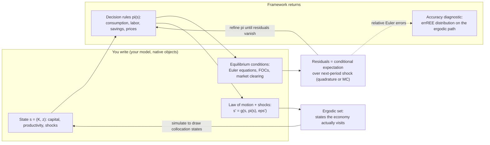
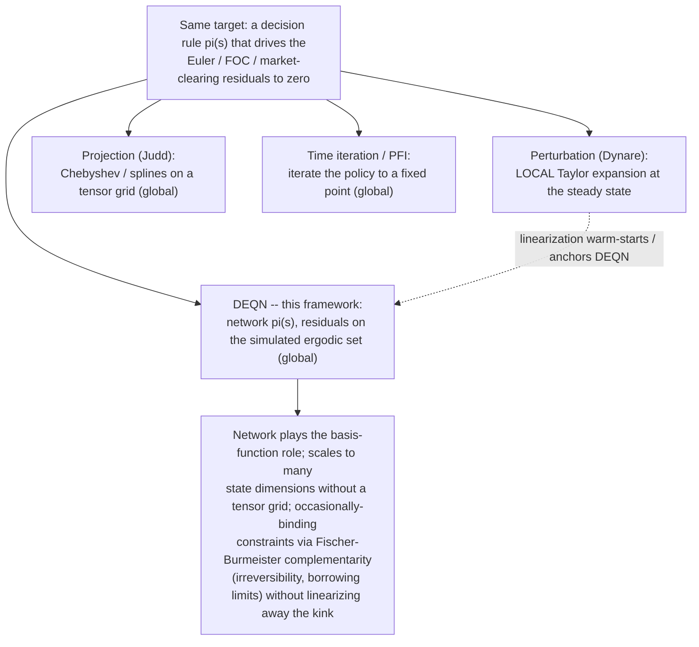

# DEQN-JAX

**A global solver for recursive economic equilibria, in JAX.** You write your model — states, Euler equations, transition law, calibration; it returns the solved decision rules and their Euler-equation accuracy.

> This project is a JAX reimplementation and extension of the Deep Equilibrium Networks
> methodology developed by Simon Scheidegger and collaborators. Foundational references:
>
> - Azinovic, M., Gaegauf, L., Scheidegger, S. (2022). *Deep Equilibrium Nets.* International Economic Review 63(4), 1471–1525.
> - Scheidegger, S., Bilionis, I. (2019). *Machine learning for high-dimensional dynamic stochastic economies.* Journal of Computational Science 33, 68–82.
>
> Upstream reference implementation: <https://github.com/sischei/DeepEquilibriumNets>.
>
> This reimplementation migrates the approach to JAX + Equinox, adds architectural
> priors (`LinearPlusMLP`) and composite loss terms. All credit for the original method
> belongs to the upstream authors.



You write your model in its native objects: a state vector, the Euler equations and first-order conditions, the transition law, and a calibration. DEQN-JAX solves the recursive equilibrium globally — it approximates the decision rules π(s) (consumption, labor, savings, prices as functions of the state) and pins them down by driving the Euler, FOC, and market-clearing residuals to zero in expectation over next-period shocks (Gauss-Hermite quadrature, or Monte Carlo with antithetic variates), across the ergodic set the model actually visits. The neural network plays exactly the role Chebyshev polynomials or splines play in a projection method (the Judd / Maliar-Maliar lineage): same target, flexible basis — but it scales to many state dimensions without a tensor grid, so it pushes back the curse of dimensionality rather than pinning you to a grid. Occasionally-binding constraints (irreversibility, borrowing limits) enter directly through Fischer-Burmeister complementarity residuals, without linearizing away the kink. It composes with your toolkit rather than replacing it: a Dynare / Blanchard-Kahn linearization can serve as the warm-start anchor, and accuracy is reported in the units you already trust — the distribution of relative Euler errors (errREE) on the ergodic path.

**Two honest limits, up front (not in a footnote).** A low residual is necessary but not sufficient: like any nonlinear global solver it can settle on the wrong equilibrium branch, and nothing here enforces equilibrium selection — there is no global analogue of the *local* Blanchard-Kahn saddle-path condition. And there are no analytic error bounds, so accuracy is the errREE distribution you measure, not a theorem.

### Where it sits among methods you already use



### What an economist calls each piece

| You'll see this ML word | What it is, in your language |
|---|---|
| neural-network policy | a flexible approximation of the decision rule π(s) — the role Chebyshev polynomials or splines play in a projection method |
| loss / training residual | the Euler-equation / FOC / market-clearing error |
| gradient descent / "training" | solving for the approximation's coefficients — the projection / collocation solve |
| epoch / batch / optimizer step | inner iterations of the numerical solver |
| on-policy sampling / minibatch | collocation points drawn by simulating the model (the ergodic set), not a fixed tensor grid |
| expectation over shocks | Gauss-Hermite quadrature, or Monte Carlo with antithetic variates, over next-period shocks |
| occasionally-binding-constraint penalty | Fischer-Burmeister complementarity residual (irreversibility, borrowing limits) |
| "deep equilibrium net" | a global, nonlinear, high-dimensional recursive-equilibrium / policy-function solver |
| "converged" / low loss | small relative Euler errors (errREE) on the ergodic path — necessary, but **not** sufficient (the solve can settle on the wrong equilibrium branch) |

**Status:** alpha (`v0.2.0`). API may change. Core plumbing is solid (571 tests pass; `uv build` produces both wheel and sdist; CLI subcommands `train`, `list`, `info`, `check`, `evaluate`, `irf`, `optimizers`, `active-subspace`, `init-config` all work). The package supports multiple research papers — it is not paper-specific.

## What's implemented

| Component | Status | Notes |
|-----------|--------|-------|
| Brock–Mirman model | stable | 2 states, 1 policy, analytical SS. Canonical smoke test. |
| Disaster model (CMR + capital destruction) | experimental | 13 states, 11 policies, numerical SS. Baseline CMR converges reliably; disaster block implemented. |
| Networks: MLP, LSTM, Transformer | stable | History-dependent (sequence) policies supported. |
| Networks: `LinearPlusMLP` (residual over Blanchard-Kahn solution) | stable | Recommended for medium-scale DSGE — see `networks/linear_plus_mlp.py`. |
| Optimizers: Adam, SGD, AdamW, Lion, Muon, NGD, Shampoo, MAO, MAO-KFAC, L-BFGS, Gauss-Newton, Levenberg-Marquardt | varying | Adam + `LinearPlusMLP` is the validated stack. Second-order methods work but are less tested. |
| Composite loss (anchor + Jacobian + barrier + Newton) | stable | Supervised priors toward the linearized policy. |
| Warm start | stable | L-BFGS fit to steady state, or Dynare linearization import. |
| Curriculum on shock magnitude | stable | Ramp shocks from small to full over N episodes. |
| Quadrature / MC expectations | stable | Gauss-Hermite nodes or Monte Carlo with antithetic variates. |
| Checkpointing, TensorBoard, W&B | stable | Resume training from checkpoint supported. |
| `aiyagari` module | internal | Present in source; not registered in the public model registry. May be exposed in a later release. |

## Installation

From a source checkout (alpha is not yet on PyPI):

```bash
git clone <repo>
cd deqn-jax
uv sync
uv pip install -e .            # optional: editable mode for hacking
```

CUDA-enabled install (Linux aarch64 / x86_64, CUDA 12 or 13):

```bash
uv pip install -U "jax[cuda13]"  # or "jax[cuda12]" for CUDA 12
```

Verify:

```bash
uv run deqn-jax check
uv run deqn-jax list
```

## Quick start

Train the 5-minute smoke-test model:

```bash
uv run deqn-jax train brock_mirman -n 1000 --warm-start
```

Train the disaster model with the validated stack:

```bash
uv run deqn-jax train --config configs/disaster.yaml
```

Evaluate a checkpoint:

```bash
uv run deqn-jax evaluate path/to/checkpoint.eqx -n 2000
```

Impulse-response functions:

```bash
uv run deqn-jax irf path/to/checkpoint.eqx --shock eps
```

## Resuming training & switching optimizers

Any checkpoint can be resumed — including with a *different* optimizer:

```bash
# Train 3000 episodes with Adam
uv run deqn-jax train --config configs/disaster.yaml

# Continue from checkpoint with NGD (Natural Gradient Descent)
uv run deqn-jax train --config configs/disaster.yaml \
    --resume checkpoints/disaster/checkpoint_003000.eqx \
    --set optimizer.name=ngd
```

The trainer detects the optimizer change, re-initializes optimizer state for
the new method, and keeps the network weights. Useful for Adam-then-L-BFGS
style pipelines where you do rough exploration with a first-order method
and polish with a second-order one. The original config is read from
`<checkpoint_dir>/config.yaml` to reconstruct the pytree template.

## Extending the framework

### Adding a new model

1. Create `src/deqn_jax/models/your_model/` with four files:
   - `variables.py` — `VariableSpec`, `CONSTANTS`, steady-state reference values
   - `equations.py` — `equations(state, policy, next_state, next_policy, constants)` returns a dict of residuals. Also `definitions()` for derived quantities.
   - `dynamics.py` — `step(state, policy, shock, constants)` returns next state.
   - `steady_state.py` — `steady_state(constants)` returns `(ss_state, ss_policy)`; analytical or numerical.
2. Build a `ModelSpec` in `__init__.py` pulling those pieces together.
3. Register it in `src/deqn_jax/models/__init__.py`.
4. Add a test in `tests/test_basic.py` that trains for 20 episodes and checks loss decreases.

See `src/deqn_jax/models/brock_mirman/` for the minimal reference and `src/deqn_jax/models/disaster/` for a full-scale DSGE.

### Adding a new optimizer

1. Create `src/deqn_jax/optimizers/your_opt.py`.
2. Either return an `optax.GradientTransformation` (standard) or implement a custom class with `.init(params)` and `.update(...)`.
3. Register with `@register_optimizer("name", kind=OptimizerKind.STANDARD)`.
4. Import in `src/deqn_jax/optimizers/__init__.py` so registration runs.

Five kinds of train-step variants are dispatched from `make_train_step`: STANDARD, PCGRAD, MAO, LBFGS, GN. Pick the right `OptimizerKind` for yours (or add a new one if needed).

### Adding a new loss term

Composite-loss auxiliary terms live in `src/deqn_jax/training/composite_loss.py`. Each term takes a policy network + precomputed data and returns a scalar. Prefix keys with `aux_` so adaptive reweighting correctly ignores them for per-equation gradient surgery.

### Adding a new network

Subclass `eqx.Module`, add a `create_your_net(...)` factory in `src/deqn_jax/networks/your_net.py`, and wire `network.type: "your_net"` into the policy-network construction block (search for `create_mlp` in `networks/factory.py`).

## Architecture


*The conceptual flow: an outer **cycle** runs a **rollout** episode that fills
`state_episode` by alternating random step / forward pass / total step, then a
**training** phase does epochs × mini-batches of NN forward+backward passes over
the rollout-produced dataset. The final rollout state seeds the next cycle.
Our JAX implementation fuses forward, loss, and backward into a single JIT'd
train step per episode — conceptually equivalent, implementation-optimised.*

```
src/deqn_jax/
  config/                 Pydantic model configs + YAML + CLI overrides (package)
  cli.py                  Entry point: train, list, info, evaluate, irf, ...
  types.py                ModelSpec, TrainState, Metrics (NamedTuples)
  metrics.py              TensorBoard / W&B / null logger

  models/
    <name>/               Per-model: variables, equations, dynamics, SS
    __init__.py           Model registry

  networks/
    mlp.py                Equinox MLP with output bounding
    lstm.py               Sequence policy (history-dependent)
    transformer.py        Transformer sequence policy
    linear_plus_mlp.py    Residual over Blanchard-Kahn linearization

  optimizers/
    registry.py           @register_optimizer, OptimizerKind, factory
    {adam,sgd,ngd,shampoo,mao,lbfgs,gauss_newton}.py

  training/
    trainer.py            Main loop (slim orchestrator; 5 train-step variants STANDARD, PCGRAD, MAO, LBFGS, GN dispatched by make_train_step in state_init.py)
    loss.py               MC/quadrature expectations, residual MSE
    composite_loss.py     Anchor + Jacobian + barrier + Newton terms
    episode.py            lax.scan trajectory simulation
    linearize.py          Blanchard-Kahn policy rule via QZ decomposition
    warm_start.py         L-BFGS fit to SS or Dynare solution
```

## Design principles

- **Single JIT boundary** around the entire train step (loss + grad + opt-step) — keeps XLA fusion opportunities alive.
- **Pytree-everywhere** state. `TrainState` is a `NamedTuple`; `jax.jit`, `vmap`, `grad` compose cleanly.
- **Equinox modules** for networks: `eqx.filter(model, eqx.is_array)` separates trainable from static.
- **Optax optimizers** for gradient transformations, with a thin registry on top for DEQN-specific extras (NGD, MAO, GN).
- **Pydantic-validated configs** with YAML + CLI overrides in a single priority chain.

## Tests

```bash
uv run pytest tests/ -v               # 226 tests
uv run pytest tests/test_basic.py     # 12 core tests
uv run pytest tests/test_optimizers.py # optimizer + short training tests
```

## License

MIT — see `LICENSE`.
