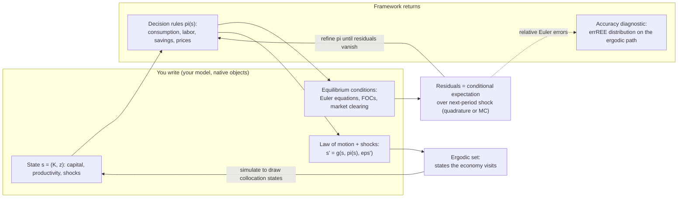
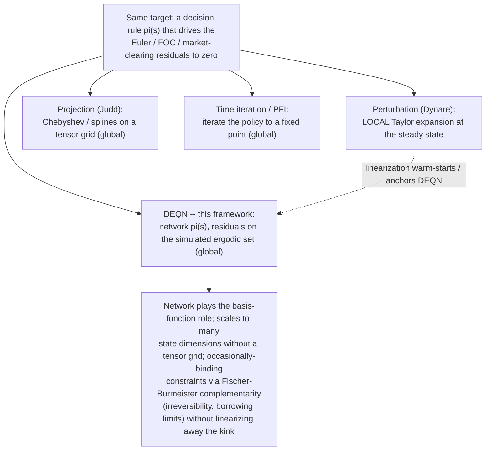
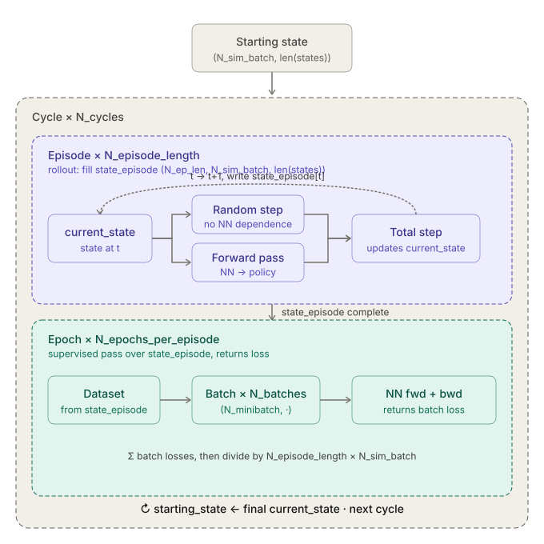

# DEQN-JAX

A global solver for recursive economic equilibria, written in JAX. You write
your model's equilibrium conditions; it returns globally solved decision rules
and their Euler-equation accuracy. Kinks from occasionally binding constraints
are kept, not linearized away as in perturbation.

> A JAX/Equinox reimplementation and extension of **Deep Equilibrium Nets**
> (Scheidegger and collaborators). All credit for the original method belongs to
> the upstream authors; full references are under *Credit &amp; provenance* below.


```mermaid
flowchart LR
    subgraph WRITE["You write (your model, native objects)"]
        S["State s = (K, z): capital, productivity, shocks"]
        EQ["Equilibrium conditions:<br/>Euler equations, FOCs, market clearing"]
        TR["Law of motion + shocks:<br/>s' = g(s, pi(s), eps')"]
    end
    subgraph RET["Framework returns"]
        PI["Decision rules pi(s):<br/>consumption, labor, savings, prices"]
        ACC["Accuracy diagnostic:<br/>errREE distribution on the ergodic path"]
    end
    S --> PI
    PI --> EQ
    EQ --> RES["Residuals = conditional expectation<br/>over next-period shock (quadrature or MC)"]
    RES -->|refine pi until residuals vanish| PI
    PI --> TR
    TR --> ERG["Ergodic set:<br/>states the economy visits"]
    ERG -->|simulate to draw collocation states| S
    RES -.->|relative Euler errors| ACC
```

### Features

- Occasionally binding constraints (ZLB, borrowing limits, irreversible investment) enter as Fischer–Burmeister complementarity residuals and are solved globally, not linearized at the steady state.
- The policy is a neural network, in the role Chebyshev polynomials or splines play in a projection method. There is no tensor grid, so many state dimensions remain tractable.
- A first-order Blanchard–Kahn linearization, computed in the framework or imported from Dynare, warm-starts and anchors the solve. DEQN extends perturbation rather than replacing it.
- Accuracy is reported as the distribution of relative Euler errors (errREE) on the ergodic set.

### Limits

1. A low residual is necessary, not sufficient. Like any nonlinear global solver, DEQN can settle on the wrong equilibrium branch, and nothing here enforces equilibrium selection. The Blanchard–Kahn saddle-path (determinacy) condition is local and linear and has no global analogue here.
2. There are no certified error bounds; accuracy is measured (the errREE distribution), not proven. If a first-order perturbation answers your question, Dynare is faster and proven. DEQN is for what it cannot handle: occasionally binding constraints, state spaces too large for a projection tensor grid, or global nonlinear rules.

<details>
<summary><b>Comparison with other solution methods</b> (diagram)</summary>

Perturbation, projection, time iteration and DEQN all look for a decision rule that sets the equilibrium residuals to zero. DEQN is a global method that scales with the state dimension and keeps the kinks.


```mermaid
flowchart TD
    T["Same target: a decision rule pi(s) that drives the<br/>Euler / FOC / market-clearing residuals to zero"]
    T --> L["Perturbation (Dynare):<br/>LOCAL Taylor expansion at the steady state"]
    T --> P["Projection (Judd):<br/>Chebyshev / splines on a tensor grid (global)"]
    T --> I["Time iteration / PFI:<br/>iterate the policy to a fixed point (global)"]
    T --> D["DEQN -- this framework:<br/>network pi(s), residuals on the simulated ergodic set (global)"]
    D --> N["Network plays the basis-function role; scales to many<br/>state dimensions without a tensor grid; occasionally-binding<br/>constraints via Fischer-Burmeister complementarity<br/>(irreversibility, borrowing limits) without linearizing away the kink"]
    L -.->|linearization warm-starts / anchors DEQN| D
```

</details>

<details>
<summary><b>ML &harr; economics dictionary</b>: ML terms and the numerical-methods ideas they correspond to</summary>

| ML term | Numerical-methods equivalent |
|---|---|
| neural-network policy | a flexible approximation of the decision rule π(s), in the role Chebyshev polynomials or splines play in a projection method |
| loss / training residual | the Euler-equation / FOC / market-clearing error |
| gradient descent / "training" | solving for the approximation's coefficients (the projection / collocation solve) |
| epoch / batch / optimizer step | inner iterations of the numerical solver |
| on-policy sampling / minibatch | collocation points drawn by simulating the model (the ergodic set), not a fixed tensor grid |
| expectation over shocks | Gauss-Hermite quadrature, or Monte Carlo with antithetic variates, over next-period shocks |
| occasionally-binding-constraint penalty | Fischer-Burmeister complementarity residual (ZLB, irreversibility, borrowing limits) |
| warm start / anchor | a Blanchard–Kahn (Dynare) linearization used as the initial guess and a supervised prior |
| "deep equilibrium net" | a global, nonlinear, high-dimensional recursive-equilibrium / policy-function solver |
| "converged" / low loss | small relative Euler errors (errREE) on the ergodic path; necessary but not sufficient, since the solve can settle on the wrong equilibrium branch |

</details>

<details>
<summary><b>Credit &amp; provenance</b>: upstream references</summary>

This project is a JAX reimplementation and extension of the Deep Equilibrium Networks methodology developed by Simon Scheidegger and collaborators. Foundational references:

- Azinovic, M., Gaegauf, L., Scheidegger, S. (2022). *Deep Equilibrium Nets.* International Economic Review 63(4), 1471–1525.
- Scheidegger, S., Bilionis, I. (2019). *Machine learning for high-dimensional dynamic stochastic economies.* Journal of Computational Science 33, 68–82.

Upstream reference implementation: <https://github.com/sischei/DeepEquilibriumNets>.

This reimplementation migrates the approach to JAX + Equinox, adds architectural priors (`LinearPlusMLP`) and composite loss terms. All credit for the original method belongs to the upstream authors.

</details>

**Status:** alpha (`v0.2.0`); the API may change. The test suite collects 668 tests, `uv build` produces a wheel and an sdist, and the eight CLI subcommands (`train`, `list`, `info`, `optimizers`, `irf`, `evaluate`, `check`, `init-config`) work. The framework is model-agnostic. The validated stack is small: Adam + `MLP` (or `LinearPlusMLP`) + MSE residual loss + antithetic-MC (or Gauss-Hermite) expectations. Second-order optimizers, sequence policies, composite loss and the rest are research tools, not recommended defaults.

## What's implemented

Twelve models are registered (`uv run deqn-jax list`). The Brock–Mirman family is the teaching tier; the occasionally binding constraint examples show what the method adds.

| Component | Status | Notes |
|-----------|--------|-------|
| `brock_mirman` (+ `bm_deterministic`, `bm_labor`, two `*_autodiff` POCs) | stable | The reference tier. State `(k, z)`, one policy `sav_rate`, one Euler equation, analytical SS. The 5-minute smoke test. |
| `bm_labor_constrained`: labor with an upper cap (Fischer–Burmeister) | example | Smallest occasionally binding example; the kink is preserved. See the gallery for measured errREE. |
| `irbc`: 2-country international RBC with irreversibility (Fischer–Burmeister) | example | Global solve of an occasionally-binding investment floor. See the gallery. |
| `olg_lifecycle`: 6-generation life-cycle OLG with borrowing constraints (Fischer–Burmeister, two-stage loss) | example | Borrowing limits as complementarity residuals; `olg_analytic_6` gives a closed-form check and `olg_lifecycle_56` is the 56-generation annual variant (57-dim state). See the gallery. |
| `disaster`: NK-DSGE with financial frictions (+ capital destruction) | experimental | 13 states, 11 policies, numerical SS. Baseline CMR converges reliably; the disaster block is implemented but still under validation. |
| `rss_trade_ez_ref`: RSS-2019 three-country trade DSGE with Epstein-Zin preferences | reference replica | Reference layout: 31 states / 73 policies / 82 residuals; two-stage loss. |
| Networks: `MLP`, `LSTM`, `Transformer` | stable | History-dependent (sequence) policies supported; MLP is the validated default. |
| Network: `LinearPlusMLP` (residual over the Blanchard–Kahn solution) | stable | Recommended for medium-scale DSGE; `networks/linear_plus_mlp.py`. |
| Optimizers: `adam`, `muon`, `ngd`, `shampoo`, `mao`, `lbfgs`, `gn`, `ign`, `lm` | varying | `adam` is the validated first-order method. Second-order (`gn`/`ign`/`lm`, `shampoo`, `ngd`, `mao`) work but are less tested. |
| Composite loss (anchor + Jacobian + barrier + Newton) | stable | Optional supervised priors toward the linearized policy. |
| Warm start | stable | L-BFGS fit to steady state, or Dynare/Blanchard–Kahn linearization import. |
| Curriculum on shock magnitude | stable | Ramp shocks from small to full over N episodes. |
| Quadrature / MC expectations | stable | Gauss-Hermite nodes, or Monte Carlo with antithetic variates. |
| Checkpointing, TensorBoard, W&B | stable | Resume training from checkpoint (even with a different optimizer) supported. |

## Installation

From a source checkout (alpha is not yet on PyPI):

```bash
git clone <repo>
cd deqn-jax
uv sync
uv pip install -e .            # optional: editable mode for hacking
```

CUDA-enabled install (Linux aarch64 / x86_64, CUDA 12 or 13):

```bash
uv pip install -U "jax[cuda13]"  # or "jax[cuda12]" for CUDA 12
```

Verify:

```bash
uv run deqn-jax check
uv run deqn-jax list
```

## Quick start

Train the 5-minute smoke-test model:

```bash
uv run deqn-jax train brock_mirman -n 1000 --warm-start
```

Train the disaster model with the validated stack:

```bash
uv run deqn-jax train --config configs/disaster.yaml
```

Evaluate a checkpoint:

```bash
uv run deqn-jax evaluate path/to/checkpoint.eqx -n 2000
```

Impulse-response functions:

```bash
uv run deqn-jax irf path/to/checkpoint.eqx --shock eps
```

## Resuming training and switching optimizers

Any checkpoint can be resumed, including with a different optimizer:

```bash
# Train 3000 episodes with Adam
uv run deqn-jax train --config configs/disaster.yaml

# Continue from checkpoint with NGD (Natural Gradient Descent)
uv run deqn-jax train --config configs/disaster.yaml \
    --resume checkpoints/disaster/checkpoint_003000.eqx \
    --set optimizer.name=ngd
```

The trainer detects the optimizer change, re-initializes the optimizer state
for the new method, and keeps the network weights. This supports
Adam-then-L-BFGS pipelines: explore with a first-order method, then refine
with a second-order one. The original config is read from
`<checkpoint_dir>/config.yaml` to rebuild the pytree template.

## Extending the framework

### Adding a new model

1. Create `src/deqn_jax/models/your_model/` with four files:
   - `variables.py`: `VariableSpec`, `CONSTANTS`, steady-state reference values
   - `equations.py`: `equations(state, policy, next_state, next_policy, constants)` returns a dict of residuals. Also `definitions()` for derived quantities.
   - `dynamics.py`: `step(state, policy, shock, constants)` returns next state.
   - `steady_state.py`: `steady_state(constants)` returns `(ss_state, ss_policy)`; analytical or numerical.
2. Build a `ModelSpec` in `__init__.py` pulling those pieces together.
3. Register it in `src/deqn_jax/models/__init__.py`.
4. Add a test in `tests/test_basic.py` that trains for 20 episodes and checks loss decreases.

See `src/deqn_jax/models/brock_mirman/` for the minimal reference and `src/deqn_jax/models/disaster/` for a full-scale DSGE.

### Adding a new optimizer

1. Create `src/deqn_jax/optimizers/your_opt.py`.
2. Either return an `optax.GradientTransformation` (standard) or implement a custom class with `.init(params)` and `.update(...)`.
3. Register with `@register_optimizer("name", kind=OptimizerKind.STANDARD)`.
4. Import in `src/deqn_jax/optimizers/__init__.py` so registration runs.

`make_train_step` dispatches five train-step variants: STANDARD, PCGRAD, MAO, LBFGS, GN. Choose the `OptimizerKind` that fits your optimizer, or add a new one.

### Adding a new loss term

Composite-loss auxiliary terms live in `src/deqn_jax/training/composite_loss.py`. Each term takes a policy network and precomputed data and returns a scalar. Prefix keys with `aux_` so adaptive reweighting and per-equation gradient surgery ignore them.

### Adding a new network

Subclass `eqx.Module`, add a `create_your_net(...)` factory in `src/deqn_jax/networks/your_net.py`, and wire `network.type: "your_net"` into the policy-network construction block (search for `create_mlp` in `networks/factory.py`).

## Architecture



*The conceptual flow: an outer cycle runs a rollout episode that fills
`state_episode` by alternating random step, forward pass and total step. A
training phase then runs epochs × mini-batches of forward and backward passes
over the rollout data. The final rollout state seeds the next cycle. In the
JAX implementation each cycle is one JIT-compiled rollout followed by a sweep
of JIT-compiled minibatch grad steps, each fusing forward, loss and backward.*

```
src/deqn_jax/
  config/                 Pydantic model configs + YAML + CLI overrides (package)
  cli/                    Entry point; one module per subcommand
  types.py                ModelSpec, TrainState, Metrics (NamedTuples)

  models/
    <name>/               Per-model: variables, equations, dynamics, SS
    __init__.py           Model registry

  networks/
    mlp.py                Equinox MLP with output bounding
    lstm.py               Sequence policy (history-dependent)
    transformer.py        Transformer sequence policy
    linear_plus_mlp.py    Residual over Blanchard-Kahn linearization

  optimizers/
    registry.py           @register_optimizer, OptimizerKind, factory
    standard.py / pcgrad.py / mao.py / lbfgs.py / gauss_newton.py / ngd.py / shampoo.py (+ _step_common.py, the shared loss call and finalize step)

  training/
    trainer.py            Main loop (slim orchestrator; 5 train-step variants STANDARD, PCGRAD, MAO, LBFGS, GN dispatched by make_train_step in state_init.py)
    loss.py               MC/quadrature expectations, residual MSE
    composite_loss.py     Anchor + Jacobian + barrier + Newton terms
    episode.py            lax.scan trajectory simulation
    linearize.py          Blanchard-Kahn policy rule via QZ decomposition
    warm_start.py         L-BFGS fit to SS or Dynare solution
```

## Design principles

- Two JIT boundaries per cycle: one JIT-compiled rollout and one JIT-compiled grad step swept over minibatches, composed in a short Python loop. Everything that varies at runtime is resolved before tracing.
- State is a pytree throughout. `TrainState` is a `NamedTuple`, so `jax.jit`, `vmap` and `grad` compose.
- Networks are Equinox modules; `eqx.filter(model, eqx.is_array)` separates trainable from static parts.
- Optax provides the gradient transformations, with a small registry on top for DEQN-specific additions (NGD, MAO, GN).
- Configs are validated by Pydantic, with YAML and CLI overrides in one priority chain.

## Tests

```bash
uv run pytest tests/ -v               # full suite (668 tests collected)
uv run pytest tests/test_basic.py     # 12 core tests
uv run pytest tests/test_optimizers.py # optimizer + short training tests
```

## License

MIT; see `LICENSE`.
