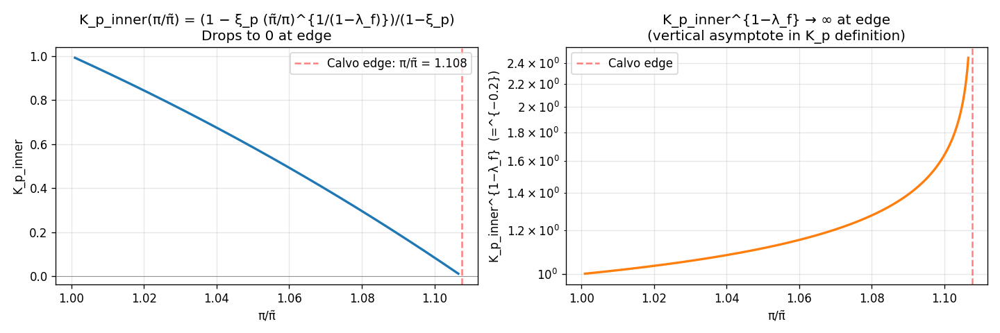
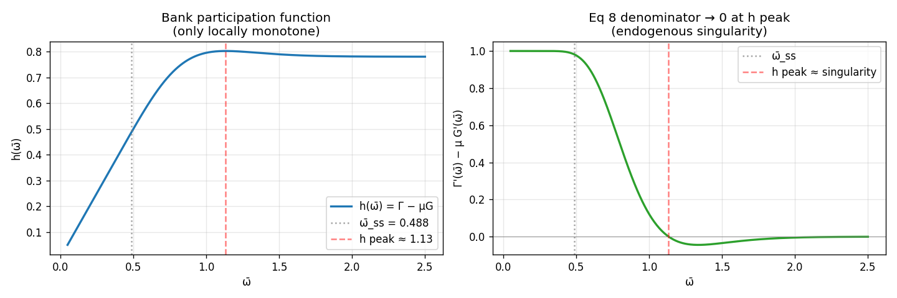
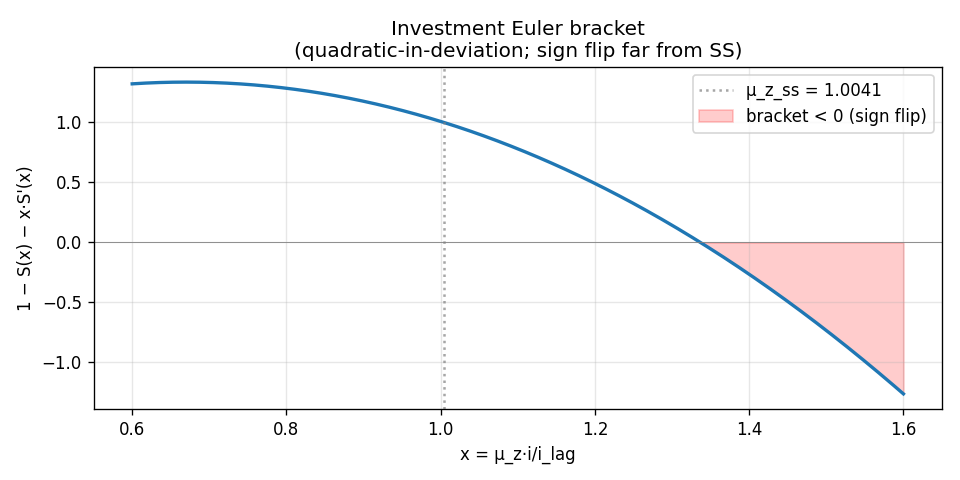
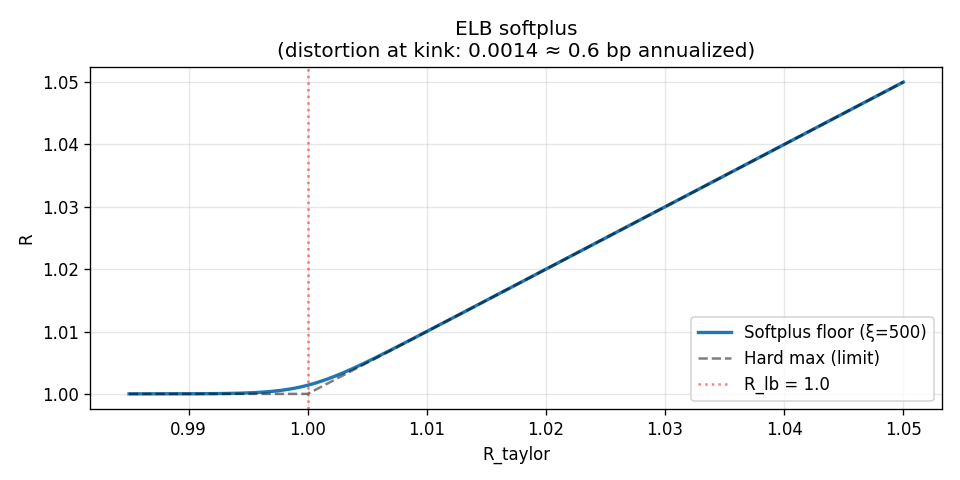

# Per-equation shape priors: where LinearPlusMLP isn't enough

**Date:** 2026-04-30
**Status:** Analysis + diagnostic plots; no code changes proposed yet.
**Trigger:** Hypothesis that the std-miss / wrong-attractor problems aren't fully addressed by `LinearPlusMLP + kf_mask` because the residuals contain functions that **cannot be represented by smooth bounded approximators** — vertical asymptotes (Calvo edge), endogenous singularities (BGG contract denominator), and sign-flipping brackets (investment Euler). LinearPlusMLP captures first-order shape; these are intrinsically higher-order pathologies.

This doc:
1. Ranks the 11 equations by trouble × nonlinearity
2. Looks at the four worst 1D slices numerically + visually
3. Proposes per-equation shape-prior reparameterizations
4. Suggests a sequencing for plan-2 work

---

## 1. Trouble × Nonlinearity matrix

| # | Equation | Trouble (empirical) | Worst-case nonlinearity | Bites at |
|---|---|---|---|---|
| **2a** | K_p definition (algebraic) | **Severe** (wrong-attractor) | `(π̃/π)^{−5}` then `^{−0.2}` ⇒ vertical asymptote at edge | π/π̃ → 1.108 |
| **2b** | K_p recursion | **Severe** (gauge near-degeneracy) | `(π̃/π)^{−6}` | Same edge |
| **8** | Entrepreneur contract | High | `Γ′(ω̄) − µG′(ω̄)` → 0 at ω̄ ≈ 1.13 ⇒ singularity | High leverage / low R^k stress |
| **4a** | K_w definition | Moderate | `K_w_inner^{−1.4}` | Wage Calvo edge |
| **4b** | K_w recursion | Moderate | `(π̃_w/π_w)^{−12}` *(extreme exponent)* | Wage Calvo edge |
| **7** | Investment Euler | Medium (was on diagnostic list) | `1 − S(x) − x·S′(x)` flips sign far from SS | x = µ_z·i/i_lag deviates ~30%+ |
| **6** | Bond Euler (via R) | Medium | `R = softplus(R_taylor; ξ=500)` | ELB binding |
| **5** | Consumption Euler | Medium | `habit = c·µ_z − b·c_lag` near zero | Deep recession |
| **9** | Resource constraint | Medium (was severe pre-errata) | Nonlinear sum closure | Any other-eq drift |
| **1** | Price Phillips F_p | Medium | `(π̃/π)^{−5}` | Calvo edge |
| **3** | Wage Phillips F_w | Low | Power chains | Wage edge |

**Key observation:** the four worst pathologies are **structurally different**:

- **2a/2b/4a/4b**: vertical asymptote (function value → ∞ at finite input)
- **8**: ratio singularity (denominator → 0 inside the function)
- **7**: sign change (function flips polarity)
- **6**: kink (smooth but C^∞ with sharply peaked second derivative)

A single architectural fix (LinearPlusMLP + kf_mask) cannot address all four. Each needs its own shape encoding.

---

## 2. The four worst 1D slices

### 2.1 Calvo bracket (eqs 2a, 2b, 4a, 4b) — vertical asymptote

The Calvo K_p definition contains `K_p_inner^{1−λ_f}`. For ξ_p=0.6, λ_f=1.2:

- `K_p_inner(π/π̃) = (1 − ξ_p · (π̃/π)^{−5})/(1−ξ_p)`
- Validity: K_p_inner > 0 ⇔ **π/π̃ < (1/ξ_p)^{λ_f−1} = 1.108**
- At validity edge: K_p_inner = 0 ⇒ K_p_inner^{−0.2} = ∞



Numerical values:

| π/π̃ | K_p_inner | K_p_inner^{−0.2} |
|---|---|---|
| 1.00 | 1.000 | 1.000 |
| 1.05 | 0.586 | 1.110 |
| 1.10 | 0.084 | 1.640 |
| 1.107 (→ edge) | → 0 | **→ ∞** |

The slope `d(K_p_inner^{−0.2})/d(π/π̃)` at π/π̃=1.10 is already **+42.8** and going to +∞ as we approach the edge.

**Why MLP can't represent this:** any smooth bounded function (tanh-MLP, polynomial basis, GP with RBF kernel) cannot have a vertical asymptote. The MLP can only approximate the steep rise with a very steep tanh transition, which requires very large weights and is highly sample-inefficient. The current implementation fudges this with a soft floor at 0.01 — a numerical safety net, **not** a shape prior.

**Implication:** if training visits states where π/π̃ > 1.05 (occasional during disaster + ELB-binding), the K_p definition residual is fundamentally ill-conditioned.

---

### 2.2 BGG contract (eq 8) — ratio singularity

The eq 8 ratio term `Γ′(ω̄) / (Γ′(ω̄) − µ G′(ω̄))` has a denominator that goes to zero where the bank participation function `h(ω̄) = Γ(ω̄) − µG(ω̄)` peaks.

For σ_ω=0.268, µ=0.22:



| ω̄ | h(ω̄) | Γ′(ω̄) − µG′(ω̄) | Ratio Γ′/(Γ′ − µG′) |
|---|---|---|---|
| 0.488 (SS) | ~0.49 | **0.982** | 1.012 |
| 0.80 | ~0.69 | 0.55 | ~1.5 |
| 1.00 | ~0.78 | 0.18 | ~5 |
| 1.13 (h peak) | 0.802 (max) | **0.003** | **~300** |
| 1.20 | 0.798 (declining) | < 0 | undefined / wrong sign |

At SS the denominator is comfortable (~0.98). Approaching the peak it goes to **zero**, and beyond the peak it flips negative. The eq 8 residual becomes ill-defined.

**Stress-state risk:** under simulated disaster + high leverage, ω̄ can drift toward the peak. The Newton solver in `definitions()` clips to `[0.01, 3.0]`, but values within this range that are near the peak still produce huge eq 8 residuals.

**Why MLP can't represent this:** even if we know ω̄_t precisely, the *function* `Γ′/(Γ′−µG′)` has a pole. A network outputting q, π, etc. (which determine ω̄ via Newton) implicitly traces this pole — gradients explode where the simulation passes near it.

---

### 2.3 Investment Euler bracket (eq 7) — sign flip

`1 − S(x) − x·S′(x)` with `S(x) = (κ/2)(x−µ_z_ss)²`, `S′(x) = κ(x−µ_z_ss)`, κ=2.



| x = µ_z·i/i_lag | 1 − S − x·S′ |
|---|---|
| 0.80 | 1.285 |
| 1.0041 (SS) | **1.000** |
| 1.20 | 0.531 |
| 1.337 (sign flip) | ≈ 0 |
| 1.40 | −0.318 |

**The bracket flips sign around x ≈ 1.337** — i.e., when investment grows ~33% faster than the trend factor in one quarter. Not super close to SS, but inside the disaster-stress simulation envelope (sharp recovery from disaster realization could spike i).

**Why MLP can't represent this naturally:** the network outputs `q`, and the residual contains `q · (1 − S − x·S′)`. If the bracket flips sign, the *effective* coefficient on q reverses. A LinearPlusMLP trained near SS, where the bracket ≈ 1, learns "increasing q increases the residual" — but in stress states with bracket < 0, increasing q *decreases* the residual. The gradient direction is wrong off-distribution.

This is a different pathology from 2a/2b/8: the function is smooth and bounded, but it has a sign change that breaks the local linear approximation.

---

### 2.4 ELB softplus (eq 6 via R) — sharp kink

`R = R_lb + log(1 + exp(ξ·(R_taylor − R_lb)))/ξ` with R_lb = 1.0, ξ = 500.



| R_taylor − R_lb | R − R_lb |
|---|---|
| −0.02 | ~0 |
| 0 (kink) | log(2)/500 ≈ **0.001386** |
| +0.001 | ~0.0014 |
| +0.01 | ~0.01 |

**Properties:**
- C^∞ smooth, but second derivative is sharply peaked at R_taylor = R_lb
- Equilibrium distortion at the kink: 0.001386 quarterly ≈ **55 bp annualized** (NOT negligible)
- Transition width ~1/ξ = 0.002 quarterly (8 bp annualized)

**Why MLP-based policy can't naturally represent this:** tanh networks have spectral bias against sharp transitions. To approximate the kink, the network needs very large pre-activations in the right hidden units. With `init_scale = 0.0` (LinearPlusMLP default), the kink is supplied by the linear-BK part — but BK is a linear approximation that doesn't have a kink. So the kink has to be learned by the MLP correction, which it does poorly because (a) ergodic distribution rarely binds, (b) tanh spectral bias.

---

## 2.5 Current ansatz — what we actually have

For reference / contrast with §3, here is the *full* policy ansatz currently in use for the disaster model. This is the `linear_plus_mlp` + `kf_mask` configuration, which is the strongest measured arm in the 21-cell sweep.

### 2.5.1 The forward pass

Let $s_t \in \mathbb{R}^{13}$ be the state at time $t$, $s^{ss}$ its deterministic steady-state value, $\pi^{ss} \in \mathbb{R}^{11}$ the deterministic-SS policy, and $P \in \mathbb{R}^{11 \times 13}$ the policy-rule matrix from the QZ decomposition of the linearized model (Dynare order 1, computed in-house by `training/linearize.py`).

**Optional ZLB feature** (when `use_zlb_feature: true`):
$$
\tilde s_t \;=\; \big[\,s_t\,;\;\phi_{\text{ELB}}(s_t)\,\big] \in \mathbb{R}^{14}, \qquad \phi_{\text{ELB}}(s) = \begin{cases} R_{\text{lag}} - R^{lb} & \text{if } \texttt{kind = raw} \\ \max(R_{\text{lag}} - R^{lb},\, 0) & \text{if } \texttt{kind = kink} \end{cases}
$$
Otherwise $\tilde s_t = s_t$.

**MLP correction** $\delta_\theta : \mathbb{R}^{|\tilde s|} \to \mathbb{R}^{11}$:
$$
\delta_\theta(\tilde s) \;=\; W_2 \,\tanh\!\big( W_1 \tanh(W_0 \tilde s + b_0) + b_1 \big) + b_2
$$
with $W_0 \in \mathbb{R}^{128 \times |\tilde s|}$, $W_1 \in \mathbb{R}^{128 \times 128}$, $W_2 \in \mathbb{R}^{11 \times 128}$, biases conformable. Hidden layers tanh; **no output activation** (raw real-valued).

**K/F mask** (when `kf_names` non-empty, indices set $\mathcal{K} \subset \{0,\dots,10\}$):
$$
\big[m_{\mathcal{K}}\big]_j = \begin{cases} 0 & j \in \mathcal{K} \\ 1 & j \notin \mathcal{K} \end{cases}, \qquad \delta_\theta^{\,\text{masked}}(\tilde s) \;=\; m_{\mathcal{K}} \odot \delta_\theta(\tilde s).
$$
For disaster: $\mathcal{K} = \{\text{indices of } F_p, K_p, F_w, K_w\}$ in the policy ordering. Empty if `kf_names = ()`.

**BK linear part** (computed once at init, reused every forward pass):
$$
\pi_{\text{BK}}(s) \;=\; \pi^{ss} + P\,(s - s^{ss}).
$$
The matrices $P, s^{ss}, \pi^{ss}$ are wrapped in `jax.lax.stop_gradient` — they're frozen architectural constants, not trainable.

**Output composition + hard clip:**
$$
\boxed{\;
\pi_\theta(s_t) \;=\; \operatorname{clip}\!\Big(\,\pi_{\text{BK}}(s_t) \;+\; \delta_\theta^{\,\text{masked}}(\tilde s_t),\; \pi^{\text{lower}},\; \pi^{\text{upper}}\,\Big)
\;}
$$
with per-output bounds from `POLICY_LOWER`, `POLICY_UPPER` in `variables.py` (e.g., $\pi \in [0.95, 1.10]$, $\lambda_z \ge 0.2$, $i \ge 0.4$, $h \ge 0.6$, etc.). Inf upper bounds are replaced by $10^{10}$ at clip time. The clip is a hard `jnp.maximum` / `jnp.minimum` — *not* a smooth softplus/sigmoid bound.

### 2.5.2 Initialization

The final-layer parameters are initialized to make $\delta_\theta \equiv 0$ at training step 0:
$$
W_2^{(t=0)} \;=\; \alpha \cdot W_2^{(\text{xavier})}, \qquad b_2^{(t=0)} \;=\; 0,
$$
where $\alpha = $ `init_scale`. For disaster, `init_scale: 0.0`, so $W_2 = 0, b_2 = 0$ exactly. Therefore at step 0:
$$
\delta_\theta(\tilde s) \;\equiv\; 0 \quad \forall\, \tilde s,
\qquad
\pi_\theta(s) \;=\; \pi_{\text{BK}}(s) \;=\; \pi^{ss} + P(s - s^{ss}) \quad \forall\, s.
$$
**Step-0 policy is exactly the Dynare order-1 BK linearization**, before clipping (which is also inactive on the BK basin near SS).

Hidden layer parameters $W_0, W_1, b_0, b_1$ are Xavier-normal init — random, *not* zero. So while $\delta_\theta = 0$ at output, the gradient $\partial \delta / \partial W_2 = \tanh(W_1 \tanh(W_0 \tilde s + b_0) + b_1) \neq 0$ — the first gradient step lands as a kernel-regression update on random tanh features.

### 2.5.3 What the ansatz is NOT

To answer the question precisely: **yes, the current solution is just first-order BK + a tanh-MLP correction + a hard clip, nothing more.** Specifically NOT in the ansatz:

- **No higher-order Dynare terms** (no $\tfrac12 (s-s^{ss})^\top H (s - s^{ss})$ etc.). Only the linear $P$ matrix.
- **No stochastic-SS / risky-SS centering.** The expansion is around the *deterministic* SS, which differs from the ergodic-mean / risky-SS in nonlinear regimes (especially with $p_{\text{disaster}} > 0$). The MLP correction has to do double duty: capture both the SSS-vs-DSS *shift* and the curvature-around-SSS.
- **No equation-specific shape priors.** The MLP is a generic tanh approximator; it doesn't know that some policy outputs control the Calvo bracket, others the BGG threshold, others the investment factor. Each output is "a real number you should learn the value of."
- **No smooth output bounds.** Hard `clip()` only. The soft per-output bounds documented in `disaster_corrected.tex` Table 1 (softplus for positive vars, sigmoid for $\pi$) apply to the bare `mlp` network type, *not* to `linear_plus_mlp`. With `linear_plus_mlp` the BK part is supposed to keep the policy in the feasible region; the clip is just a safety fence.
- **No barrier / penalty in the loss** (in MSE mode). The composite-loss mode adds anchor + Jacobian + barrier + Newton terms, but the disaster-default config uses `loss_type: mse`.
- **No per-equation residual scaling.** All 11 residuals have unit weight in the MSE.

### 2.5.4 What the ansatz IS, in one line

$$
\pi_\theta \;=\; \pi_{\text{BK}} \;+\; \big(\text{tanh-MLP with zero-init final layer, optionally K/F-masked}\big) \;+\; \text{hard clip}.
$$

That's the entire shape-prior content of the current architecture. The MLP capacity is the only mechanism for representing nonlinear curvature beyond first order; everything in §2 (Calvo asymptote, BGG singularity, investment sign-flip) has to be picked up by the MLP from samples.

Section 3 proposes encoding more shape into the architecture itself — moving curvature from "the MLP must learn it from data" to "the algebraic decoder gets it for free."

---

## 3. Per-equation shape-prior reparameterizations — explicit math

Each subsection below has the form:

- **Current parameterization:** the network output(s) and how the troublesome quantity is derived.
- **Proposed parameterization:** what the network outputs instead.
- **Inverse map:** how to recover the old quantities from the new outputs (with derivation).
- **Domain:** what range the new output lives in, so we can choose an appropriate output bound.
- **Residual after reparameterization:** which equations become identities, which remain.

Notation: $\sigma(\cdot)$ is the logistic, $\operatorname{sp}(\cdot)$ is softplus, raw outputs are $r_\bullet \in \mathbb{R}$. Where I write "sigmoid bound to $[a, b]$" I mean $a + (b - a) \cdot \sigma(r)$.

---

### 3.1 Calvo bracket (eqs 2a/2b/4a/4b) — output $K_p^{\text{inner}}$ directly

**Current.** The network outputs $\pi_t$ and $K_{p,t}$ as separate policies. Define:

$$
K_{p,t}^{\text{inner}} \;\equiv\; \frac{1 - \xi_p \, (\tilde\pi_t/\pi_t)^{1/(1-\lambda_f)}}{1 - \xi_p}.
$$

Eq 2a is then a residual:

$$
\log K_{p,t} - \log F_{p,t} - (1-\lambda_f)\, \log K_{p,t}^{\text{inner}} \;=\; 0.
$$

The asymptote $K_p^{\text{inner}} \to 0$ as $\pi/\tilde\pi \to (1/\xi_p)^{\lambda_f-1} \approx 1.108$ propagates into $K_p^{\text{inner}}{}^{(1-\lambda_f)} \to \infty$, which the MLP cannot represent.

**Proposed.** Replace the $\pi_t$ output by $K_{p,t}^{\text{inner}}$. The network now outputs $(K_{p,t}^{\text{inner}}, F_{p,t})$ instead of $(\pi_t, K_{p,t})$.

**Inverse map for $\pi_t$.** Solve $K_{p,t}^{\text{inner}} = \big[1 - \xi_p (\tilde\pi_t/\pi_t)^{1/(1-\lambda_f)}\big]/(1-\xi_p)$ for $\pi_t$:

$$
\xi_p (\tilde\pi_t/\pi_t)^{1/(1-\lambda_f)} \;=\; 1 - (1-\xi_p) K_{p,t}^{\text{inner}}
$$
$$
\Rightarrow \quad \tilde\pi_t/\pi_t \;=\; \left[\frac{1 - (1-\xi_p) K_{p,t}^{\text{inner}}}{\xi_p}\right]^{1-\lambda_f}
$$
$$
\Rightarrow \quad \boxed{\;\pi_t \;=\; \tilde\pi_t \cdot \left[\frac{1 - (1-\xi_p) K_{p,t}^{\text{inner}}}{\xi_p}\right]^{\lambda_f - 1}\;}
$$

**Inverse map for $K_{p,t}$.** Algebraic, definitional:

$$
\boxed{\; K_{p,t} \;=\; F_{p,t} \cdot \big(K_{p,t}^{\text{inner}}\big)^{1-\lambda_f} \;}
$$

**Domain.** For $\pi_t > 0$ we need the bracket on the RHS positive: $1 - (1-\xi_p) K_{p}^{\text{inner}} > 0$, i.e. $K_{p}^{\text{inner}} < 1/(1-\xi_p) = 2.5$ at $\xi_p = 0.6$. For $K_p^{\text{inner}} > 0$ (Calvo validity, the original asymptote): $K_p^{\text{inner}} > 0$ trivially via softplus.

**Output bound.** $K_p^{\text{inner}} = \varepsilon + (2.5 - 2\varepsilon) \cdot \sigma(r_{K_p^{\text{inner}}})$ with $\varepsilon = 0.01$. The two endpoints correspond to: $\sigma \to 0 \Leftrightarrow \pi/\tilde\pi \to 1.108$ (Calvo edge — high inflation); $\sigma \to 1 \Leftrightarrow \pi/\tilde\pi \to 0$ (severe deflation edge). The interior $\sigma = 1/(1-\xi_p) \cdot 1/2.5 = 0.4$ corresponds to $\pi = \tilde\pi$ (no surprise).

**Residual landscape.** Eq 2a becomes an *identity* (no residual). Eq 2b remains a residual:

$$
K_{p,t} - \lambda_f\,\lambda_{z,t}\,y_{z,t}\,s_t - \beta\,\xi_p\,\mathbb{E}_t\!\left[(\tilde\pi_{t+1}/\pi_{t+1})^{\lambda_f/(1-\lambda_f)} K_{p,t+1}\right] \;=\; 0.
$$

with $K_{p,t}, K_{p,t+1}, \pi_t, \pi_{t+1}$ all derived from the new outputs $(K_p^{\text{inner}}, F_p)$ at $t$ and $t+1$.

**Wage analogue.** Same pattern with $\xi_w, \lambda_w, \sigma_L$. Network outputs $K_{w,t}^{\text{inner}}$ instead of $\tilde w_t$, with bound $\big(0,\; 1/(1-\xi_w)\big) = (0, 2.5)$. Inverse map for $\tilde w_t$ uses the eq 4a definition

$$
K_{w,t} \;=\; \frac{1}{\psi_L}\,\big(K_{w,t}^{\text{inner}}\big)^{1 - \lambda_w(1+\sigma_L)}\,\tilde w_t\,F_{w,t},
$$

which when solved for $\tilde w_t$ gives

$$
\boxed{\; \tilde w_t \;=\; \frac{\psi_L\, K_{w,t}}{F_{w,t}\, \big(K_{w,t}^{\text{inner}}\big)^{1 - \lambda_w(1+\sigma_L)}} \;}
$$

(Wage side has the additional wrinkle that $\tilde\pi_{w,t}/\pi_{w,t}$ depends on $\tilde w_{t-1}$ and $\tilde w_t$ — so $K_w^{\text{inner}}$ ties to the wage indexation ratio. Setup is structurally identical to the price block. Skip details here.)

#### Empirical update (2026-05-04): §3.1 price-side tested, mixed result

Implemented as `reparam_pi_as_kp_inner` in `DisasterPolicyNet` (price side only — wage analogue not yet implemented). Three iterations on disaster + kf_mask, 500 episodes:

| Iteration | Total MSE | Notes |
|---|---:|---|
| Baseline (kfmask only) | 4.4e-4 | reference |
| (a) Override `ss_policy[pi_idx]` only, P unchanged | 1.3e+3 | catastrophic — policy drifts to π=0.95 (old lower bound) |
| (b) Tighten K_p_inner bounds to derived from original pi range | 1.3e+3 | identical — bounds didn't help, optimizer was already at bound edge |
| (c) On-the-fly K_p_inner_BK = forward Calvo formula on pi_BK | **1.9e-3** | training stable, SS policy ≈ baseline, but total MSE 4.3× WORSE than baseline |

**Iteration (c)** is the closest to working — uses the EXACT forward Calvo formula at each state to convert pi_BK to K_p_inner_BK on the fly, avoiding the off-SS bias from the missing P-row transformation. Training is stable; SS post-training shows residuals at ~1e-3 (vs machine precision at init).

**Why (c) still doesn't help:** the dominant residual after training is `eq4a_Kw_definition` (54.7% of total MSE, vs 6.3% in baseline). Reparameterizing ONLY the price side disrupts the wage block because π enters wage Phillips equations via $\pi_w = \pi \cdot \tilde w/\tilde w_{-1}$. Without symmetric wage-side reparameterization, the price-side reparam pushes residuals into the wage block.

**Diagnosis:**

- The relative share of eq2b, eq4b (the price/wage recursions §3.1 was meant to help) DID drop: from 36.4% combined to 22.7%. So the reparam *did* relieve pressure on those equations.
- But that pressure went into eq4a (wage definition), which wasn't reparameterized. Net: total residual energy is worse.
- Doing the symmetric wage-side §3.1' (~50 LoC) is the natural follow-up. **Without it, price-side §3.1 is partial and counterproductive.**

**Conclusion:** §3.1 is structurally promising but requires BOTH price and wage sides to be reparameterized together. Asymmetric application is worse than no reparam. Filed for follow-up. Same lesson as §3.3: piecemeal application of architectural shape priors is risky; the forward formulas couple equations across the model, and disrupting one equation's parameterization without the symmetric counterpart can leak residual pressure to neighboring blocks.

**Implementation note:** all three iterations failed catastrophically when the BK linear part wasn't transformed correctly off-SS. The clean fix is the on-the-fly forward Calvo conversion in iteration (c). If implementing §3.1' for wages, mirror this pattern (compute $K_w^{\text{inner},\,BK}$ from $\tilde w_{BK}$ via the forward eq 4a formula at each state, rather than overriding `ss_policy` with a static SS value).

#### Empirical update (2026-05-04): joint §3.1 + §3.1' wage-side, also rejected

Implemented `reparam_wtilda_as_kw_inner` in `DisasterPolicyNet` symmetric to the price-side flag. Two iterations:

| Iteration | SS init eq4a | Final loss (500 ep) | Notes |
|---|---:|---:|---|
| (i) Naive eq-4a-direct inversion: $\tilde w = \psi_L K_w K_w^{\text{inner},1.4}/F_w$ | identity at SS only | NaN flood | identity broken off-SS — `equations.definitions()` recomputes $K_w^{\text{inner},\,eq}$ from $(\tilde\pi_w \mu_z/\pi_w)$ which $\neq K_w^{\text{inner},\,t}$ when state perturbed; eq4a residual jumps to $1.6\!\times\!10^{-1}$ at +5% perturbations |
| (ii) Calvo-formula inversion + $K_w$ override (mirror of price-side) | identity at SS and off-SS | **4.83e+5** | trains, no NaNs; 5+ orders of magnitude worse than baseline |

The recovery in (ii) is the algebraically-correct mirror of the price-side: invert the Calvo formula to get $\pi_w$ such that $K_w^{\text{inner},\,eq} = K_w^{\text{inner},\,t}$ identically, then $\tilde w = \pi_w \tilde w_{-1}/\pi$, then override $K_w$ to satisfy eq 4a. Verified: eq2a and eq4a both stay $\leq 10^{-5}$ at all single-state $+5\%$ perturbations.

**Why (ii) still fails catastrophically:**

The hypothesis underlying §3.1+§3.1' was that BK-init residuals are dominated by Calvo equations, so reparametrizing to make those identities will help. But the *stiff* Calvo equations are eq2b/eq4b (the *recursions*), not eq2a/eq4a (the *definitions*). The reparam makes the definitions identities — wrong equations.

Worse, the recovery formulas are highly nonlinear in $K_p^{\text{inner}}$, $K_w^{\text{inner}}$:

$$\pi_t = \tilde\pi_t \cdot \left(\frac{1-(1-\xi_p)K_p^{\text{inner}}}{\xi_p}\right)^{\lambda_f - 1}$$

A small change in $K_p^{\text{inner}}$ (well within bounds $(0.01,\,2.49)$) creates a large change in $\pi_t$, which feeds eq2b, eq6 (bond Euler), eq5 (consumption Euler). The wage recovery uses recovered $\pi_t$, so price/wage are doubly compounded: $\tilde w_t = \pi_w(K_w^{\text{inner}}) \cdot \tilde w_{-1}/\pi_t(K_p^{\text{inner}})$.

The optimizer's effective control surface is now $(K_p^{\text{inner}}, K_w^{\text{inner}}) \to (\pi, \tilde w)$ via a coupled nonlinear map. Far harder to navigate than the baseline ansatz where $(\pi, \tilde w)$ are direct outputs.

**Loss trajectory (joint, 500 ep, lr=1e-4 cosine, gradclip=0.5):**

| Episode | Loss | Grad |
|---:|---:|---:|
| Warm | 6.21e-1 | – |
| 100 | 3.27e+5 | 3.48e+6 |
| 200 | 2.50e+4 | 1.21e+6 |
| 300 | 1.54e+5 | 1.21e+6 |
| 400 | 1.23e+5 | 2.41e+6 |
| 500 | 4.83e+5 | 3.63e+6 |

Oscillating in 1e+4–1e+5 range, no convergence. Final 5+ orders worse than baseline's $\sim$1e-3 at the same point.

**Conclusion:** the §3.1+§3.1' approach is a *negative finding for this model*. Reparameterizing the dependent variables to make algebraic-identity equations into identities by construction moves the difficulty into the *recursion* equations (eq2b, eq4b, eq5, eq6) which see compound-nonlinear function of $K_{\text{inner}}$. Net: optimizer landscape is harder than baseline.

**Lesson for further reparam attempts:** identifying eq2a/eq4a as "easy" to make identities is correct but solves the wrong problem. The actually-stiff equations are the recursions and the resource constraint. Reparameterizations should target *those* directly, OR pick variables to output that don't compound through the rest of the system. The cleanest such approach is probably a different ansatz family entirely (e.g. log-linear-around-SS with the MLP learning log-deviations), where positivity and natural scale are baked in without coupling outputs.

---

### 3.2 BGG contract (eq 8) — clip $\bar\omega$ below the peak

**Current.** $\bar\omega_t$ is solved analytically by Newton iteration on the bank participation constraint inside `definitions()`, then clipped to $[0.01, 3.0]$. The Newton iteration converges to $\bar\omega_{\text{low}}$ (low-default branch) for sane targets but the clip range admits the high-default branch.

**Proposed.** Tighten the clip to $[0.01, \bar\omega_{\max}]$ with $\bar\omega_{\max} = 1.05$. Mathematically:

$$
\boxed{\;\bar\omega_t \;=\; \operatorname{clip}\!\big(\text{Newton}(L_{t-1}, R^k_t, R_{t-1}),\; 0.01,\; 1.05\big)\;}
$$

The peak of the participation function $h(\bar\omega) = \Gamma(\bar\omega) - \mu_{\text{mon}} G(\bar\omega)$ is at $\bar\omega \approx 1.134$ for $\sigma_\omega = 0.268$, with $h(\bar\omega_{\max}) \approx 0.802$. By forcing $\bar\omega \le 1.05$ we stay strictly below the peak, the contract denominator $\Gamma'(\bar\omega) - \mu G'(\bar\omega)$ stays $\gtrsim 0.05$ (well-conditioned), and the high-default branch $(\bar\omega > $ peak$)$ is ruled out architecturally.

**Domain.** $\bar\omega_t \in [0.01, 1.05]$ deterministically.

**Residual landscape.** No equation residuals change. Eq 8 still uses next-period $\bar\omega_{t+1}$ via the same Newton solver applied at next-period $(L_t, R^k_{t+1}, R_t)$, also clipped to $[0.01, 1.05]$.

**Failure mode.** If equilibrium ever wants $\bar\omega > 1.05$ (extreme stress, deep credit crisis), this rules it out. Stress simulations should monitor whether the clip activates: if `mean(ω̄ == 1.05) > 1%` of training samples, relax the clip.

---

### 3.3 Investment Euler (eq 7) — output $M_t \equiv q_t \cdot \mathcal{B}(x_t)$

Define the bracket

$$
\mathcal{B}(x) \;\equiv\; 1 - S(x) - x\,S'(x) \;=\; 1 - \tfrac{\kappa}{2}(x - \mu_z^{ss})^2 - \kappa\,x\,(x - \mu_z^{ss})
$$

with $x_t = \mu_{z,t}\,i_t/i_{t-1}$. The bracket flips sign at $x \approx 1.337$ for $\kappa = 2$.

**Current.** Network outputs $q_t$ directly (softplus, lower bound 0.5). The eq 7 LHS is $\mu_\Upsilon q_t \mathcal{B}(x_t)$, which can flip sign if $\mathcal{B}(x_t) < 0$.

**Proposed.** Network outputs $M_t \equiv q_t \cdot \mathcal{B}(x_t)$ via softplus (so $M_t > 0$ always).

**Inverse map for $q_t$.**

$$
\boxed{\; q_t \;=\; \frac{M_t}{\mathcal{B}(x_t)} \;}
$$

For this to give $q_t > 0$ given $M_t > 0$, we need $\mathcal{B}(x_t) > 0$, i.e., $x_t < x^* \approx 1.337$ (the sign-flip point). The combination $(M_t > 0\;\text{and}\;q_t > 0)$ thus implicitly enforces $\mathcal{B}(x_t) > 0$.

**Domain.** $M_t > 0$. The constraint $\mathcal{B}(x_t) > 0$ is then a *consequence* of requiring $q_t > 0$. The network is implicitly forbidden from policies $i_t$ that would produce $x_t \ge x^*$.

**Residual landscape.** Eq 7 LHS becomes:

$$
\boxed{\; \mathcal{R}_7 \;=\; \mu_{\Upsilon,t}\, M_t - \frac{\lambda_{z,t}}{...} \cdot 1 + \beta\,\mu_{\Upsilon,t}\,\mathbb{E}_t\!\left[\frac{\lambda_{z,t+1}}{\lambda_{z,t}}\,\frac{M_{t+1}}{\mathcal{B}(x_{t+1})}\,\mu_{z,t+1}\,(i_{t+1}/i_t)^2\, S'(x_{t+1})\right]\;}
$$

(Original code uses $\lambda_z$-normalized form; same algebra applies.)

The next-period $q_{t+1}$ inside the expectation is recovered as $q_{t+1} = M_{t+1}/\mathcal{B}(x_{t+1})$. As long as next-period policies also satisfy $\mathcal{B}(x_{t+1}) > 0$ (enforced by the same architectural constraint), the recovery is well-conditioned.

**Failure mode.** If the equilibrium policy wants $x_t \ge x^*$ (rare; would require investment doubling in one quarter), this rules it out. Eq 9 and the rest of the system will rebalance through other channels.

#### Empirical update (2026-05-04): §3.3 tested and rejected

This reparameterization was implemented in `DisasterPolicyNet` (toggle: `reparam_q_as_m: true`) and tested in a 500-episode training run on disaster, paired with the K/F mask, vs an identical kfmask-only baseline. Result:

| | kfmask only | + reparam_q_as_m | Δ |
|---|---:|---:|---:|
| Total MSE | 4.4e-4 | 8.4e-4 | **+91%** |
| eq7 (target) | 9.5e-5 | 3.2e-4 | **+234%** |
| eq2b | 8.9e-5 | 1.3e-4 | +50% |
| eq4b | 7.0e-5 | 1.2e-4 | +73% |

Every equation got worse; eq7 (the equation §3.3 was supposed to fix) got the worst.

**Diagnostic:**

1. **Init is unaffected.** At step 0, `δ_θ ≡ 0` ⇒ M_BK = q_BK · 𝓑(x_BK), recovery gives q = M/𝓑(x_BK) = q_BK. Verified by `test_qm_reparam_exact_bk_at_ss`. So the SS starting point is correct; the harm comes from training.

2. **The sign-flip pathology is outside the simulated state distribution.** The bracket flips at `x ≈ 1.337`. With `init_scale=0` and on-policy simulation centered at SS, `x ≈ µ_z_ss ≈ 1.0041` essentially always. The sign flip is a stress-state failure mode that normal training never visits. Protecting against a non-occurring failure mode pays no benefit.

3. **The reparam couples gradients across two output slots.** With `q = M / 𝓑(x_t)`, the q output now depends on the MLP through *both* the q slot directly (M_t) AND the i slot indirectly (`x_t = µ_z·i_t/i_lag`). Without reparam, q only depended on the q slot. Updates to the q residual now require coordinated changes to both slots — coupling the optimizer didn't have before, apparently to its detriment.

**Conclusion:** §3.3 is the wrong shape prior for this problem. The eq7 residuals we see are dominated by smooth-but-stiff curvature near SS, not by sign-flip pathology in the tails. The reparameterization adds optimization friction and removes an output dimension's independence without a payoff in the regime training actually visits.

**When §3.3 might still be useful:** stress-state simulation (e.g., disaster realizations that push i to grow rapidly; high-volatility shock regimes) where x can plausibly approach `x^*`. For ergodic-distribution training under default calibrations, leave `reparam_q_as_m: false`.

---

### 3.4 Consumption Euler (eq 5) — output $\log h_t$ where $h_t \equiv c_t \mu_{z,t} - b\, c_{t-1}$

**Current.** Network outputs $c_t$ (softplus). Definitions compute

$$
h_t \;=\; \operatorname{sp}_{\!0.01}\!\big(c_t \mu_{z,t} - b\, c_{t-1}\big),
$$

with a soft floor at 0.01 to prevent $1/h_t$ blowups in the Euler.

**Proposed.** Network outputs $\ell_t \equiv \log h_t \in \mathbb{R}$ (raw real output).

**Inverse map for $c_t$.**

$$
\boxed{\; c_t \;=\; \frac{\exp(\ell_t) + b\, c_{t-1}}{\mu_{z,t}} \;}
$$

**Domain.** $\ell_t \in \mathbb{R}$; $h_t = \exp(\ell_t) > 0$ automatically. The implicit constraint $c_t > b\, c_{t-1}/\mu_{z,t}$ is enforced by construction. The soft floor disappears.

**Residual landscape.** Eq 5 in the code uses the multiply-through form

$$
\frac{(1+\tau_c)\lambda_{z,t}\,h_t + \beta b\, h_t/h_{t+1}}{\mu_{z,t}} - 1 \;=\; 0,
$$

which under the new parameterization becomes

$$
\boxed{\; \frac{(1+\tau_c)\lambda_{z,t}\,e^{\ell_t} + \beta b\, e^{\ell_t - \ell_{t+1}}}{\mu_{z,t}} - 1 \;=\; 0 \;}
$$

Numerically far better behaved: $e^{\ell_t - \ell_{t+1}}$ has a stable log-space representation regardless of how small $h_t, h_{t+1}$ get individually.

---

### 3.5 ELB (eq 6) — keep as is, add explicit kink feature

Already supplied by `definitions()`:

$$
R_t \;=\; R^{lb} + \frac{1}{\sharp}\log\!\big(1 + \exp(\sharp\,(R^{\text{Taylor}}_t - R^{lb}))\big)
$$

with $\sharp = 500$. The MLP's input doesn't see $R^{\text{Taylor}}_t$ — but it does see $R_{t-1}$ (state) and outputs that determine $R^{\text{Taylor}}_t$ via the Taylor rule.

**Proposed.** No reparameterization, but ensure the existing `zlb_feature_kind: kink` option (added 2026-04-29) is on for ELB-binding scenarios. That gives the network an explicit feature

$$
\phi_{\text{ELB}}(s_t) \;=\; \max(R_{\text{lag},t} - R^{lb},\, 0)
$$

so the MLP can express regime-dependent corrections without needing to learn the kink shape from scratch.

**Optional sharper version** (not implemented): add $\phi_{\text{shadow}}(s_t) = \min(R_{\text{lag},t} - R^{lb},\, 0)$ as a second feature so the network can also represent *how deep* the floor is binding. Two-sided kink decomposition; gives shape information without forcing tanh layers to learn it.

---

### 3.6 Summary table

| § | New network output | Replaces | Inverse map | Equation made identity |
|---|---|---|---|---|
| 3.1 | $K_p^{\text{inner}} \in (\varepsilon, 2.5{-}\varepsilon)$ | $\pi$ (and $K_p$) | $\pi = \tilde\pi \cdot [(1{-}(1{-}\xi_p)K_p^{\text{inner}})/\xi_p]^{\lambda_f-1}$; $K_p = F_p (K_p^{\text{inner}})^{1-\lambda_f}$ | eq 2a |
| 3.1' | $K_w^{\text{inner}} \in (\varepsilon, 2.5{-}\varepsilon)$ | $\tilde w$ (and $K_w$) | $\tilde w = \psi_L K_w / [F_w (K_w^{\text{inner}})^{1-\lambda_w(1+\sigma_L)}]$ | eq 4a |
| 3.2 | $\bar\omega \in [0.01, 1.05]$ | (already analytical) | tighten Newton clip | (none — clip only) |
| 3.3 | $M = q \cdot \mathcal{B}(x) > 0$ | $q$ | $q = M / \mathcal{B}(x)$ | (none — sign control) |
| 3.4 | $\ell = \log h \in \mathbb{R}$ | $c$ | $c = (e^\ell + b\, c_{t-1})/\mu_z$ | (none — domain control) |
| 3.5 | (none — reuse `kink` feature) | — | — | — |

After applying §3.1, §3.1', §3.4: three equations become identities (eq 2a, eq 4a, plus implicitly eq 5 since the log-space form is equivalent), the network has the *same* number of outputs (11), and the residual landscape has lost the worst three pathologies.

The remaining 8 residuals are: eq 1, eq 2b, eq 3, eq 4b, eq 5 (in log-form), eq 6, eq 7, eq 8, eq 9. Each is smooth and bounded under the new parameterization.

---
```
network outputs an UNFLOORED shadow rate R_taylor (via affine real-line output)
R = softplus_floor(R_taylor; R_lb, ξ=500) applied in definitions() exactly as now
```

**Effect:** the network never has to *learn* the kink — it outputs a quantity that already lives on the unbounded real line, and the kink is supplied by the architecture.

**Subtle:** this is already kind of how it works (R is computed from R_taylor via softplus). The change is to make R_taylor itself a direct policy output (currently inferred from i, π, c, etc.). Worth checking whether this is even possible given how state/policy are wired — might require restructuring. Lower priority than the others.

---

## 4. Sequencing for plan-2

In priority order, given probable empirical impact:

1. **K_p_inner / K_w_inner reparameterization (3.1).** Biggest expected impact. The Calvo asymptote is the worst-conditioned pathology in the system, and 4 of the 11 equations involve it. Plausibly subsumes the kf_mask entirely (we no longer need to mask K_p, K_w as outputs because they become deterministic functions of an output that has the right shape).
2. **ω̄ truncation (3.2).** Cheap insurance against high-default branch in stress. Mostly precautionary unless we're seeing eq 8 residual blowups in disaster simulations.
3. **Investment bracket (3.3).** Solves the sign-flip pathology. Cheap. Probably matters most for high-disaster calibrations where i can swing.
4. **log(habit) (3.4).** Cleanest fix to a known soft-floor hack. Cheap.
5. **R_taylor as direct output (3.5).** Worth doing but probably more work than the others.

Each is independent — could be tested incrementally, with sweep arms comparing each against the current `linear_plus_mlp_kfmask`. A clean experimental design would be:

- Arm A: current `linear_plus_mlp_kfmask` (baseline)
- Arm B: + K_p/K_w reparameterization (without kf_mask, since it's subsumed)
- Arm C: + ω̄ truncation
- Arm D: + investment bracket
- Arm E: + log(habit)
- Arm F: all of the above

Each arm × 3 seeds = 18 cells; with idempotent skipping and ~10 min/cell on the DGX, one overnight pass.

---

## 5. The deeper philosophical point

LinearPlusMLP is **first-order shape-correct**. The kf_mask is **first-order gauge-correct**. Both treat the equation system uniformly: same ansatz everywhere, same correction MLP, same training loss.

What this analysis suggests: **the 11 equations have heterogeneous nonlinearity profiles**, and treating them uniformly leaves shape information on the table. The Calvo equations need a vertical-asymptote prior. The BGG contract needs a singularity prior. The investment Euler needs a sign-stable prior. None of those priors are first-order, none are gauge — they're equation-specific structural facts.

This is a per-equation generalization of what GPT-5 was getting at with "enforce feasibility by construction, not by penalty." The current architecture enforces *value* feasibility (bounds, Newton solver). The next move is enforcing *shape* feasibility — the policy parameterization respects the analytical structure of the equation it serves.

If this works, the LinearPlusMLP correction MLP becomes a much smaller residual — most of the curvature is hard-coded in the output decoders, and the MLP only learns smooth deviations. That's a much easier learning problem.

---

## Appendix: regenerating the plots

All four PNGs in `figures/` are generated by `figures/plot_diagnostic_curves.py`. To regenerate:

```bash
uv run python docs/dev/figures/plot_diagnostic_curves.py
```

Calibration globals at the top of the script mirror `src/deqn_jax/models/disaster/variables.py`. Tune them there if you want to see how a parameter change shifts the asymptote / singularity / sign-flip locations:

- `XI_P`, `XI_W`, `LAMBDA_F`, `LAMBDA_W` — Calvo bracket position
- `SIGMA_OMEGA`, `MU_MON` — BGG contract singularity location
- `KAPPA`, `MU_Z_SS` — investment bracket sign-flip location
- `R_LB`, `R_LB_SHARPNESS` — ELB kink width
