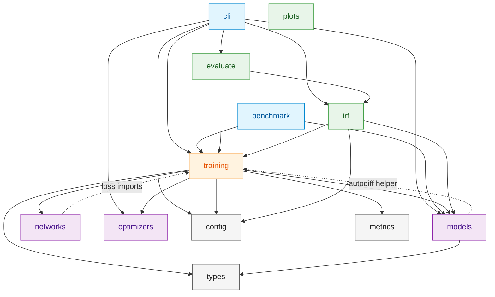
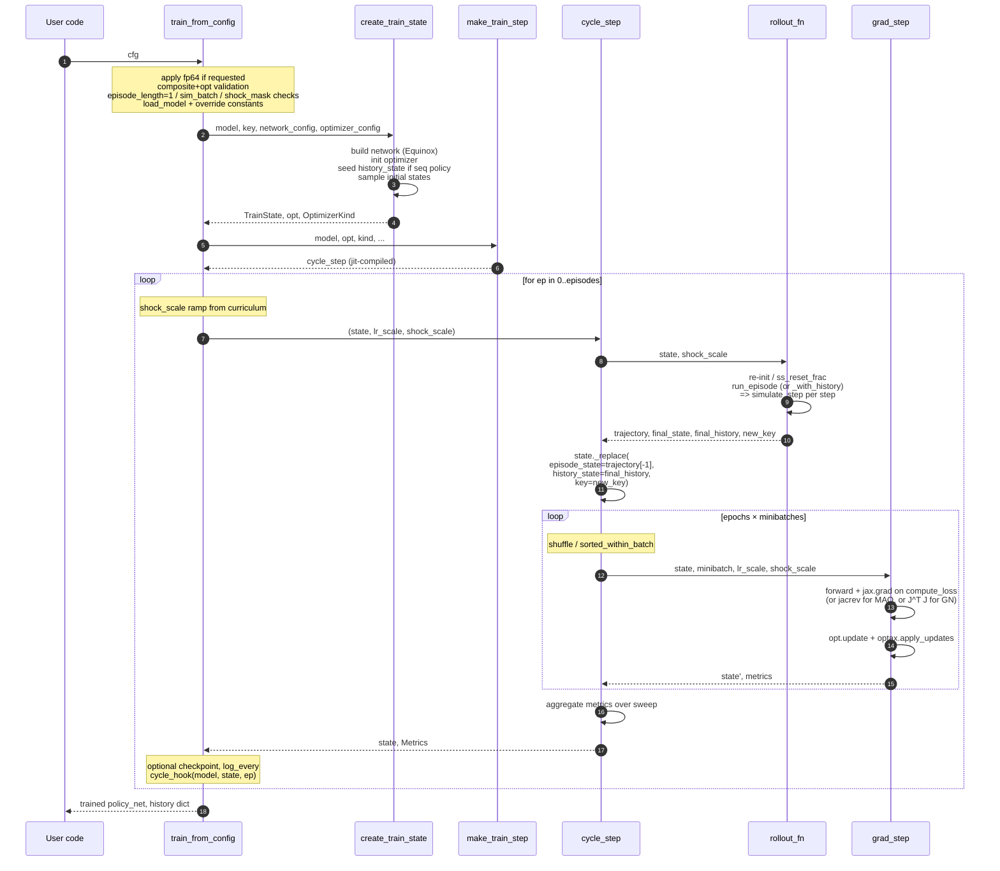

# Architecture

Three diagrams: the **module dependency graph** (what imports what), the **training cycle sequence** (what happens when you call `train_from_config`), and the **`ModelSpec` contract** (what a model author writes vs. what the framework consumes). A fourth section traces **tensor shapes** through one cycle for the people who think in shapes.

Diagrams are hand-drawn against the actual import graph (extracted via `pydeps src/deqn_jax --show-deps`) — collapse-at-depth-2 to keep them readable. Regenerate with:

```bash
uv run pydeps src/deqn_jax --show-deps --no-output --noshow --max-bacon=4 > /tmp/deps.json
```

## 1. Module dependency graph



**Reading the graph:**

- **`training`** is the hub. Everything that does work goes through it.
- **`models`, `networks`, `optimizers`** are author-facing — what you write or extend when porting a new model / new network / new optimizer.
- **`evaluate`, `irf`, `plots`** are diagnostic-only — consume a trained policy + a `ModelSpec`, never touched at training time. (`plots` has no inbound deps within the package.)
- **`types`, `config`, `metrics`** are leaf utilities. `types` defines `ModelSpec` / `TrainState` / `Metrics`; `config` is the four Pydantic classes; `metrics` is the TB / W&B / NullLogger stack.
- **Two dashed back-edges into `training`** are worth flagging:
  - `models -.-> training`: only via the autodiff helper (`training.autodiff.euler_from_period_return`), used by the `*_autodiff` variants. Conceptually `training` shouldn't be a model dependency, but the autodiff path puts the `jax.grad` plumbing there. Acceptable given how localized it is.
  - `networks -.-> training`: a few sequence-network helpers consume `training.history` for window construction. Same trade-off.

## 2. Training cycle sequence

What happens when you call `train_from_config(cfg)`:



**Key things to note:**

- **One `cycle_step` = one rollout + N minibatch grad steps.** Everything inside the `loop` is JIT-compiled; the outer Python loop just dispatches.
- **Single JIT boundary.** `cycle_step` is the single `@jax.jit` function. Validators, checkpointing, logging happen outside JIT.
- **`shock_scale` flows through everything** — into the rollout (so curriculum and `shock_mask` apply to state simulation) AND into the loss expectation. Pre-2026-04-24 it only applied to the loss; that bug is now closed.
- **`history_state`** persists across cycles for sequence policies. For MLP it stays `None` and the path through `cycle_step` is unchanged.

## 3. The `ModelSpec` contract

What a model author writes vs. what the framework consumes:

```mermaid
graph LR
    subgraph "Author writes (src/deqn_jax/models/<name>/)"
        VAR[variables.py<br/>SPEC, CONSTANTS,<br/>POLICY_LOWER/UPPER, N_SHOCKS]
        EQ[equations.py<br/>definitions(), equations(),<br/>EQUATION_NAMES]
        DYN[dynamics.py<br/>step]
        SS[steady_state.py<br/>steady_state(),<br/>init_state]
        INIT[__init__.py<br/>MODEL: ModelSpec]
    end

    VAR --> INIT
    EQ --> INIT
    DYN --> INIT
    SS --> INIT

    subgraph "Framework consumes"
        TR[trainer<br/>create_train_state,<br/>make_train_step]
        LOSS[training.loss<br/>compute_loss<br/>compute_residuals]
        EP[training.episode<br/>run_episode,<br/>simulate_step]
        EVAL[evaluate<br/>euler_equation_errors]
        IRFM[irf<br/>run_irf]
    end

    INIT -->|n_states, n_policies, n_shocks| TR
    INIT -->|equations_fn| LOSS
    INIT -->|step_fn| EP
    INIT -->|step_fn, equations_fn| EVAL
    INIT -->|step_fn, equations_fn,<br/>shock_names, definitions_fn| IRFM
    INIT -->|init_state_fn, steady_state_fn| TR
    INIT -->|policy_lower, policy_upper| TR
    INIT -.->|optional: cycle_hook,<br/>state_bounds, definition_bounds,<br/>clip_state_fn| TR
```

The `ModelSpec` is a **static contract**: nothing about it changes during training. The framework reads its fields at training-state construction and at JIT-trace time, then specializes the entire training loop around the model's shapes and equation count. From there the JIT'd cycle step has zero per-step Python dispatch.

## 4. Tensor shapes through one cycle (for the torchview-minded)

Tracing actual shapes from the start of `cycle_step` to the end, for a typical config (`brock_mirman` MLP, `batch_size=128`, `sim_batch=128`, `episode_length=1`, `mc_samples=5`, `n_states=2`, `n_policies=1`, `n_shocks=1`):

| Step | Object | Shape | Notes |
|---|---|---|---|
| 0 | `state.episode_state` (in) | `[sim_batch=128, n_states=2]` | Carried from previous cycle |
| 0 | `state.params` | pytree of arrays | Equinox MLP, ~10k params |
| 0 | `state.history_state` | `None` (MLP) or `[128, H, 2]` | Threaded for sequence policies |
| 1 | `init_state_fn` redraw (if `initialize_each_episode`) | `[128, 2]` | Fresh uniform from rect |
| 2 | `simulate_step` shock | `[128, 1]` | `shock_scale * N(0,1)`, optional `shock_mask` |
| 2 | `policy = policy_net(state)` | `[128, 1]` | One forward pass |
| 2 | `next_state = step_fn(...)` | `[128, 2]` | One step forward |
| 3 | `trajectory` (lax.scan stack) | `[episode_length=1, 128, 2]` | T-axis prepended |
| 4 | minibatch from trajectory | `[batch_size=128, 2]` | Reshape + shuffle |
| 5 | **per-shock residuals** (vmap) | `[mc_samples=5, batch_size=128]` per equation | Inside `compute_loss` |
| 5 | mean over shocks → per-state residual | `[128]` per equation | $\mathbb{E}_\varepsilon[r]$ for each batch element |
| 5 | square + mean over batch | scalar per equation | MSE |
| 5 | mean over equations | scalar | Loss |
| 6 | `grads = jax.grad(loss_fn)(params)` | pytree, same shape as params | |
| 7 | `opt.update(grads, opt_state, params)` | pytree of updates | |
| 7 | `apply_updates(params, updates)` | new params, same shapes | |
| 8 | `state.episode_state` (out) | `[128, 2]` | Seeded from `trajectory[-1]` for next cycle |

For sequence policies (LSTM/Transformer with `history_len=H`), insert `[128, H, 2]` for any `train_batch` and policy-input slot, plus `state.history_state` is `[128, H, 2]` instead of `None`.

For multi-equation models (`bm_labor` with 2, `olg_analytic_6` with 5, `disaster` with 11), the per-equation residual stack is `[mc_samples, batch_size, n_equations]` and the mean-over-equations happens at the end before the squared loss.

For Gauss-Hermite quadrature instead of MC, replace `mc_samples` with `n_quadrature_points^n_shocks` and the "mean over shocks" becomes a quadrature-weighted sum.

## Cross-references

- [What is DEQN?](what_is_deqn.md) — the method itself, in plain economist terms.
- [Implementing a model](models/implementing.md) — the author's-side walkthrough of writing the five files in section 3.
- [Running experiments](running_experiments.md) — the user's-side walkthrough of the loop in section 2.
- [Config reference](config_reference.md) — every knob that controls section 2's behavior.
