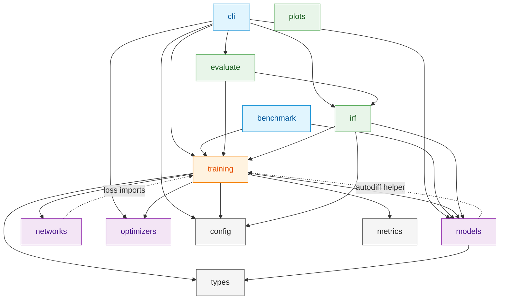
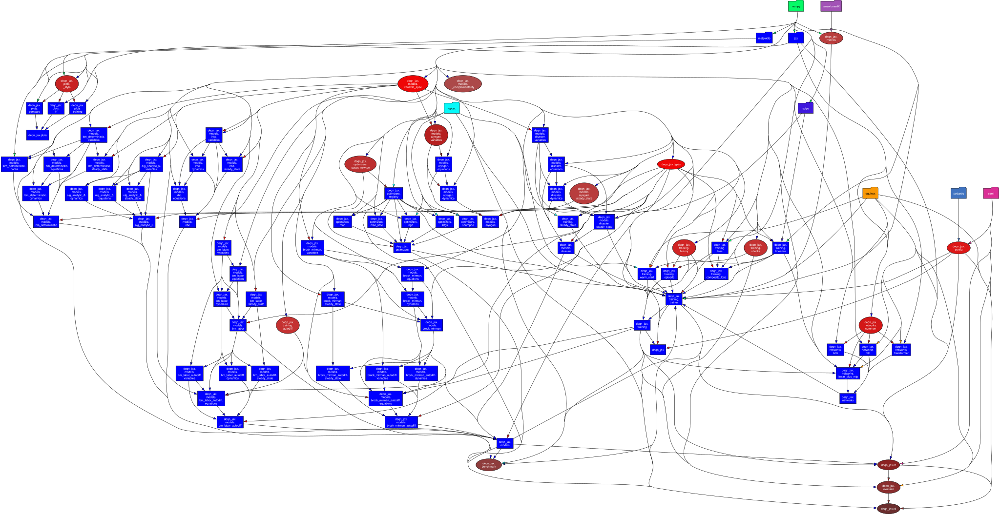
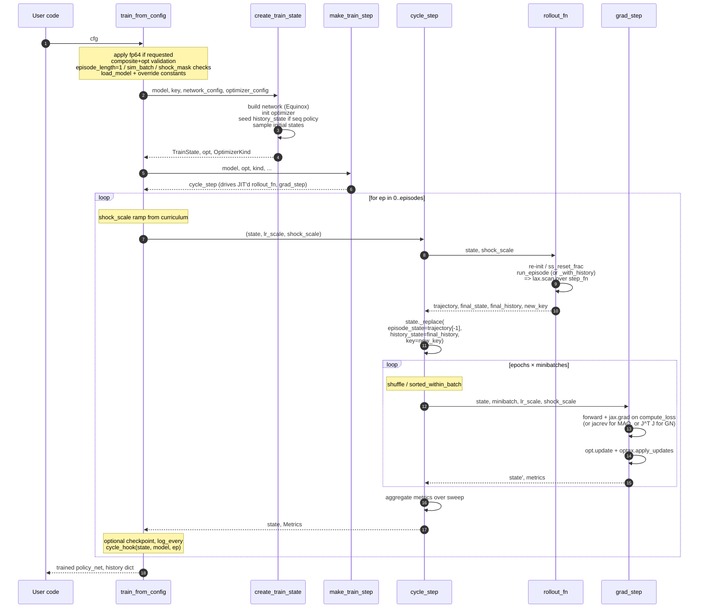

# Architecture

!!! info "For contributors"
    This page describes the code: modules, imports, JIT boundaries. Economists
    evaluating the method should read the [home page](index.md), which covers
    the recursive-equilibrium loop and how DEQN relates to projection, time
    iteration and perturbation.

The page has three diagrams: the module dependency graph (what imports what),
the training cycle sequence (what happens when you call `train_from_config`),
and the `ModelSpec` contract (what a model author writes and what the
framework consumes). A fourth section traces tensor shapes through one cycle.

The diagrams are drawn by hand from the import graph that
`pydeps src/deqn_jax --show-deps` extracts, collapsed at depth 2 for
readability. To regenerate the import data:

```bash
uv run pydeps src/deqn_jax --show-deps --no-output --noshow --max-bacon=4 > /tmp/deps.json
```

## 1. Module dependency graph


```mermaid
graph TD
    %% Entry / orchestration
    cli[cli]:::entry
    bench[benchmark]:::entry

    %% Training core
    training[training]:::core

    %% Model authoring
    models[models]:::author
    networks[networks]:::author
    optimizers[optimizers]:::author

    %% Diagnostics
    evaluate[evaluate]:::diag
    irf[irf]:::diag
    plots[plots]:::diag

    %% Shared utilities
    types[types]:::util
    config[config]:::util
    metrics[metrics]:::util

    cli --> training
    cli --> models
    cli --> evaluate
    cli --> irf
    cli --> config
    cli --> optimizers

    bench --> training
    bench --> models

    training --> config
    training --> types
    training --> metrics
    training --> networks
    training --> optimizers
    training --> models

    models --> types
    models -.->|autodiff helper| training

    networks -.->|loss imports| training

    evaluate --> training
    evaluate --> irf
    irf --> training
    irf --> models
    irf --> config

    classDef entry fill:#e1f5fe,stroke:#0288d1,color:#01579b
    classDef core fill:#fff3e0,stroke:#f57c00,color:#e65100
    classDef author fill:#f3e5f5,stroke:#8e24aa,color:#4a148c
    classDef diag fill:#e8f5e9,stroke:#43a047,color:#1b5e20
    classDef util fill:#f5f5f5,stroke:#616161,color:#212121
```

Reading the graph:

- `training` is the hub; everything that does work goes through it.
- `models`, `networks` and `optimizers` are what you write or extend when
  porting a new model, network or optimizer.
- `evaluate`, `irf` and `plots` are diagnostics. They consume a trained policy
  and a `ModelSpec`. The one use during training is `evaluate.dynare_io`,
  which the Dynare warm start and the composite loss import to read Dynare
  output. `plots` has no inbound dependencies within the package.
- `types`, `config` and `metrics` are leaf utilities. `types` defines
  `ModelSpec`, `TrainState` and `Metrics`; `config` holds the Pydantic config
  classes (`TrainConfig` and its six nested blocks); `metrics` is the
  TensorBoard / W&B / null logger stack.
- Two dashed back-edges point into `training`:
  - `models -.-> training`: the `*_autodiff` models import the autodiff
    helper `training.autodiff.euler_from_period_return`, and the disaster
    network imports `training.linearize.linearize_model`. `training` would
    ideally not be a model dependency, but these imports are few and local.
  - `networks -.-> training`: `linear_plus_mlp` imports
    `training.linearize.linearize_model` to build its Blanchard-Kahn base.
    Same trade-off.

### Checking the diagram against the code

`scripts/dev/check_module_graph.py` compares the drawn package-level edges
with the real import graph from `pydeps`:

```bash
uv run python scripts/dev/check_module_graph.py
```

The diagram is currently out of date. The script reports 28 real
package-level edges against 16 drawn, among them the edges of the `api`
module, which the diagram predates. The diagram also still shows a
`benchmark` module that no longer exists.

The full module-level picture, with each `*.py` as a node clustered by
package, is generated by `pydeps`:



The SVG also shows structure inside packages (the `models/<name>/`
directories, the individual `training/*.py` modules), which helps when the
question is which file in a package to open. The mermaid diagram above is the
package-level overview.

## 2. Training cycle sequence

What happens when you call `train_from_config(cfg)`:


```mermaid
sequenceDiagram
    autonumber
    participant U as User code
    participant TFC as train_from_config
    participant CTS as create_train_state
    participant MTS as make_train_step
    participant CS as cycle_step
    participant RF as rollout_fn
    participant GS as grad_step

    U->>TFC: cfg
    Note over TFC: apply fp64 if requested<br/>composite+opt validation<br/>episode_length=1 / sim_batch / shock_mask checks<br/>load_model + override constants

    TFC->>CTS: model, key, network_config, optimizer_config
    CTS->>CTS: build network (Equinox)<br/>init optimizer<br/>seed history_state if seq policy<br/>sample initial states
    CTS-->>TFC: TrainState, opt, OptimizerKind

    TFC->>MTS: model, opt, kind, ...
    MTS-->>TFC: cycle_step (drives JIT'd rollout_fn, grad_step)

    loop for ep in 0..episodes
        Note over TFC: shock_scale ramp from curriculum
        TFC->>CS: (state, lr_scale, shock_scale)
        CS->>RF: state, shock_scale
        RF->>RF: re-init / ss_reset_frac<br/>run_episode (or _with_history)<br/>=> lax.scan over step_fn
        RF-->>CS: trajectory, final_state, final_history, new_key
        CS->>CS: state._replace(<br/>  episode_state=trajectory[-1],<br/>  history_state=final_history,<br/>  key=new_key)

        loop epochs × minibatches
            Note over CS: shuffle / sorted_within_batch
            CS->>GS: state, minibatch, lr_scale, shock_scale
            GS->>GS: forward + jax.grad on compute_loss<br/>(or jacrev for MAO, or J^T J for GN)
            GS->>GS: opt.update + optax.apply_updates
            GS-->>CS: state', metrics
        end

        CS->>CS: aggregate metrics over sweep
        CS-->>TFC: state, Metrics
        Note over TFC: optional checkpoint, log_every<br/>cycle_hook(state, model, ep)
    end

    TFC-->>U: trained policy_net, history dict
```

Notes:

- One `cycle_step` is one rollout plus N minibatch grad steps.
- There are two JIT boundaries per cycle. `rollout_fn` is one `@jax.jit`
  function, called once; the variant's `grad_step` is another, called once
  per minibatch. `cycle_step` is the Python function that drives them.
  Validators, checkpointing and logging run outside JIT.
- `shock_scale` reaches both the rollout (so the curriculum and `shock_mask`
  apply to state simulation) and the loss expectation. Before 2026-04-24 it
  applied only to the loss.
- `history_state` persists across cycles for sequence policies. For an MLP it
  stays `None` and the path through `cycle_step` is the same.

## 3. The `ModelSpec` contract

What a model author writes vs. what the framework consumes:

```mermaid
graph LR
    subgraph "Author writes (src/deqn_jax/models/<name>/)"
        VAR[variables.py<br/>SPEC, CONSTANTS,<br/>POLICY_LOWER/UPPER, N_SHOCKS]
        EQ[equations.py<br/>definitions(), equations(),<br/>EQUATION_NAMES]
        DYN[dynamics.py<br/>step]
        SS[steady_state.py<br/>steady_state(),<br/>init_state]
        INIT[__init__.py<br/>MODEL: ModelSpec]
    end

    VAR --> INIT
    EQ --> INIT
    DYN --> INIT
    SS --> INIT

    subgraph "Framework consumes"
        TR[trainer<br/>create_train_state,<br/>make_train_step]
        LOSS[training.loss<br/>compute_loss<br/>compute_residuals]
        EP[training.episode<br/>run_episode,<br/>run_episode_with_history]
        EVAL[evaluate<br/>euler_equation_errors]
        IRFM[irf<br/>run_irf]
    end

    INIT -->|n_states, n_policies, n_shocks| TR
    INIT -->|equations_fn| LOSS
    INIT -->|step_fn| EP
    INIT -->|step_fn, equations_fn| EVAL
    INIT -->|step_fn, equations_fn,<br/>shock_names, definitions_fn| IRFM
    INIT -->|init_state_fn, steady_state_fn| TR
    INIT -->|policy_lower, policy_upper| TR
    INIT -.->|optional: cycle_hook,<br/>state_bounds, definition_bounds,<br/>clip_state_fn| TR
```

The `ModelSpec` is static: nothing in it changes during training. The
framework reads its fields when it builds the training state and when JAX
traces, and specializes the training loop to the model's shapes and equation
count. The JIT'd functions then do no per-step Python dispatch.

## 4. Tensor shapes through one cycle

Shapes from the start of `cycle_step` to the end, for a typical config
(`brock_mirman` MLP, `batch_size=128`, `sim_batch=128`, `episode_length=1`,
`mc_samples=5`, `n_states=2`, `n_policies=1`, `n_shocks=1`):

| Step | Object | Shape | Notes |
|---|---|---|---|
| 0 | `state.episode_state` (in) | `[sim_batch=128, n_states=2]` | Carried from previous cycle |
| 0 | `state.params` | pytree of arrays | Equinox MLP, ~10k params |
| 0 | `state.history_state` | `None` (MLP) or `[128, H, 2]` | Threaded for sequence policies |
| 1 | `init_state_fn` redraw (if `initialize_each_episode`) | `[128, 2]` | Fresh uniform from rect |
| 2 | rollout shock | `[128, 1]` | `shock_scale * N(0,1)`, optional `shock_mask` |
| 2 | `policy = policy_net(state)` | `[128, 1]` | One forward pass |
| 2 | `next_state = step_fn(...)` | `[128, 2]` | One step forward |
| 3 | `trajectory` (lax.scan stack) | `[episode_length=1, 128, 2]` | T-axis prepended |
| 4 | minibatch from trajectory | `[batch_size=128, 2]` | Reshape + shuffle |
| 5 | per-shock residuals (vmap) | `[mc_samples=5, batch_size=128]` per equation | Inside `compute_loss` |
| 5 | mean over shocks → per-state residual | `[128]` per equation | $\mathbb{E}_\varepsilon[r]$ for each batch element |
| 5 | square + mean over batch | scalar per equation | MSE |
| 5 | mean over equations | scalar | Loss |
| 6 | `grads = jax.grad(loss_fn)(params)` | pytree, same shape as params | |
| 7 | `opt.update(grads, opt_state, params)` | pytree of updates | |
| 7 | `apply_updates(params, updates)` | new params, same shapes | |
| 8 | `state.episode_state` (out) | `[128, 2]` | Seeded from `trajectory[-1]` for next cycle |

For sequence policies (LSTM/Transformer with `history_len=H`), every
`train_batch` and policy-input slot is `[128, H, 2]`, and
`state.history_state` is `[128, H, 2]` instead of `None`.

For multi-equation models (`bm_labor` with 2, `olg_analytic_6` with 5,
`disaster` with 11), the per-equation residual stack is
`[mc_samples, batch_size, n_equations]`. Each equation's shock-mean residual
is squared and averaged over the batch first; the mean over equations comes
last, over those per-equation losses.

With Gauss-Hermite quadrature instead of MC, `mc_samples` becomes
`n_quadrature_points^n_shocks` and the mean over shocks becomes a
quadrature-weighted sum.

## Cross-references

- [What is DEQN?](what_is_deqn.md): the method, for economists.
- [Implementing a model](models/implementing.md): writing the five files of
  section 3.
- [Running experiments](running_experiments.md): running the loop of
  section 2.
- [Config reference](config_reference.md): every setting that controls the
  loop in section 2.
