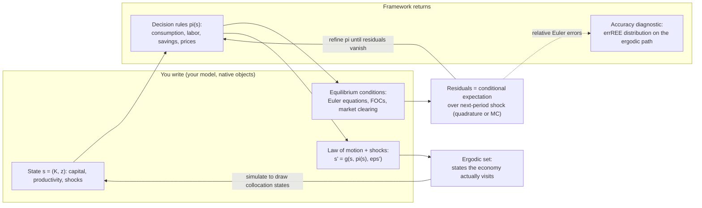
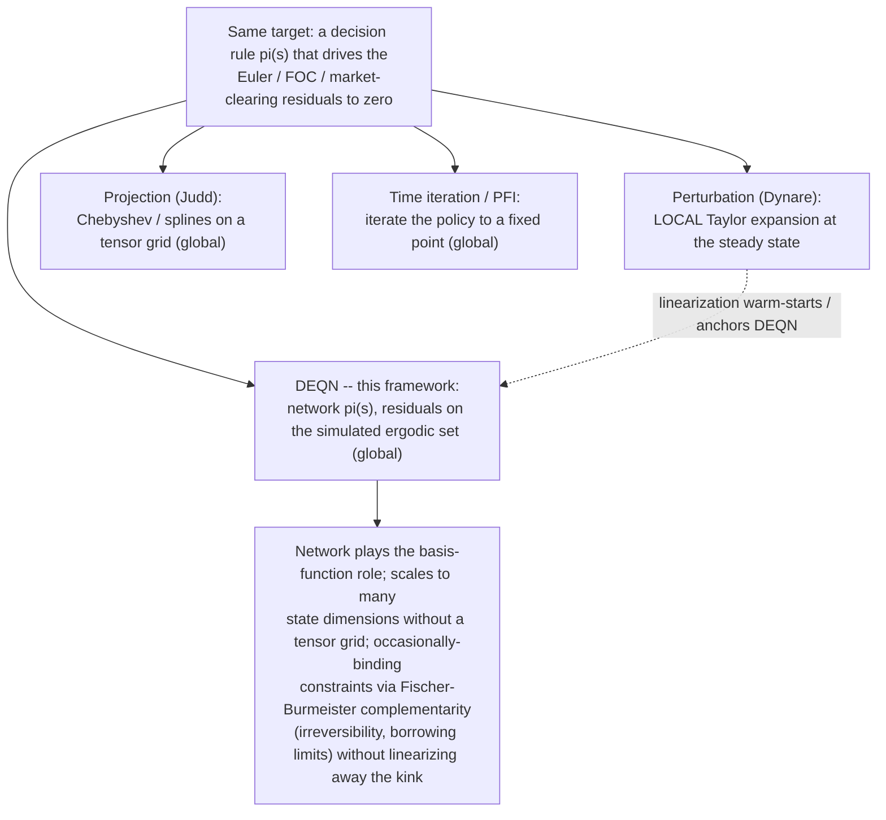

# DEQN-JAX

**A global solver for recursive economic equilibria, in JAX.** You write your
model — states, Euler equations, transition law, calibration; it returns the
solved decision rules and their Euler-equation accuracy.

DEQN-JAX solves the recursive equilibrium **globally**: it approximates the
decision rules $\pi(s)$ and pins them down by driving the Euler / FOC /
market-clearing residuals to zero in expectation over next-period shocks, on
the ergodic set the model actually visits. The neural network plays the role
Chebyshev polynomials or splines play in a **projection method** (Judd /
Maliar-Maliar) — same target, flexible basis — but it scales to many state
dimensions without a tensor grid. Occasionally-binding constraints
(irreversibility, borrowing limits) enter via Fischer-Burmeister
complementarity residuals, and a Dynare / Blanchard-Kahn linearization can
warm-start it: DEQN composes with your toolkit, it doesn't replace it.

!!! note "Two honest limits, up front"
    A low residual is **necessary but not sufficient** — like any nonlinear
    global solver it can settle on the wrong equilibrium branch, and nothing
    here enforces equilibrium selection (there is no global analogue of the
    *local* Blanchard-Kahn saddle-path condition). And there are no analytic
    error bounds: accuracy is the errREE distribution you measure, not a theorem.

### Where it sits among methods you already use

### What an economist calls each piece

| You'll see this ML word | What it is, in your language |
|---|---|
| neural-network policy | a flexible approximation of the decision rule $\pi(s)$ — the role Chebyshev/splines play in a projection method |
| loss / training residual | the Euler-equation / FOC / market-clearing error |
| gradient descent / "training" | solving for the approximation's coefficients — the projection / collocation solve |
| on-policy sampling / minibatch | collocation points drawn by simulating the model (the ergodic set), not a fixed tensor grid |
| expectation over shocks | Gauss-Hermite quadrature, or Monte Carlo with antithetic variates |
| occasionally-binding-constraint penalty | Fischer-Burmeister complementarity residual (irreversibility, borrowing limits) |
| "deep equilibrium net" | a global, nonlinear, high-dimensional recursive-equilibrium / policy-function solver |
| "converged" / low loss | small relative Euler errors (errREE) on the ergodic path — necessary, but **not** sufficient |

## What's here

- **Models**: Brock-Mirman (canonical smoke test), CMR-style NK-DSGE with
  financial frictions and disaster risk.
- **Networks**: MLP, LSTM, Transformer, LinearPlusMLP (residual over
  Blanchard-Kahn linearization).
- **Optimizers**: Adam, SGD, AdamW, Lion, Muon, NGD, Shampoo, MAO,
  MAO-KFAC, L-BFGS, Gauss-Newton, Levenberg-Marquardt.
- **Loss**: Composite (anchor + Jacobian + barrier + Newton) layered on
  residual MSE.
- **Expectations**: Monte Carlo with antithetic variates or tensor-product
  Gauss-Hermite quadrature.

## Where to go next

- New here? → [Installation](getting-started/installation.md), then
  [Quickstart](getting-started/quickstart.md).
- Building an agent stack on top of deqn-jax? → [REFERENCE](REFERENCE.md) —
  the type-signature-first contract for every public entry point.
- Want to add a model? → [Implementing a model](models/implementing.md)
  is the prose-first walkthrough; the [REFERENCE](REFERENCE.md#adding-a-model)
  has the programmatic `register_model(...)` path for codegen / plugins.
- Training in production? → [Running experiments](running_experiments.md).
- Why this framework exists at all? → [Overview](why.md).
- Reading the source? → [Reading guide](reading_guide.md) is a
  code-level narrative for contributors.

## Citing

If you use DEQN-JAX in research, please cite the foundational DEQN
papers:

- Azinovic, M., Gaegauf, L., Scheidegger, S. (2022). *Deep Equilibrium Nets.*
  International Economic Review 63(4), 1471–1525.
- Scheidegger, S., Bilionis, I. (2019). *Machine learning for high-dimensional
  dynamic stochastic economies.* Journal of Computational Science 33, 68–82.
