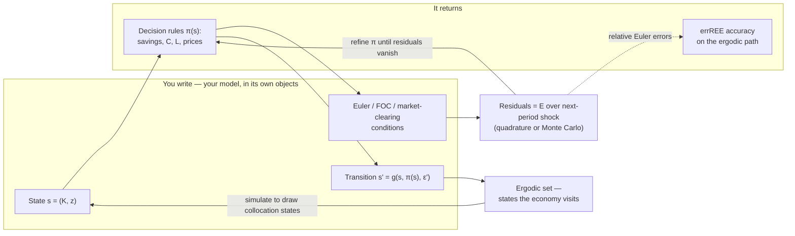

# DEQN-JAX

**A global solver for recursive economic equilibria, in JAX.**

You write your model's equilibrium conditions — Euler equations, FOCs, market
clearing, a transition law, a calibration. It returns globally-solved decision
rules and their Euler-equation accuracy, with the kinks your perturbation tools
linearize away left **intact**.

!!! note "Status: alpha (v0.2.0)"
    The **validated stack is small**: `adam` + an MLP (or `LinearPlusMLP`) +
    an MSE residual + antithetic Monte-Carlo (or Gauss–Hermite) expectations.
    Everything else in the registries is a research instrument, not a turnkey
    recommendation. Two hard limits — equilibrium **selection** and the absence
    of certified error bounds — are stated plainly under *[Is this for you?](#is-this-for-you)*.



## Why reach for it

<div class="grid cards" markdown>

-   :material-chart-bell-curve-cumulative:{ .lg .middle } __Kinks stay kinked__

    ---

    The ZLB, borrowing limits, irreversible investment enter as
    **Fischer–Burmeister complementarity** residuals — solved globally, *not*
    linearized away at the steady state.

-   :material-cube-outline:{ .lg .middle } __No tensor-grid curse__

    ---

    The policy is a **neural network**, playing the role Chebyshev polynomials
    or splines play in a projection method — but many state dimensions stay
    tractable, with no grid to explode.

-   :material-vector-link:{ .lg .middle } __Composes with Dynare__

    ---

    A first-order **Blanchard–Kahn linearization — computed in-framework, or
    imported from Dynare — warm-starts and anchors** the solve. DEQN extends
    your workflow; it doesn't ask you to throw out perturbation.

-   :material-ruler-square-compass:{ .lg .middle } __Accuracy you'd quote__

    ---

    Reported as the distribution of **relative Euler errors (errREE)** on the
    ergodic set — the number you already put in a paper, not a black-box loss.

</div>

## Is this for you?

!!! success "Reach for DEQN when…"

    - your model has **occasionally-binding constraints** a perturbation misses — ZLB, borrowing limits, irreversibility;
    - the state space is **too large for a projection tensor grid**;
    - you want a **global, nonlinear** decision rule, not a local Taylor expansion around the steady state.

!!! warning "Reach for something else (for now) when…"

    - a **first-order perturbation already answers your question** — Dynare is faster and proven;
    - you need a **determinacy / equilibrium-selection guarantee** — there is no global analogue of the *local* Blanchard–Kahn saddle-path condition here. Like any nonlinear global solver, DEQN can settle on the **wrong equilibrium branch**, and nothing in the framework enforces selection — a low residual is necessary but **not sufficient**;
    - you need **certified error bounds** — accuracy here is *measured* (the errREE distribution), not a theorem.

## You write the model; it returns the solve

=== "What you write"

    The equilibrium conditions, as residuals that must vanish in expectation.
    Here is the **actual** Brock–Mirman model in the tree — its real objects,
    not a sketch. The one decision rule is the **savings rate**; consumption and
    everything else fall out of it.

    ```python
    # variables.py — you declare the model's objects
    SPEC = VariableSpec(
        state_names=("k", "z"),        # capital, log TFP
        policy_names=("sav_rate",),    # ONE decision rule: the savings rate
    )

    # equations.py — the equilibrium condition, as a residual that must vanish
    def equations(state, policy, next_state, next_policy, constants):
        d  = definitions(state,      policy,      constants)   # c, u'(c), mpk — this period
        dn = definitions(next_state, next_policy, constants)   #                — next period
        beta, delta = constants["beta"], constants["delta"]

        # consumption Euler — holds in E over next-period z'
        euler = d["u_c"] - beta * dn["u_c"] * (1.0 + dn["mpk"] - delta)
        return {"euler": euler}
    ```

    No grid, no basis functions, no solver loop to hand-roll: you declare the
    economics; the framework supplies the approximation and the solve.

=== "What you get"

    A trained decision rule you can call, simulate, and shock —

    ```text
    policy(k, z)  ->  sav_rate              # the trained decision rule
                      c, k', mpk, ...       # everything else falls out of it
    errREE on the ergodic path             # the accuracy certificate you report
    impulse responses, simulated moments, stability check
    ```

    See the **[Gallery](gallery/index.md)** for worked models with their
    *measured* errREE certificates — the evidence, not a promise.

??? abstract "Where it sits among the methods you already use"

    Same target as perturbation, projection, and time iteration — a decision
    rule $\pi(s)$ that drives the equilibrium residuals to zero. DEQN is the
    **global** member that scales in the state dimension and keeps the kinks.

    ```mermaid
    flowchart TD
        T["Target: a decision rule &pi;(s) that zeroes the<br/>Euler / FOC / market-clearing residuals"]
        T --> L["Perturbation (Dynare):<br/>LOCAL Taylor expansion at the steady state"]
        T --> P["Projection (Judd):<br/>Chebyshev / splines on a tensor grid — global"]
        T --> I["Time iteration / PFI:<br/>iterate the policy to a fixed point — global"]
        T --> D["DEQN — this framework:<br/>network &pi;(s), residuals on the simulated ergodic set — global"]
        D --> N["scales to many state dimensions without a tensor grid;<br/>occasionally-binding constraints via Fischer–Burmeister,<br/>no linearizing-away the kink"]
        L -.->|linearization warm-starts / anchors DEQN| D
    ```

??? quote "ML ↔ economics dictionary"

    Every ML word here is a numerical-methods idea you already use:

    | The ML word | What it is, in your language |
    |---|---|
    | neural-network policy | a flexible approximation of the decision rule $\pi(s)$ — the role Chebyshev/splines play in projection |
    | loss / training residual | the Euler / FOC / market-clearing error |
    | gradient descent / "training" | solving for the approximation's coefficients — the collocation / projection solve |
    | on-policy sampling / minibatch | collocation points drawn by **simulating the model** (the ergodic set), not a fixed tensor grid |
    | expectation over shocks | Gauss–Hermite quadrature, or Monte Carlo with antithetic variates |
    | constraint penalty | a Fischer–Burmeister complementarity residual (irreversibility, borrowing limits, ZLB) |
    | "deep equilibrium net" | a global, nonlinear, high-dimensional recursive-equilibrium / policy-function solver |
    | "converged" / low loss | small relative Euler errors (errREE) on the ergodic path — necessary, **not** sufficient |

## Start here

<div class="grid cards" markdown>

-   :material-rocket-launch:{ .lg .middle } __Run it in five minutes__

    ---

    Install, then train the canonical smoke-test model and read its accuracy.

    [:octicons-arrow-right-24: Quickstart](getting-started/quickstart.md)

-   :material-image-multiple:{ .lg .middle } __See worked models__

    ---

    Closed-form pedagogy → the constraint trilogy → an experimental NK-DSGE —
    each with its measured errREE certificate.

    [:octicons-arrow-right-24: Gallery](gallery/index.md)

-   :material-tune-variant:{ .lg .middle } __Pick your method__

    ---

    The swappable toolkit — networks, optimizers, expectations, diagnostics —
    and *when* (and when not) to reach for each.

    [:octicons-arrow-right-24: Method Zoo](method-zoo/index.md)

-   :material-pencil-ruler:{ .lg .middle } __Write your own model__

    ---

    Declare states, equilibrium equations, transition, calibration — as data.
    The `ModelSpec` contract is the whole surface.

    [:octicons-arrow-right-24: Implementing a model](models/implementing.md)

-   :material-robot-outline:{ .lg .middle } __Paper → policy, automated__

    ---

    `deqn-agent` turns a model description into a trained, residual-checked DEQN
    policy. Experimental, v0 alpha.

    [:octicons-arrow-right-24: deqn-agent](ecosystem/deqn-agent.md)

-   :material-book-open-variant:{ .lg .middle } __The full contract__

    ---

    Type-signature-first reference for every public entry point — for
    contributors and codegen.

    [:octicons-arrow-right-24: REFERENCE](REFERENCE.md)

</div>

## Citing

If you use DEQN-JAX in research, please cite the foundational DEQN papers:

- Azinovic, M., Gaegauf, L., Scheidegger, S. (2022). *Deep Equilibrium Nets.*
  International Economic Review 63(4), 1471–1525.
- Scheidegger, S., Bilionis, I. (2019). *Machine learning for high-dimensional
  dynamic stochastic economies.* Journal of Computational Science 33, 68–82.

This is a JAX/Equinox reimplementation and extension of the Deep Equilibrium
Networks methodology of Simon Scheidegger and collaborators; all credit for the
original method belongs to the upstream authors.

