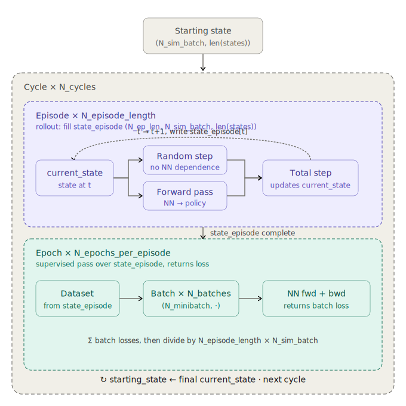

# DEQN-JAX

**Pure-JAX framework for solving economic equilibrium models with deep
equilibrium networks.**

Train a neural network to satisfy a dynamic model's equilibrium conditions
across the full state space, rather than solving point-by-point.

```text
state  →  Network  →  policy  →  Equilibrium equations  →  Loss = Σ residuals²
```



## What's here

- **Models**: Brock-Mirman (canonical smoke test), CMR-style NK-DSGE with
  financial frictions and disaster risk.
- **Networks**: MLP, LSTM, Transformer, LinearPlusMLP (residual over
  Blanchard-Kahn linearization).
- **Optimizers**: Adam, SGD, AdamW, Lion, Muon, NGD, Shampoo, MAO,
  MAO-KFAC, L-BFGS, Gauss-Newton, Levenberg-Marquardt.
- **Loss**: Composite (anchor + Jacobian + barrier + Newton) layered on
  residual MSE.
- **Expectations**: Monte Carlo with antithetic variates or tensor-product
  Gauss-Hermite quadrature.

## Where to go next

- New here? → [Installation](getting-started/installation.md), then
  [Quickstart](getting-started/quickstart.md).
- Building an agent stack on top of deqn-jax? → [REFERENCE](REFERENCE.md) —
  the type-signature-first contract for every public entry point.
- Want to add a model? → [Implementing a model](models/implementing.md)
  is the prose-first walkthrough; the [REFERENCE](REFERENCE.md#adding-a-model)
  has the programmatic `register_model(...)` path for codegen / plugins.
- Training in production? → [Running experiments](running_experiments.md).
- Why this framework exists at all? → [Overview](why.md).
- Reading the source? → [Reading guide](reading_guide.md) is a
  code-level narrative for contributors.

## Citing

If you use DEQN-JAX in research, please cite the foundational DEQN
papers:

- Azinovic, M., Gaegauf, L., Scheidegger, S. (2022). *Deep Equilibrium Nets.*
  International Economic Review 63(4), 1471–1525.
- Scheidegger, S., Bilionis, I. (2019). *Machine learning for high-dimensional
  dynamic stochastic economies.* Journal of Computational Science 33, 68–82.
