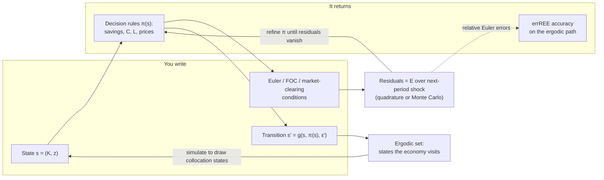

# DEQN-JAX

A global solver for recursive economic equilibria, written in JAX.

You write the model's equilibrium conditions: Euler equations, first-order
conditions, market clearing, a transition law and a calibration. DEQN-JAX
returns globally solved decision rules and their Euler-equation accuracy.
Occasionally-binding constraints keep their kinks instead of being linearized
away.

DEQN-JAX implements Deep Equilibrium Nets, the method of Azinovic, Gaegauf &
Scheidegger (2022) and Scheidegger & Bilionis (2019). It is a JAX/Equinox
reimplementation and extension; all credit for the original method belongs to
the upstream authors. See [Citing](#citing) for the references.

!!! note "Status: alpha (v0.2.0)"
    The API may change. The validated combination is `adam`, an MLP (or
    `LinearPlusMLP`), an MSE residual, and antithetic Monte Carlo (or
    Gauss–Hermite) expectations. The other networks, optimizers and losses in
    the registries are research tools. Two limits apply to every result: the
    solver does not enforce equilibrium selection, and it gives no certified
    error bounds. See [Is this for you?](#is-this-for-you).


```mermaid
flowchart LR
    subgraph WRITE["You write"]
        S["State s = (K, z)"]
        EQ["Euler / FOC / market-clearing<br/>conditions"]
        TR["Transition s' = g(s, &pi;(s), &epsilon;')"]
    end
    subgraph RET["It returns"]
        PI["Decision rules &pi;(s):<br/>savings, C, L, prices"]
        ACC["errREE accuracy<br/>on the ergodic path"]
    end
    S --> PI
    PI --> EQ
    EQ --> RES["Residuals = E over next-period shock<br/>(quadrature or Monte Carlo)"]
    RES -->|refine &pi; until residuals vanish| PI
    PI --> TR
    TR --> ERG["Ergodic set:<br/>states the economy visits"]
    ERG -->|simulate to draw collocation states| S
    RES -.->|relative Euler errors| ACC
```

## Features

- Occasionally-binding constraints (the ZLB, borrowing limits, irreversible
  investment) enter as Fischer–Burmeister complementarity residuals and are
  solved globally, not linearized at the steady state.
- The policy is a neural network. It plays the role that Chebyshev polynomials
  or splines play in a projection method, but there is no tensor grid, so
  models with many state variables stay tractable.
- A first-order Blanchard–Kahn linearization, computed in the framework or
  imported from Dynare, can warm-start and anchor the solve. DEQN extends a
  perturbation workflow rather than replacing it.
- Accuracy is reported as the distribution of relative Euler errors (errREE)
  on the ergodic set, the same measure used in the literature.

## Is this for you?

DEQN is a good fit when:

- the model has occasionally-binding constraints that perturbation misses (ZLB,
  borrowing limits, irreversibility);
- the state space is too large for a projection tensor grid;
- you want a global, nonlinear decision rule rather than a local Taylor
  expansion around the steady state.

Use something else for now when:

- a first-order perturbation already answers your question. Dynare is faster
  and well tested.
- you need a determinacy or equilibrium-selection guarantee. There is no global
  analogue of the local Blanchard–Kahn saddle-path condition. Like any
  nonlinear global solver, DEQN can converge to the wrong equilibrium branch,
  and the framework does not enforce selection. A low residual is necessary
  but not sufficient.
- you need certified error bounds. Accuracy here is measured (the errREE
  distribution), not proven.

## What you write and what you get

=== "What you write"

    The equilibrium conditions, written as residuals that must vanish in
    expectation. This is the Brock–Mirman model as it appears in the source
    tree. The only decision rule is the savings rate; consumption and the other
    variables follow from it.

    ```python
    # variables.py — you declare the model's objects
    SPEC = VariableSpec(
        state_names=("k", "z"),        # capital, log TFP
        policy_names=("sav_rate",),    # ONE decision rule: the savings rate
    )

    # equations.py — the equilibrium condition, as a residual that must vanish
    def equations(state, policy, next_state, next_policy, constants):
        d  = definitions(state,      policy,      constants)   # c, u'(c), mpk — this period
        dn = definitions(next_state, next_policy, constants)   #                — next period
        beta, delta = constants["beta"], constants["delta"]

        # consumption Euler — holds in E over next-period z'
        euler = d["u_c"] - beta * dn["u_c"] * (1.0 + dn["mpk"] - delta)
        return {"euler": euler}
    ```

    You do not write a grid, basis functions or a solver loop. The framework
    supplies the approximation and the solve.

=== "What you get"

    A trained decision rule that you can evaluate, simulate and shock:

    ```text
    policy(k, z)  ->  sav_rate              # the trained decision rule
                      c, k', mpk, ...       # everything else falls out of it
    errREE on the ergodic path             # the accuracy certificate you report
    impulse responses, simulated moments, stability check
    ```

    The [Gallery](gallery/index.md) has worked models with their measured
    errREE.

??? abstract "Where it sits among standard methods"

    Perturbation, projection, time iteration and DEQN all look for a decision
    rule $\pi(s)$ that sets the equilibrium residuals to zero. DEQN is a global
    method that scales with the number of state variables and handles kinks.

    ```mermaid
    flowchart TD
        T["Target: a decision rule &pi;(s) that zeroes the<br/>Euler / FOC / market-clearing residuals"]
        T --> L["Perturbation (Dynare):<br/>LOCAL Taylor expansion at the steady state"]
        T --> P["Projection (Judd):<br/>Chebyshev / splines on a tensor grid, global"]
        T --> I["Time iteration / PFI:<br/>iterate the policy to a fixed point, global"]
        T --> D["DEQN (this framework):<br/>network &pi;(s), residuals on the simulated ergodic set, global"]
        D --> N["scales to many state dimensions without a tensor grid;<br/>occasionally-binding constraints via Fischer–Burmeister,<br/>kink not linearized away"]
        L -.->|linearization warm-starts / anchors DEQN| D
    ```

??? quote "Machine-learning terms and their economics equivalents"

    | Machine-learning term | Economics equivalent |
    |---|---|
    | neural-network policy | a flexible approximation of the decision rule $\pi(s)$, the role Chebyshev polynomials or splines play in projection |
    | loss / training residual | the Euler / FOC / market-clearing error |
    | gradient descent / "training" | solving for the approximation's coefficients, as in a collocation / projection solve |
    | on-policy sampling / minibatch | collocation points drawn by simulating the model (the ergodic set), not a fixed tensor grid |
    | expectation over shocks | Gauss–Hermite quadrature, or Monte Carlo with antithetic variates |
    | constraint penalty | a Fischer–Burmeister complementarity residual (irreversibility, borrowing limits, ZLB) |
    | "deep equilibrium net" | a global, nonlinear, high-dimensional recursive-equilibrium / policy-function solver |
    | "converged" / low loss | small relative Euler errors (errREE) on the ergodic path; necessary, not sufficient |

## Start here

- [Quickstart](getting-started/quickstart.md): install, train the smoke-test
  model and read its accuracy.
- [Gallery](gallery/index.md): worked models, from closed-form examples through
  the three occasionally-binding-constraint models to an experimental NK-DSGE,
  each with its measured errREE.
- [Method Zoo](method-zoo/index.md): the interchangeable networks, optimizers,
  expectation operators and diagnostics, and when to use each.
- [Implementing a model](models/implementing.md): declare states, equilibrium
  equations, transition and calibration through the `ModelSpec` contract.
- [deqn-agent](ecosystem/deqn-agent.md): an experimental (v0 alpha) package that
  turns a model description into a trained, residual-checked DEQN policy.
- [REFERENCE](REFERENCE.md): signatures of every public entry point, for
  contributors and code generation.

## Citing

If you use DEQN-JAX in research, please cite the foundational DEQN papers:

- Azinovic, M., Gaegauf, L., Scheidegger, S. (2022). *Deep Equilibrium Nets.*
  International Economic Review 63(4), 1471–1525.
- Scheidegger, S., Bilionis, I. (2019). *Machine learning for high-dimensional
  dynamic stochastic economies.* Journal of Computational Science 33, 68–82.

This is a JAX/Equinox reimplementation and extension of the Deep Equilibrium
Networks methodology of Simon Scheidegger and collaborators; all credit for the
original method belongs to the upstream authors.
