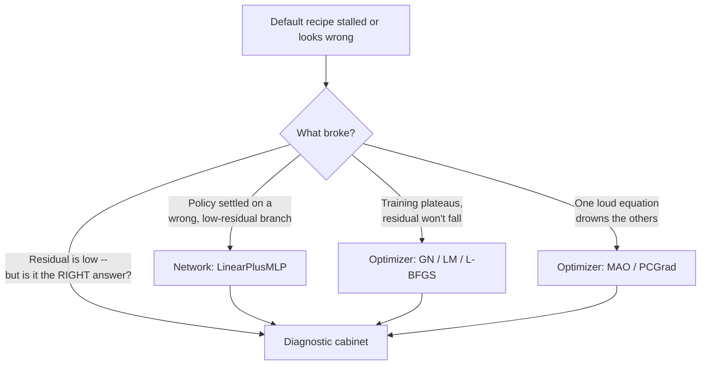

# Method Zoo

A run is **four orthogonal choices** -- how you step the parameters
(*optimizer*), how you parameterize the decision rule &pi;(s) (*network*), how
you take the expectation over next-period shocks and score the residual
(*expectation & loss*), and how you check the answer (*diagnostics*). The zoo
below is the full menu. But on a new model you touch **almost none of it**: pick
the default recipe, and reach into the cabinets only when something concrete
breaks.

!!! tip "The default recipe -- start here"
    <div class="grid" markdown>

    `network = mlp`
    { .card }

    `optimizer = adam`
    { .card }

    `expectation = mc` *(antithetic)*
    { .card }

    `loss = mse`
    { .card }

    </div>

    This is the **validated stack** -- the combination exercised by the test
    suite and the [gallery](../gallery/index.md) on working models. Train it, look
    at the **errREE** distribution on the ergodic path
    ([gallery](../gallery/index.md) for measured certificates). If it converges
    with small relative-Euler errors, **you are done** -- close the page. The
    cabinets exist for when it doesn't.

---

## If the default stalls

Each symptom maps to **one** intervention, anchored to a tool you already use.
Pick by what actually went wrong -- not by browsing the optimizer list.



<div class="grid cards" markdown>

-   :material-vector-line:{ .lg .middle } __Wrong fixed point &rarr; LinearPlusMLP__

    ---

    A bare network can collapse to a **wrong, low-residual equilibrium** -- the
    residual is small but the policy is nonsense. `network.type=linear_plus_mlp`
    starts the policy **as the Blanchard-Kahn linear solution** (a
    zero-initialized correction on top of the first-order rule), so training can
    only improve on a correct local floor.

    [:octicons-arrow-right-24: Network cabinet](#cabinet-network)

-   :material-chart-bell-curve:{ .lg .middle } __Training stalls &rarr; Newton-style solvers__

    ---

    Plateaued residual is a curvature problem, not a step-size one. Reach for the
    **Newton-style solvers you know from GMM / MLE estimation**, applied to the
    equilibrium residuals: `gn` / `lm` (Gauss-Newton, Levenberg-Marquardt) for
    quadratic convergence *near* a solution, and `lbfgs` -- which also drives the
    **steady-state warm-start**.

    [:octicons-arrow-right-24: Optimizer cabinet](#cabinet-optimizer)

-   :material-scale-balance:{ .lg .middle } __One equation dominates &rarr; MAO / PCGrad__

    ---

    In a multi-equation system one residual can swamp the gradient and starve the
    rest. `mao` keeps a **separate Adam moment per equation**; `gradient_surgery:
    pcgrad` projects conflicting per-equation gradients off each other before
    summing. Built for systems like the 11-equation disaster model.

    [:octicons-arrow-right-24: Optimizer cabinet](#cabinet-optimizer)

-   :material-magnify-scan:{ .lg .middle } __"Is the answer good?" &rarr; Diagnostics__

    ---

    A low residual is **necessary but not sufficient** -- residual-minimization
    can land on wrong answers. Before you trust a policy, run the cabinet:
    **errREE** (the number you'd quote), the **stability check** (bounds / drift /
    NaN gate), and the **Dynare Jacobian match** (your SS policy slope vs the BK
    matrix).

    [:octicons-arrow-right-24: Diagnostic cabinet](#cabinet-diagnostic)

</div>

!!! warning "Two limits, stated up front -- not in a footnote"
    DEQN-JAX is **alpha (v0.2.0)**, and like any nonlinear *global* solver it
    carries two honest limits:

    - **A low residual does not pin down the right equilibrium.** It can settle on
      the wrong **branch**, and nothing here enforces equilibrium *selection*.
      There is no global analogue of the **local** Blanchard-Kahn saddle-path
      condition -- BK is a linear/local determinacy criterion, not a global one.
    - **No analytic error bounds.** Accuracy is **measured** (the errREE
      distribution), not proven by a theorem. Quote the number; don't assume it.

    The validated stack is deliberately small: `adam` + `mlp` (or
    `linear_plus_mlp`) + `mse` residual + antithetic `mc` (or Gauss-Hermite).
    Everything else in the cabinets is a research instrument -- a lead, not a
    turnkey recommendation.

??? note "Footnote: the deep-learning optimizers you can ignore"
    `lion`, `muon`, `shampoo`, and `ngd` are **deep-learning optimizers** exposed
    for completeness and ablation. They are sign-momentum, orthogonalized-update,
    Kronecker-factored, and diagonal-Fisher variants respectively -- useful if you
    are stress-testing the trainer, but on a typical macro model **you will not
    need them**. The decision above never routes you here. If `adam` stalls, the
    answer is almost always a better *network* (LinearPlusMLP) or a *Newton-style*
    solver (GN/LM), not a fancier first-order optimizer.

---

## The reference cabinets

The four cabinets below are the **exhaustive, current** menu -- kept one click
deeper so the decision layer stays glanceable. The canonical lists always come
from the live registries:

```bash
uv run deqn-jax optimizers   # the 13 registered optimizers, live
uv run deqn-jax list         # the registered models
```

Items tagged **(validated)** are exercised by the test suite and gallery on a
working model. **(experimental)** items work but are lightly tested or
model-specific. **(research probe)** items live in `docs/dev/` as analyses, not
packaged API.

<h3 id="cabinet-optimizer">Cabinet 1 -- Optimizers</h3>

??? abstract "Optimizer zoo -- the parameter-update rule (`--set optimizer.name=<name>`)"
    Each name maps to one of four **train-step variants** (how gradients are
    formed before the update), dispatched once at construction, outside JIT.

    | Optimizer | Variant | Status | When to reach for it |
    |---|---|---|---|
    | `adam` | STANDARD | validated | **The default.** Start here; only move if it stalls. |
    | `adamw` | STANDARD | validated | Adam with decoupled weight decay -- mild regularization for a large net. |
    | `sgd` | STANDARD | validated | Baselines and ablations; rarely the production choice. |
    | `lion` | STANDARD | experimental | Sign-momentum; cheaper state than Adam. (DL optimizer -- see footnote.) |
    | `muon` | STANDARD | experimental | Newton-Schulz orthogonalized updates. (DL optimizer -- see footnote.) |
    | `ngd` | STANDARD | experimental | Diagonal-Fisher natural gradient. (DL optimizer -- see footnote.) |
    | `shampoo` | STANDARD | experimental | Kronecker-factored second-order. (DL optimizer -- see footnote.) |
    | `mao` | MAO | experimental | **Multi-equation models.** A separate Adam moment per equation so a loud equation can't drown a quiet one -- built for the 11-equation disaster system. |
    | `mao_kfac` | MAO | experimental | MAO plus a shared-input Kronecker preconditioner. |
    | `lbfgs` | LBFGS | experimental | Quasi-Newton with line search; near-deterministic residuals, and the **steady-state warm-start engine**. |
    | `gn` | GN | experimental | Dense Gauss-Newton (H&asymp;J&#7488;J). Quadratic convergence *near* a solution -- a polish step. |
    | `ign` | GN | experimental | Matrix-free implicit Gauss-Newton via conjugate gradients. |
    | `lm` | GN | experimental | Levenberg-Marquardt: damped Gauss-Newton, the robust GN member. |

    **Gradient surgery (orthogonal to the choice above).** PCGrad projects
    conflicting per-equation gradients off each other before summing. It wraps any
    STANDARD optimizer: `gradient_surgery: pcgrad` (experimental). Reach for it on
    multi-equation models where equations pull the policy in competing directions.

    > ML &harr; econ: "optimizer" is just *how you solve for the approximation's
    > coefficients* -- the inner solve of a projection method. Adam is the
    > workhorse; the GN/LM family is the Newton-style polish from a deterministic
    > solver.

<h3 id="cabinet-network">Cabinet 2 -- Networks</h3>

??? abstract "Network zoo -- the decision-rule basis (`network.type`)"
    The decision-rule parameterization -- the role Chebyshev polynomials or
    splines play in a projection method.

    | Network | `network.type` | Status | When to reach for it |
    |---|---|---|---|
    | **MLP** | `mlp` | validated | The default basis. Start here for any Markov policy. |
    | **LinearPlusMLP** | `linear_plus_mlp` | validated | **The canonical fix for degenerate basins.** Policy = Blanchard-Kahn linear rule + a zero-initialized MLP correction; at init the policy *is* the BK solution, so training can only improve on a correct first-order floor. Reach for it whenever a bare MLP collapses to a wrong, low-residual fixed point. |
    | **LSTM** | `lstm` | experimental | History-dependent policies: a window of past states. |
    | **Transformer** | `transformer` | experimental | Same history window, attention instead of recurrence. |
    | **DisasterPolicyNet** | `disaster_policy_net` | experimental | LinearPlusMLP *plus* model-specific shape priors for CMR-style NK-DSGE (ZLB kink feature, Calvo reparameterizations, K/F gauge mask). The disaster superset -- not general-purpose. |
    | **KfAnchoredMLP** | `kf_anchored_mlp` | legacy | An earlier, narrower gauge fix, **superseded by `disaster_policy_net`**. Kept for reproducibility; don't start new work on it. |

    > The lineage that matters: `mlp` &rarr; `linear_plus_mlp` (add a BK floor)
    > &rarr; `disaster_policy_net` (add model-specific priors). `kf_anchored_mlp`
    > is an accidental earlier fork of the same gauge fix.

    See [LinearPlusMLP](../networks/linear_plus_mlp.md) for the residual-ansatz math.

<h3 id="cabinet-loss">Cabinet 3 -- Expectation & loss</h3>

??? abstract "Expectation & loss -- three orthogonal config axes"
    Mix freely (with the documented exclusions).

    **(a) Expectation over shocks -- `expectation_type`**

    | Method | value | Status | When to reach for it |
    |---|---|---|---|
    | **Monte Carlo (antithetic)** | `mc` | validated | The default. Each &epsilon; paired with -&epsilon; for variance reduction; scales to many shock dimensions. |
    | **Gauss-Hermite quadrature** | `gauss_hermite` | validated | Deterministic tensor-product nodes (cost `n_points^n_shocks`); a noise-free expectation with few shocks. The IRBC notebook uses this. |
    | **Discrete Markov** | `discrete` | experimental | Exact enumeration over a finite chain (needs `model.transition_matrix` and `model.z_state_idx`). |

    **(b) Residual aggregation -- `loss_choice`**

    | Aggregation | value | Status | When to reach for it |
    |---|---|---|---|
    | **MSE** | `mse` | validated | The default: square the shock-mean residual `(E[r])^2`. |
    | **Huber** | `huber` | validated | Caps the gradient at &plusmn;`huber_delta` when rare pathological states dominate. |
    | **AiO (all-in-one)** | `aio` | experimental | Maliar-Maliar-Winant unbiased estimator; removes MSE's `Var(r-bar)/N` bias at small `mc_samples`. Requires `expectation_type=mc`, `mc_samples>=2`; per-eq losses can go transiently negative, so use `loss_reweight=none`. |

    **(c) Loss structure -- `loss_type`**

    | Structure | value | Status | When to reach for it |
    |---|---|---|---|
    | **Plain residual** | `mse` | validated | Just the equilibrium residuals. The right default. |
    | **Composite** | `composite` | experimental | Layers anchor + Jacobian-match + barrier + Newton auxiliary terms over the residual for stiff models. See [Composite loss](../training/composite_loss.md). |

    Occasionally-binding constraints (irreversibility, borrowing limits, labor
    caps, the ZLB) enter the residual as **Fischer-Burmeister complementarity**
    terms -- solved globally, no special-casing the optimizer or the loss.
    **Two-stage / nested expectation** (when a model defines
    `combine_fn`/`inside_fn`) is wired automatically (experimental). **Adaptive
    reweighting** (`lr_annealing`, `relobralo`) balances multi-equation losses;
    any term keyed with an `aux_` prefix is excluded from reweighting and gradient
    surgery by construction.

    > ML &harr; econ: the "loss" is the Euler/FOC/market-clearing error; "taking
    > the expectation" is the quadrature or Monte-Carlo integration over
    > next-period shocks you'd do in any global solver.

<h3 id="cabinet-diagnostic">Cabinet 4 -- Diagnostics</h3>

??? abstract "Diagnostic zoo -- because a low residual is necessary but not sufficient"
    These tools tell you whether the solved policy is actually good -- several
    exist precisely because we caught residual-minimization landing on wrong
    answers.

    | Diagnostic | Where | Status | What it tells you |
    |---|---|---|---|
    | **errREE -- relative Euler errors** | `evaluate/diagnostics.py: euler_equation_errors` | validated | **The gold-standard accuracy metric** (Azinovic et al. 2022). The `log10|residual|` distribution on a long ergodic path. The number you quote. |
    | **Market-clearing errors** | `evaluate/diagnostics.py: market_clearing_errors` | validated | Resource-constraint violation along the path -- feasibility independent of the Euler residual. |
    | **Simulated moments** | `evaluate/diagnostics.py: simulated_moments` | validated | Ergodic means/stds vs a reference. Catches a *state-blind* policy. |
    | **Stability check** | `evaluate/diagnostics.py: stability_check` | validated | Flags policies pinned to bounds, states drifting from SS, NaNs. A fast pass/fail gate. |
    | **Dynare Jacobian match** | `evaluate/dynare.py` | validated | Frobenius distance between the network's policy slope at SS and the Dynare/BK matrix `P`. |
    | **Active subspace / effective dimension** | `active_subspace.py` | experimental | Eigenanalysis of the policy-gradient covariance + a degeneracy detector. |
    | **Ergodic replay buffer** | `training/replay.py` | experimental | A prioritized ring buffer so the policy doesn't forget rare-event branches (ZLB, disaster). A training mechanism, not a metric. |
    | **Bias floor -- MSE vs AiO** | dev analysis (`docs/dev/aio_loss_estimator.md`) | research probe | Estimates the MC bias floor with no ground truth. A write-up + probe, not shipped API. |

    !!! note "The research probe is a lead, not a feature"
        The bias-floor estimator lives in `docs/dev/` as an analysis, not a
        stable API. To use it today, read the dev note and run it by hand.

??? quote "Lineage & attribution"
    DEQN-JAX is a JAX/Equinox reimplementation of the **Deep Equilibrium Nets**
    method of **Azinovic, Gaegauf & Scheidegger (2022)**, building on the
    all-in-one / deep-learning Euler-error line of Maliar, Maliar & Winant. The
    method, accuracy metric (errREE), and the linear-anchor idea are theirs; this
    repo contributes the trainer, optimizer/network cabinets, and the model
    library. See the [home page](../index.md) for full references.
