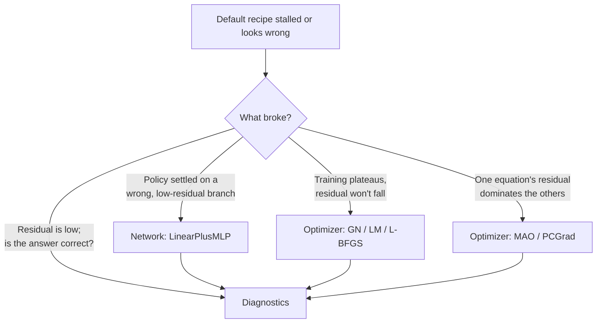

# Method Zoo

A run is defined by four independent choices: how the parameters are stepped
(*optimizer*), how the decision rule &pi;(s) is parameterized (*network*), how
the expectation over next-period shocks is taken and the residual scored
(*expectation & loss*), and how the answer is checked (*diagnostics*). This page
lists all of them. On a new model you rarely need more than the default recipe;
the other options are for specific failures.

!!! tip "Default recipe"
    - `network = mlp`
    - `optimizer = adam`
    - `expectation = mc` (antithetic)
    - `loss = mse`

    This is the validated stack, exercised by the test suite and the
    [gallery](../gallery/index.md) (which has measured certificates). Train it
    and look at the errREE distribution on the ergodic path. If the relative
    Euler errors are small, you do not need the rest of this page.

---

## If the default stalls

Each symptom below has one suggested intervention. Choose by what went wrong,
not by browsing the optimizer list.


```mermaid
flowchart TD
    A[Default recipe stalled or looks wrong] --> B{What broke?}
    B -->|"Policy settled on a<br/>wrong, low-residual branch"| C[Network: LinearPlusMLP]
    B -->|"Training plateaus,<br/>residual won't fall"| D[Optimizer: GN / LM / L-BFGS]
    B -->|"One equation's residual<br/>dominates the others"| E[Optimizer: MAO / PCGrad]
    B -->|"Residual is low;<br/>is the answer correct?"| F[Diagnostics]
    C --> F
    D --> F
    E --> F
```

- Wrong fixed point: use LinearPlusMLP. A bare network can converge to a
  wrong equilibrium with a low residual, where the residual is small but the
  policy is wrong. `network.type=linear_plus_mlp` starts the policy at the
  Blanchard-Kahn linear solution (a zero-initialized correction on top of the
  first-order rule), so training starts from a correct local floor. See the
  [network cabinet](#cabinet-network).
- Training stalls: use a Newton-style solver. A plateaued residual usually
  points to curvature rather than step size. The Gauss-Newton and
  Levenberg-Marquardt methods familiar from GMM and MLE estimation apply here to
  the equilibrium residuals: `gn` / `lm` converge quadratically near a solution,
  and `lbfgs` also runs the steady-state warm start. See the
  [optimizer cabinet](#cabinet-optimizer).
- One equation dominates: use MAO or PCGrad. In a multi-equation system one
  residual can dominate the gradient and stall progress on the others. `mao`
  keeps a separate Adam moment per equation; `gradient_surgery: pcgrad`
  projects conflicting per-equation gradients off each other before summing.
  Both were built for systems like the 11-equation disaster model. See the
  [optimizer cabinet](#cabinet-optimizer).
- Checking the answer: diagnostics. A low residual is necessary but not
  sufficient; residual minimization can converge to wrong answers. Before
  trusting a policy, run errREE (the accuracy figure to report), the stability
  check (bounds, drift and NaN gate), and the Dynare Jacobian match (the policy
  slope at SS against the BK matrix). See the
  [diagnostic cabinet](#cabinet-diagnostic).

!!! warning "Limits"
    A low residual does not identify the right equilibrium: training can settle
    on the wrong branch, nothing here enforces equilibrium selection, and BK is
    only a local determinacy criterion. Accuracy is measured (the errREE
    distribution), not bounded analytically. The validated stack is `adam` +
    `mlp` (or `linear_plus_mlp`) + `mse` + antithetic `mc` (or Gauss-Hermite);
    everything else on this page is a research instrument.

??? note "Deep-learning optimizers you can usually ignore"
    `muon`, `shampoo` and `ngd` are deep-learning optimizers included for
    completeness and ablation: orthogonalized-update, Kronecker-factored and
    diagonal-Fisher variants respectively. They are useful for stress-testing the
    trainer, but a typical macro model does not need them, and the guide above
    does not point to them. If `adam` stalls, the fix is usually a better network
    (LinearPlusMLP) or a Newton-style solver (GN/LM), not a different
    first-order optimizer.

---

## The reference cabinets

The four sections below list the current options. The registries are the
authoritative lists:

```bash
uv run deqn-jax optimizers   # the 9 registered optimizers
uv run deqn-jax list         # the registered models
```

Status tags: **validated** items are exercised by the test suite and the
gallery on a working model; **experimental** items work but are lightly tested
or model-specific; **research probe** items are analyses in `docs/dev/`, not
packaged API.

<h3 id="cabinet-optimizer">Cabinet 1 -- Optimizers</h3>

??? abstract "Optimizers: the parameter-update rule (`--set optimizer.name=<name>`)"
    Each name maps to one of four train-step variants (how gradients are formed
    before the update), dispatched once at construction, outside JIT.

    | Optimizer | Variant | Status | When to use it |
    |---|---|---|---|
    | `adam` | STANDARD | validated | The default. Change only if it stalls. |
    | `muon` | STANDARD | experimental | Newton-Schulz orthogonalized updates. (Deep-learning optimizer, see note above.) |
    | `ngd` | STANDARD | experimental | Diagonal-Fisher natural gradient. (Deep-learning optimizer, see note above.) |
    | `shampoo` | STANDARD | experimental | Kronecker-factored second-order. (Deep-learning optimizer, see note above.) |
    | `mao` | MAO | experimental | Multi-equation models. A separate Adam moment per equation, so one equation cannot dominate the others; built for the 11-equation disaster system. |
    | `lbfgs` | LBFGS | experimental | Quasi-Newton with line search; for near-deterministic residuals. Also runs the steady-state warm start. |
    | `gn` | GN | experimental | Dense Gauss-Newton (H&asymp;J&#7488;J). Quadratic convergence near a solution; a polish step. |
    | `ign` | GN | experimental | Matrix-free implicit Gauss-Newton via conjugate gradients. |
    | `lm` | GN | experimental | Levenberg-Marquardt: damped Gauss-Newton, the most robust GN variant. |

    Gradient surgery is independent of the choice above. PCGrad projects
    conflicting per-equation gradients off each other before summing. It wraps
    any STANDARD optimizer: `gradient_surgery: pcgrad` (experimental). Use it on
    multi-equation models where equations pull the policy in different
    directions.

    > In economics terms, the optimizer is how the approximation's coefficients
    > are solved for: the inner solve of a projection method. Adam is the
    > workhorse; the GN/LM family is the Newton-style polish of a deterministic
    > solver.

<h3 id="cabinet-network">Cabinet 2 -- Networks</h3>

??? abstract "Networks: the decision-rule basis (`network.type`)"
    The network parameterizes the decision rule, the role Chebyshev polynomials
    or splines play in a projection method.

    | Network | `network.type` | Status | When to use it |
    |---|---|---|---|
    | MLP | `mlp` | validated | The default basis for any Markov policy. |
    | LinearPlusMLP | `linear_plus_mlp` | validated | The standard fix for degenerate basins. Policy = Blanchard-Kahn linear rule + a zero-initialized MLP correction. At init the policy equals the BK solution, so training starts from a correct first-order floor. Use it when a bare MLP converges to a wrong, low-residual fixed point. |
    | LSTM | `lstm` | experimental | History-dependent policies: a window of past states. |
    | Transformer | `transformer` | experimental | Same history window, with attention instead of recurrence. |
    | DisasterPolicyNet | `disaster_policy_net` | experimental | LinearPlusMLP plus model-specific shape priors for CMR-style NK-DSGE (ZLB kink feature, Calvo reparameterizations, K/F gauge mask). Specific to the disaster model, not general-purpose. |
    | RSS market-clearing net | `rss_market_clearing_net` | model-specific | The `rss_trade_ez_ref` policy network: a tanh ansatz plus a bounded MLP correction with the world-bond clearing projection, kept for checkpoint parity with the reference solution. Not general-purpose. |

    `linear_plus_mlp` adds a BK floor to `mlp`, and `disaster_policy_net` adds
    model-specific priors to `linear_plus_mlp`.

    See [LinearPlusMLP](../networks/linear_plus_mlp.md) for the residual-ansatz math.

<h3 id="cabinet-loss">Cabinet 3 -- Expectation & loss</h3>

??? abstract "Expectation and loss: three independent config settings"
    These combine freely, with the documented exclusions.

    **(a) Expectation over shocks: `expectation_type`**

    | Method | value | Status | When to use it |
    |---|---|---|---|
    | Monte Carlo (antithetic) | `mc` | validated | The default. Each &epsilon; is paired with -&epsilon; for variance reduction; scales to many shock dimensions. |
    | Gauss-Hermite quadrature | `gauss_hermite` | validated | Deterministic tensor-product nodes (cost `n_points^n_shocks`); a noise-free expectation when there are few shocks. Used in the IRBC notebook. |
    | Discrete Markov | `discrete` | experimental | Exact enumeration over a finite chain (needs `model.transition_matrix` and `model.z_state_idx`). |

    **(b) Residual aggregation: `loss_choice`**

    | Aggregation | value | Status | When to use it |
    |---|---|---|---|
    | MSE | `mse` | validated | The default: square the shock-mean residual `(E[r])^2`. |
    | Huber | `huber` | validated | Caps the gradient at &plusmn;`huber_delta` when rare pathological states dominate. |
    | AiO (all-in-one) | `aio` | experimental | Maliar-Maliar-Winant unbiased estimator; removes the `Var(r-bar)/N` bias of MSE at small `mc_samples`. Requires `expectation_type=mc` and `mc_samples>=2`. Per-equation losses can be transiently negative, so use `loss_reweight=none`. |

    **(c) Loss structure: `loss_type`**

    | Structure | value | Status | When to use it |
    |---|---|---|---|
    | Plain residual | `mse` | validated | The equilibrium residuals only. The default. |
    | Composite | `composite` | experimental | Adds anchor, Jacobian-match, barrier and Newton auxiliary terms to the residual for stiff models. See [Composite loss](../training/composite_loss.md). |

    Occasionally-binding constraints (irreversibility, borrowing limits, labor
    caps, the ZLB) enter the residual as Fischer-Burmeister complementarity
    terms. They are solved globally and need no special handling in the
    optimizer or the loss. Two-stage (nested) expectations, for models that
    define `combine_fn`/`inside_fn`, are wired automatically (experimental).
    Adaptive reweighting (`lr_annealing`, `relobralo`) balances multi-equation
    losses. Any term whose key starts with `aux_` is excluded from reweighting
    and gradient surgery.

    > In economics terms, the loss is the Euler, FOC or market-clearing error,
    > and the expectation is the quadrature or Monte Carlo integration over
    > next-period shocks that any global solver performs.

<h3 id="cabinet-diagnostic">Cabinet 4 -- Diagnostics</h3>

??? abstract "Diagnostics: checks beyond a low residual"
    These tools test whether a solved policy is correct. Several were added
    after residual minimization was observed converging to wrong answers.

    | Diagnostic | Where | Status | What it tells you |
    |---|---|---|---|
    | errREE (relative Euler errors) | `evaluate/diagnostics.py: euler_equation_errors` | validated | The standard accuracy metric (Azinovic et al. 2022): the `log10|residual|` distribution on a long ergodic path. This is the figure to report. |
    | Market-clearing errors | `evaluate/diagnostics.py: market_clearing_errors` | validated | Resource-constraint violation along the path; a feasibility check independent of the Euler residual. |
    | Simulated moments | `evaluate/diagnostics.py: simulated_moments` | validated | Ergodic means and standard deviations against a reference. Detects a policy that ignores the state. |
    | Stability check | `evaluate/diagnostics.py: stability_check` | validated | Flags policies pinned to bounds, states drifting from SS, and NaNs. A fast pass/fail gate. |
    | Dynare Jacobian match | `evaluate/dynare.py` | validated | Frobenius distance between the network's policy slope at SS and the Dynare/BK matrix `P`. |
    | Ergodic replay buffer | `training/replay.py` | experimental | A prioritized ring buffer that keeps rare-event branches (ZLB, disaster) in the training data. A training mechanism, not a metric. |
    | Bias floor (MSE vs AiO) | dev analysis (`docs/dev/aio_loss_estimator.md`) | research probe | Estimates the Monte Carlo bias floor without ground truth. A write-up and probe, not shipped API. |

    !!! note "The bias-floor probe is not packaged"
        The bias-floor estimator is an analysis in `docs/dev/`, not a stable
        API. To use it, read the dev note and run it by hand.

??? quote "Lineage & attribution"
    DEQN-JAX is a JAX/Equinox reimplementation of the Deep Equilibrium Nets
    method of Azinovic, Gaegauf & Scheidegger (2022), building on the
    all-in-one / deep-learning Euler-error line of Maliar, Maliar & Winant. The
    method, the accuracy metric (errREE) and the linear-anchor idea are theirs;
    this repository contributes the trainer, the optimizer and network options,
    and the model library. See the [home page](../index.md) for full references.
