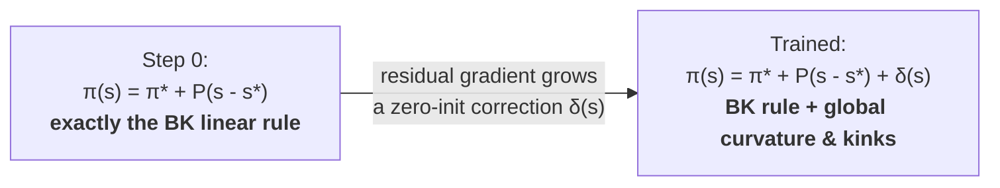

# LinearPlusMLP

**The policy starts life *as* your Blanchard–Kahn solution.** `linear_plus_mlp`
parameterizes the decision rule as a first-order linear rule plus a
zero-initialized neural correction — so at training step 0 the policy *is* the
BK linearization, and gradient descent can only bend it away from there to the
extent that doing so lowers the equilibrium residual. A correct first-order
floor you can only improve on.

!!! success "Validated (`v0.2.0`) — the canonical fix when a bare MLP collapses to a wrong, low-residual fixed point."



## Why an economist reaches for it

<div class="grid cards" markdown>

-   :material-vector-line:{ .lg .middle } __At init, the policy *is* the BK solution__

    ---

    `policy = ss + P·(s − ss) + δ(s)`, with the MLP's final layer scaled to
    zero. So `δ ≡ 0` at step 0 and the rule is **exactly** your first-order
    perturbation — the same first-order object Dynare's `stoch_simul order=1`
    reports.

-   :material-trending-up:{ .lg .middle } __Training improves on a first-order floor__

    ---

    The network inherits the linear rule's first-order correctness as a
    **local floor**. The correction starts at zero and grows only where the true
    global policy departs from linear — curvature and occasionally-binding
    kinks. Near the steady state it can help, not hurt.

-   :material-vector-link:{ .lg .middle } __Linearization computed in-framework, via QZ__

    ---

    `P` comes from an in-house QZ (generalized Schur) solve of the linearized
    rational-expectations system — **the same first-order object Dynare
    produces**. You can import a Dynare solution, but you don't need to: a
    working `steady_state_fn` is enough.

-   :material-target:{ .lg .middle } __The fix for the wrong-branch collapse__

    ---

    A bare MLP on equilibrium residuals can settle on a degenerate, low-residual
    manifold (the residual is set-identifying, not point-identifying). The BK
    ansatz drops you in the correct *local* basin; the correction has to grow
    large to leave it, which never happens spontaneously.

</div>

## When to reach for it — and when not

=== "Reach for it"

    - A bare `mlp` converges to a **wrong, low-residual** policy — the residual is small but the dynamics are nonsense.
    - Medium-scale DSGE where you already trust a first-order Dynare/perturbation solution and want to **extend it globally**, keeping the kinks.
    - Any model with a tractable steady state where you want training anchored to a known-correct local rule rather than random init.

=== "Reach for something else"

    - **Brock–Mirman / simple RBC** — a bare `mlp` is fine; no wrong-attractor pathology to cure. (See [Method Zoo](../method-zoo/index.md).)
    - **No tractable `steady_state_fn`** — the linearizer needs steady-state values to produce `P`; supply an analytical or numerical SS first.
    - **Model fails the Blanchard–Kahn rank condition** — there is no first-order rule to anchor against; the linearizer raises. Reformulate.

!!! warning "The floor is *local*. Global equilibrium selection is not guaranteed."
    The BK anchor is a **local/linear** determinacy object. It places you in the
    correct *local* basin — it does **not** enforce *global* equilibrium
    selection. Like any nonlinear global solver, the trained policy can still
    settle on a wrong **branch**; a low residual is necessary but **not
    sufficient**. This is multiplicity/**selection** — there is no global
    analogue of the local, linear Blanchard–Kahn saddle-path condition, so it is
    emphatically *not* "Blanchard–Kahn selection." Always confirm with the
    [diagnostic cabinet](../method-zoo/index.md#cabinet-diagnostic): errREE, the
    stability check, and the Dynare-Jacobian match.

## Configure it

```yaml
network:
  type: linear_plus_mlp
  hidden_sizes: [128, 128]
  activation: tanh
  init_scale: 0.0       # 0.0 = exact BK linear rule at init (default);
                        # 0.01 = small random perturbation around it
```

The only two knobs specific to this network are `init_scale` (how exactly the
correction starts at zero) and `output_links` (additive vs. multiplicative
correction). Everything else — optimizer, loss, expectation — is the standard
[validated stack](../method-zoo/index.md): `adam` + `mse` + antithetic `mc`.

??? abstract "`output_links`: additive (`linear`) vs. multiplicative (`log`) correction"
    Per-policy parameterization of how the MLP correction enters. Length must
    equal `n_policies`.

    | link | rule | use when |
    |---|---|---|
    | `linear` *(default)* | `π_i = ss_i + P_i·(s − ss) + δ_i(s)` | level deviations; the legacy/all-purpose default |
    | `log` | `π_i = ss_i · exp(P_iˡᵒᵍ·(s − ss) + δ_i(s))` | strictly-positive policies; bakes in positivity, the natural form for **log-deviations-from-SS**, the standard DSGE convention (cf. Dynare's log-linearized solutions). Requires `ss_i > 0`. |

    Both forms reduce to `ss_i` exactly at `s = ss` and at init (`init_scale=0`).
    The BK row `P` is delta-method–converted to log space (`Pˡᵒᵍ = P / ss`)
    inside the factory. If unset, the model's `default_output_links` is used, else
    all-`linear`.

    ```yaml
    network:
      type: linear_plus_mlp
      output_links: [log, log, linear]   # one entry per policy
    ```

??? abstract "The math: a residual ansatz over the first-order rule"
    The decision rule is parameterized as a linear baseline plus a learned
    correction:

    $$
    \pi_\theta(s) \;=\; \underbrace{\pi^* + P\,(s - s^*)}_{\text{BK first-order rule}} \;+\; \underbrace{\delta_\theta(s)}_{\text{MLP correction}}
    $$

    The first term is the textbook Blanchard–Kahn linear policy: steady-state
    values plus a linear rule in the state, with `P` from the QZ solve. The
    second is an MLP whose **final layer is zero-initialized**
    (`init_scale=0`), so $\delta_\theta(s) = 0$ for every state at step 0 — the
    policy is *exactly* the BK rule.

    Training grows $\delta_\theta$ to capture what the linear rule misses.
    Taylor-expanding the true policy around the steady state:

    $$
    \pi^*(s) - \pi_{\text{BK}}(s) \;=\; \tfrac{1}{2}(s - s^*)^\top H (s - s^*) \;+\; \mathcal{O}(\|s - s^*\|^3) \;+\; (\text{boundary kinks})
    $$

    — second-order curvature, higher-order terms, and the
    occasionally-binding kinks perturbation linearizes away. The correction
    starts with no work to do, and the residual gradient grows it only in the
    directions where the global policy departs from linear.

??? abstract "Initialization, in detail"
    At step 0 with `init_scale: 0.0`:

    - final-layer weights $W_n = 0$ (exactly), bias $b_n = 0$;
    - so $\delta_\theta(s) = W_n\,h(s) + b_n = 0$ for every state $s$;
    - so $\pi(s) = \pi^* + P(s - s^*)$ exactly — the BK linear rule.

    The gradient $\partial\delta/\partial W_n = h(s)$ is **non-zero** even though
    $\delta$ is zero: the hidden layers compute random (Xavier-init) features
    $h(s)$, so the first gradient step is a kernel-regression update on those
    features. Earlier layers only start moving once $W_n \neq 0$ (step 2+). The
    network warms in safely from the BK basin. The linearization constants
    (`P`, `ss_state`, `ss_policy`) are fixed throughout training — frozen
    architecture, not trainable parameters.

??? abstract "Disaster-style shape priors (K/F gauge, ELB feature) live one layer up"
    `kf_names`, `use_zlb_feature`, and the q-as-M / Calvo reparameterizations are
    **not** knobs of the generic `linear_plus_mlp` — the factory routes them only
    to **`disaster_policy_net`** (experimental), the CMR-NK superset that layers
    model-specific priors on this core:

    - **`kf_names`** — mask the MLP correction to zero on Calvo discounted-sum
      auxiliaries (`F_p`, `K_p`, `F_w`, `K_w`), which carry first-order gauge
      freedom in the residual loss; those outputs stay exactly $\pi^*_i + P_i(s-s^*)$.
    - **`use_zlb_feature`** — prepend an effective-lower-bound regime feature so
      the correction can learn an ELB-regime-dependent shape.

    For a CMR-style NK-DSGE, use `network.type: disaster_policy_net`. For
    everything else, the generic `linear_plus_mlp` is the right tool. See the
    [Network cabinet](../method-zoo/index.md#cabinet-network) for the lineage
    `mlp → linear_plus_mlp → disaster_policy_net`.

??? abstract "Composes with"
    - **Composite loss** (`loss_type: composite`, experimental) — adds anchor +
      Jacobian + barrier + Newton auxiliary terms. The anchor term softly holds
      $\pi$ near the linearization at SS-adjacent points; redundant by
      construction near SS for a zero-init correction, but useful during
      curriculum-driven exploration. See [Composite loss](../training/composite_loss.md).
    - **Moment matching** (`moment_matching.enabled: true`, experimental) — a
      *separate, independent* supervised loss against Dynare ergodic moments/IRFs
      (supplied as CSVs). It anchors the trained policy's long-run distribution to
      a reference solve. Composes with this network but is not required by it.

??? abstract "Source"
    - `src/deqn_jax/networks/linear_plus_mlp.py` — the `LinearPlusMLP` module and `create_linear_plus_mlp` factory (model-agnostic).
    - `src/deqn_jax/training/linearize.py` — `linearize_model(model)` returns `(P, Q)` via QZ (`scipy.linalg.ordqz`) for any model with a `steady_state_fn`.
    - `src/deqn_jax/networks/factory.py` — `network.type` dispatch.
    - `tests/test_linear_plus_mlp.py` — tests.

---

*DEQN-JAX is a JAX/Equinox reimplementation of the Deep Equilibrium Nets method
of Azinovic, Gaegauf & Scheidegger (2022); the linear-anchor idea is theirs.
See the [home page](../index.md) for full references.*

