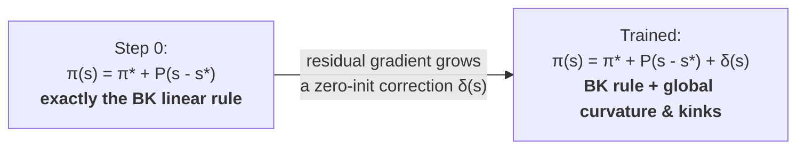

# LinearPlusMLP

`linear_plus_mlp` parameterizes the decision rule as a first-order linear rule
plus a zero-initialized neural correction. At training step 0 the policy equals
the Blanchard-Kahn linearization. Gradient descent moves it away from that rule
only as far as doing so lowers the equilibrium residual.

It is part of the validated stack and is the standard fix when a bare MLP
converges to a wrong, low-residual fixed point.


```mermaid
flowchart LR
    INIT["Step 0:<br/>&pi;(s) = &pi;* + P(s - s*)<br/><b>exactly the BK linear rule</b>"]
    INIT -->|"residual gradient grows<br/>a zero-init correction &delta;(s)"| TRAINED["Trained:<br/>&pi;(s) = &pi;* + P(s - s*) + &delta;(s)<br/><b>BK rule + global curvature & kinks</b>"]
```

## Properties

- At initialization the policy is the BK solution.
  `policy = ss + P·(s − ss) + δ(s)`, with the MLP's final layer scaled to
  zero. So `δ ≡ 0` at step 0 and the rule is exactly the first-order
  perturbation, the same object Dynare's `stoch_simul order=1` reports.
- Training starts from a first-order floor. The network inherits the linear
  rule's first-order accuracy as a local floor. The correction starts at zero
  and grows only where the global policy departs from linear: curvature and
  occasionally-binding kinks. Near the steady state it does not make the policy
  worse.
- The linearization is computed in-framework, via QZ. `P` comes from a QZ
  (generalized Schur) solve of the linearized rational-expectations system,
  the same first-order object Dynare produces. Importing a Dynare solution is
  possible but not required; a working `steady_state_fn` is enough.
- It addresses wrong-branch convergence. A bare MLP trained on equilibrium
  residuals can settle on a degenerate, low-residual manifold, because the
  residual is set-identifying rather than point-identifying. The BK ansatz
  starts training in the correct local basin. Leaving it would require the
  correction to grow large, which does not happen spontaneously.

## When to use it

=== "Use it"

    - A bare `mlp` converges to a wrong, low-residual policy: the residual is small but the dynamics are wrong.
    - A medium-scale DSGE where you already trust a first-order Dynare/perturbation solution and want to extend it globally, keeping the kinks.
    - Any model with a tractable steady state where you want training anchored to a correct local rule rather than a random initialization.

=== "Use something else"

    - Brock–Mirman or a simple RBC: a bare `mlp` works and there is no wrong attractor to avoid. (See [Method Zoo](../method-zoo/index.md).)
    - No tractable `steady_state_fn`: the linearizer needs steady-state values to produce `P`. Supply an analytical or numerical SS first.
    - The model fails the Blanchard–Kahn rank condition: there is no first-order rule to anchor to, and the linearizer raises. Reformulate the model.

!!! warning "The floor is local; global equilibrium selection is not guaranteed"
    The BK anchor is a local, linear determinacy object. It places training in
    the correct local basin but does not enforce global equilibrium selection.
    Like any nonlinear global solver, the trained policy can still settle on a
    wrong branch, and a low residual is necessary but not sufficient. This is a
    multiplicity (selection) problem. There is no global analogue of the local,
    linear Blanchard–Kahn saddle-path condition, so this is not
    "Blanchard–Kahn selection". Always confirm with the
    [diagnostic cabinet](../method-zoo/index.md#cabinet-diagnostic): errREE, the
    stability check, and the Dynare Jacobian match.

## Configure it

```yaml
network:
  type: linear_plus_mlp
  hidden_sizes: [128, 128]
  activation: tanh
  init_scale: 0.0       # 0.0 = exact BK linear rule at init (default);
                        # 0.01 = small random perturbation around it
```

Two settings are specific to this network: `init_scale` (how exactly the
correction starts at zero) and `output_links` (additive or multiplicative
correction). Everything else uses the
[validated stack](../method-zoo/index.md): `adam` + `mse` + antithetic `mc`.

??? abstract "`output_links`: additive (`linear`) vs. multiplicative (`log`) correction"
    Sets, per policy, how the MLP correction enters. The length must equal
    `n_policies`.

    | link | rule | use when |
    |---|---|---|
    | `linear` *(default)* | `π_i = ss_i + P_i·(s − ss) + δ_i(s)` | level deviations; the general-purpose default |
    | `log` | `π_i = ss_i · exp(P_iˡᵒᵍ·(s − ss) + δ_i(s))` | strictly positive policies. Enforces positivity and matches log-deviations from SS, the standard DSGE convention (cf. Dynare's log-linearized solutions). Requires `ss_i > 0`. |

    Both forms reduce to `ss_i` exactly at `s = ss` and at init (`init_scale=0`).
    The factory converts the BK row `P` to log space by the delta method
    (`Pˡᵒᵍ = P / ss`). If unset, the model's `default_output_links` is used,
    otherwise all `linear`.

    ```yaml
    network:
      type: linear_plus_mlp
      output_links: [log, log, linear]   # one entry per policy
    ```

??? abstract "The math: a residual ansatz over the first-order rule"
    The decision rule is a linear baseline plus a learned correction:

    $$
    \pi_\theta(s) \;=\; \underbrace{\pi^* + P\,(s - s^*)}_{\text{BK first-order rule}} \;+\; \underbrace{\delta_\theta(s)}_{\text{MLP correction}}
    $$

    The first term is the Blanchard–Kahn linear policy: steady-state values plus
    a linear rule in the state, with `P` from the QZ solve. The second is an MLP
    whose final layer is zero-initialized (`init_scale=0`), so
    $\delta_\theta(s) = 0$ for every state at step 0 and the policy is exactly
    the BK rule.

    Training grows $\delta_\theta$ to capture what the linear rule misses.
    Taylor-expanding the true policy around the steady state:

    $$
    \pi^*(s) - \pi_{\text{BK}}(s) \;=\; \tfrac{1}{2}(s - s^*)^\top H (s - s^*) \;+\; \mathcal{O}(\|s - s^*\|^3) \;+\; (\text{boundary kinks})
    $$

    That is, second-order curvature, higher-order terms, and the
    occasionally-binding kinks that perturbation linearizes away. The correction
    starts at zero, and the residual gradient grows it only in directions where
    the global policy departs from linear.

??? abstract "Initialization, in detail"
    At step 0 with `init_scale: 0.0`:

    - final-layer weights $W_n = 0$ (exactly), bias $b_n = 0$;
    - so $\delta_\theta(s) = W_n\,h(s) + b_n = 0$ for every state $s$;
    - so $\pi(s) = \pi^* + P(s - s^*)$ exactly, the BK linear rule.

    The gradient $\partial\delta/\partial W_n = h(s)$ is non-zero even though
    $\delta$ is zero: the hidden layers compute random (Xavier-init) features
    $h(s)$, so the first gradient step is a kernel-regression update on those
    features. Earlier layers start moving only once $W_n \neq 0$ (step 2 and
    later), so the network leaves the BK basin gradually. The linearization
    constants (`P`, `ss_state`, `ss_policy`) are fixed throughout training; they
    are part of the architecture, not trainable parameters.

??? abstract "Disaster-style shape priors (K/F gauge, ELB feature) live in `disaster_policy_net`"
    `kf_names`, `use_zlb_feature`, and the q-as-M / Calvo reparameterizations
    are not settings of the generic `linear_plus_mlp`. The factory passes them
    only to `disaster_policy_net` (experimental), the CMR-NK network that adds
    model-specific priors on top of this one:

    - `kf_names`: mask the MLP correction to zero on the Calvo discounted-sum
      auxiliaries (`F_p`, `K_p`, `F_w`, `K_w`), which carry first-order gauge
      freedom in the residual loss. Those outputs stay exactly
      $\pi^*_i + P_i(s-s^*)$.
    - `use_zlb_feature`: prepend an effective-lower-bound regime feature so the
      correction can learn a shape that depends on the ELB regime.

    For a CMR-style NK-DSGE, use `network.type: disaster_policy_net`. For other
    models, use the generic `linear_plus_mlp`. See the
    [Network cabinet](../method-zoo/index.md#cabinet-network) for how `mlp`,
    `linear_plus_mlp` and `disaster_policy_net` build on each other.

??? abstract "Composes with"
    - Composite loss (`loss_type: composite`, experimental) adds anchor,
      Jacobian, barrier and Newton auxiliary terms. The anchor term softly holds
      $\pi$ near the linearization at points near SS. With a zero-init
      correction it is redundant near SS, but it helps during curriculum-driven
      exploration. See [Composite loss](../training/composite_loss.md).
    - Moment matching (`moment_matching.enabled: true`, experimental) is a
      separate supervised loss against Dynare ergodic moments or IRFs, supplied
      as CSVs. It anchors the trained policy's long-run distribution to a
      reference solve. It works with this network but is not required by it.

??? abstract "Source"
    - `src/deqn_jax/networks/linear_plus_mlp.py`: the `LinearPlusMLP` module and the `create_linear_plus_mlp` factory (model-agnostic).
    - `src/deqn_jax/training/linearize.py`: `linearize_model(model)` returns `(P, Q)` via QZ (`scipy.linalg.ordqz`) for any model with a `steady_state_fn`.
    - `src/deqn_jax/networks/factory.py`: `network.type` dispatch.
    - `tests/test_linear_plus_mlp.py`: tests.

---

*DEQN-JAX is a JAX/Equinox reimplementation of the Deep Equilibrium Nets method
of Azinovic, Gaegauf & Scheidegger (2022); the linear-anchor idea is theirs.
See the [home page](../index.md) for full references.*
