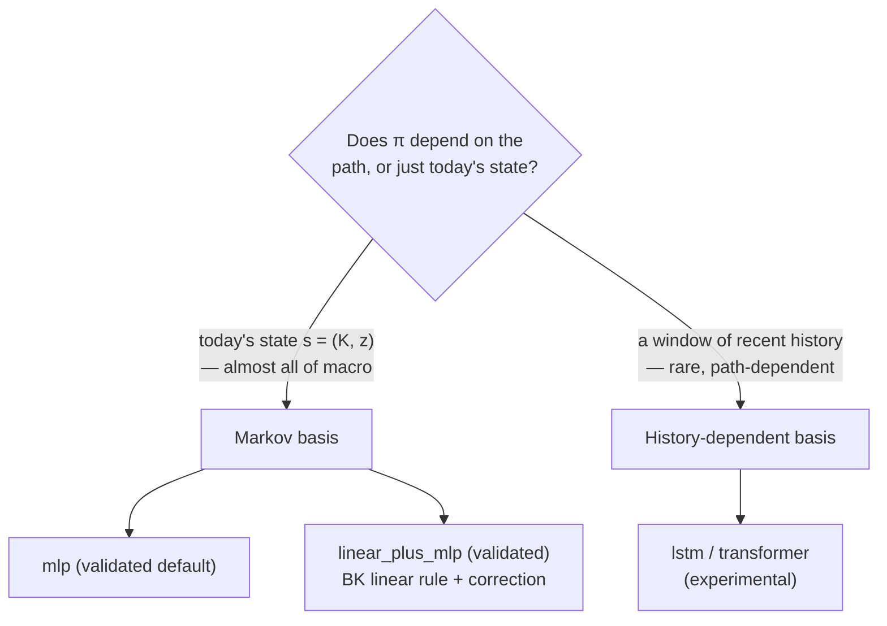

# Networks: choosing the decision-rule basis

The network **is your approximation family for the decision rule &pi;(s)** — the
role Chebyshev polynomials or splines play in a projection method. Picking one is
not a deep-learning decision; it is the same modeling choice you already make
when you decide *what functions your policy is allowed to be*.

!!! tip "The whole decision, in one line"
    Is your policy a function of **today's state** (Markov) or of a **window of
    recent history**? Markov is almost everything in macro — and the **validated
    default is `mlp`**. Reach for a sequence network only when the policy
    genuinely depends on the path, not just the point.



## The Markov choice (start here)

A Markov policy maps **today's state to today's controls** — `&pi;(s)` &rarr;
savings, consumption, labor, prices. This is the recursive-equilibrium setup
behind almost every DSGE, RBC, and projection-method model you have written.

<div class="grid cards" markdown>

-   :material-vector-square:{ .lg .middle } __MLP — the validated default__

    ---

    A flexible global approximator of &pi;(s), bounded to the policy's admissible
    range. This is the basis the test suite and the gallery exercise. **For any
    Markov policy, start here and don't look further unless something concrete
    breaks.**

    ```yaml
    network:
      type: mlp
      hidden_sizes: [128, 128]
      activation: tanh
    ```

-   :material-vector-line:{ .lg .middle } __LinearPlusMLP — when the basin is wrong__

    ---

    Policy = **Blanchard–Kahn linear rule + a zero-initialized MLP correction**.
    At training step 0 the policy *is* the BK solution, so descent starts from a
    correct first-order floor. Reach for it when a bare MLP collapses to a wrong,
    low-residual fixed point.

    [:octicons-arrow-right-24: LinearPlusMLP](linear_plus_mlp.md)

</div>

!!! note "Both are validated; they share the same Markov interface"
    `mlp` and `linear_plus_mlp` are the two members of the **small validated
    stack**. They take the same state vector and return the same policy vector;
    `linear_plus_mlp` simply anchors the starting point to your first-order rule.
    For medium-scale DSGE where random init can land in the wrong attractor, it is
    the canonical fix — not a different category of object. It changes *where
    descent starts*, not *which equilibrium gets selected*: see the honest limits
    in the [Method Zoo](../method-zoo/index.md).

## The history-dependent choice (rare, experimental)

If — and only if — your policy depends on a **window of recent states**
`[H, n_states]` rather than the current point, the framework also offers two
sequence bases. These are **experimental**: they work and are wired end-to-end,
but they are lightly tested and outside the validated stack. Do not reach for
them unless the economics is genuinely path-dependent.

=== "LSTM (experimental)"

    A recurrent sequence policy: it consumes a history window and emits the
    current controls from the final hidden state.

    ```yaml
    network:
      type: lstm
      hidden_sizes: [64]
      history_len: 8
    ```

=== "Transformer (experimental)"

    Multi-head self-attention over the same history window — useful when the
    policy benefits from longer context than a recurrence carries cleanly.

    ```yaml
    network:
      type: transformer
      hidden_sizes: [64]
      history_len: 16
      n_heads: 4
    ```

!!! warning "Experimental — not part of the validated stack"
    The validated recipe is `adam` + `mlp` (or `linear_plus_mlp`) + `mse` +
    antithetic Monte-Carlo. `lstm` and `transformer` are research instruments for
    path-dependent policies, not turnkey recommendations. If you reach for one,
    treat the **errREE distribution on the ergodic path** as the only verdict that
    counts — and check it against a Markov baseline first.

## When to reach for each

| You have… | Use | Status |
|---|---|---|
| A recursive policy in today's state — almost all macro | `mlp` | validated |
| A medium-scale DSGE where a bare MLP lands in the wrong basin | `linear_plus_mlp` | validated |
| A genuinely **path-dependent** policy (a window of history) | `lstm` / `transformer` | experimental |
| A CMR-style NK-DSGE with model-specific shape priors | `disaster_policy_net` | experimental |

The canonical, current list always comes from the code:

```bash
uv run deqn-jax list   # registered models, to see which carry history
```

??? abstract "How Markov vs sequence dispatch works (reference)"
    There is **one** policy interface; the framework routes by input rank — an
    `ndim` check inside `compute_residuals` that resolves at trace time, so there
    is no per-step branching.

    - **Markov** networks take a state batch `[B, D]`.
    - **Sequence** networks take a history window `[B, H, D]`.

    Episode simulation builds and maintains the window transparently via
    `make_constant_history` (seed a window by tiling the current state) and
    `build_history_windows` (slice a simulated trajectory into overlapping
    windows), both in `training/history.py`. A network advertises its memory
    through a `history_len` attribute; `get_history_len` returns `1` for a
    Markov net, so the two paths share all downstream loss and expectation code.

??? abstract "The full network cabinet (reference)"
    The decision-rule basis is one of the four orthogonal choices in the
    [Method Zoo](../method-zoo/index.md#cabinet-network). The complete menu:

    | Network | `network.type` | Status |
    |---|---|---|
    | MLP | `mlp` | validated — the default basis |
    | LinearPlusMLP | `linear_plus_mlp` | validated — BK floor + correction |
    | LSTM | `lstm` | experimental — history window, recurrence |
    | Transformer | `transformer` | experimental — history window, attention |
    | DisasterPolicyNet | `disaster_policy_net` | experimental — LinearPlusMLP + CMR-specific priors |
    | KfAnchoredMLP | `kf_anchored_mlp` | legacy — superseded by `disaster_policy_net` |

    The lineage that matters: `mlp` &rarr; `linear_plus_mlp` (add a BK floor)
    &rarr; `disaster_policy_net` (add model-specific priors). Sequence nets sit on
    a separate axis — reach for them for *path dependence*, not for accuracy.

---

For the residual-ansatz math behind the canonical Markov upgrade, see
[LinearPlusMLP](linear_plus_mlp.md). For where the basis choice sits among
optimizers, expectations, and diagnostics, see the
[Method Zoo](../method-zoo/index.md).

