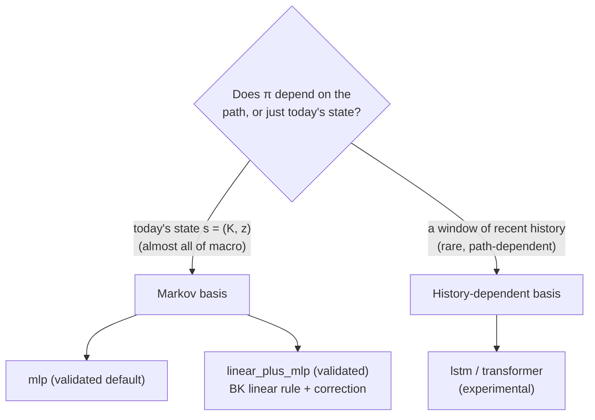

# Networks: choosing the decision-rule basis

The network is the approximation family for the decision rule &pi;(s), the role
Chebyshev polynomials or splines play in a projection method. Choosing one is
the usual modeling choice of which functions the policy may be.

!!! tip "Summary"
    Does the policy depend on today's state (Markov) or on a window of recent
    history? Almost all macro models are Markov, and the validated default is
    `mlp`. Use a sequence network only when the policy depends on the path, not
    only the current point.


```mermaid
flowchart TD
    Q{"Does &pi; depend on the<br/>path, or just today's state?"}
    Q -->|"today's state s = (K, z)<br/>(almost all of macro)"| M["Markov basis"]
    Q -->|"a window of recent history<br/>(rare, path-dependent)"| H["History-dependent basis"]
    M --> MLP["mlp  (validated default)"]
    M --> LPM["linear_plus_mlp  (validated)<br/>BK linear rule + correction"]
    H --> LSTM["lstm / transformer<br/>(experimental)"]
```

## The Markov choice (start here)

A Markov policy maps today's state to today's controls: `&pi;(s)` &rarr;
savings, consumption, labor, prices. This is the recursive-equilibrium setup of
most DSGE, RBC and projection-method models.

- `mlp` is the validated default: a flexible global approximator of &pi;(s),
  bounded to the policy's admissible range. The test suite and the gallery use
  it. For a Markov policy, start here and change only if something specific
  fails.

    ```yaml
    network:
      type: mlp
      hidden_sizes: [128, 128]
      activation: tanh
    ```

- `linear_plus_mlp` is for training that lands in a wrong basin. Policy =
  Blanchard-Kahn linear rule + a zero-initialized MLP correction. At training step 0 the policy equals the BK
  solution, so descent starts from a correct first-order floor. Use it when a
  bare MLP converges to a wrong, low-residual fixed point. See
  [LinearPlusMLP](linear_plus_mlp.md).

!!! note "Both are validated and share the Markov interface"
    `mlp` and `linear_plus_mlp` are the two networks in the validated stack.
    They take the same state vector and return the same policy vector;
    `linear_plus_mlp` sets the starting point to the first-order rule. For
    medium-scale DSGE models where random initialization can reach the wrong
    attractor, it is the standard fix. It changes where descent starts, not
    which equilibrium is selected; see the limits in the
    [Method Zoo](../method-zoo/index.md).

## The history-dependent choice (rare, experimental)

If the policy depends on a window of recent states `[H, n_states]` rather than
the current point, two sequence bases are available. They are experimental:
wired end to end, but lightly tested and outside the validated stack. Use them
only when the economics is path-dependent.

=== "LSTM (experimental)"

    A recurrent sequence policy. It reads a history window and emits the current
    controls from the final hidden state.

    ```yaml
    network:
      type: lstm
      hidden_sizes: [64]
      history_len: 8
    ```

=== "Transformer (experimental)"

    Multi-head self-attention over the same history window. Useful when the
    policy needs longer context than a recurrence handles well.

    ```yaml
    network:
      type: transformer
      hidden_sizes: [64]
      history_len: 16
      n_heads: 4
    ```

!!! warning "Not part of the validated stack"
    The validated recipe is `adam` + `mlp` (or `linear_plus_mlp`) + `mse` +
    antithetic Monte Carlo. `lstm` and `transformer` are research instruments
    for path-dependent policies. If you use one, judge it by the errREE
    distribution on the ergodic path, and compare against a Markov baseline
    first.

## When to use each

| You have… | Use | Status |
|---|---|---|
| A recursive policy in today's state (almost all macro) | `mlp` | validated |
| A medium-scale DSGE where a bare MLP lands in the wrong basin | `linear_plus_mlp` | validated |
| A path-dependent policy (a window of history) | `lstm` / `transformer` | experimental |
| A CMR-style NK-DSGE with model-specific shape priors | `disaster_policy_net` | experimental |

To see the registered models, and which carry history:

```bash
uv run deqn-jax list   # registered models, to see which carry history
```

??? abstract "How Markov vs sequence dispatch works (reference)"
    There is one policy interface. The framework routes by input rank with an
    `ndim` check inside `compute_residuals`, which resolves at trace time, so
    there is no per-step branching.

    - Markov networks take a state batch `[B, D]`.
    - Sequence networks take a history window `[B, H, D]`.

    Episode simulation builds and maintains the window with
    `make_constant_history` (seed a window by tiling the current state) and
    `build_history_windows` (slice a simulated trajectory into overlapping
    windows), both in `training/history.py`. A network declares its memory
    through a `history_len` attribute; `get_history_len` returns `1` for a
    Markov net, so both paths share the downstream loss and expectation code.

??? abstract "All network types (reference)"
    The decision-rule basis is one of the four choices in the
    [Method Zoo](../method-zoo/index.md#cabinet-network):

    | Network | `network.type` | Status |
    |---|---|---|
    | MLP | `mlp` | validated; the default basis |
    | LinearPlusMLP | `linear_plus_mlp` | validated; BK floor + correction |
    | LSTM | `lstm` | experimental; history window, recurrence |
    | Transformer | `transformer` | experimental; history window, attention |
    | DisasterPolicyNet | `disaster_policy_net` | experimental; LinearPlusMLP + CMR-specific priors |

    The progression is `mlp` &rarr; `linear_plus_mlp` (adds a BK floor)
    &rarr; `disaster_policy_net` (adds model-specific priors). Sequence nets
    are a separate choice, made for path dependence rather than accuracy.

---

For the residual-ansatz math, see [LinearPlusMLP](linear_plus_mlp.md). For how
the network choice relates to optimizers, expectations and diagnostics, see the
[Method Zoo](../method-zoo/index.md).
