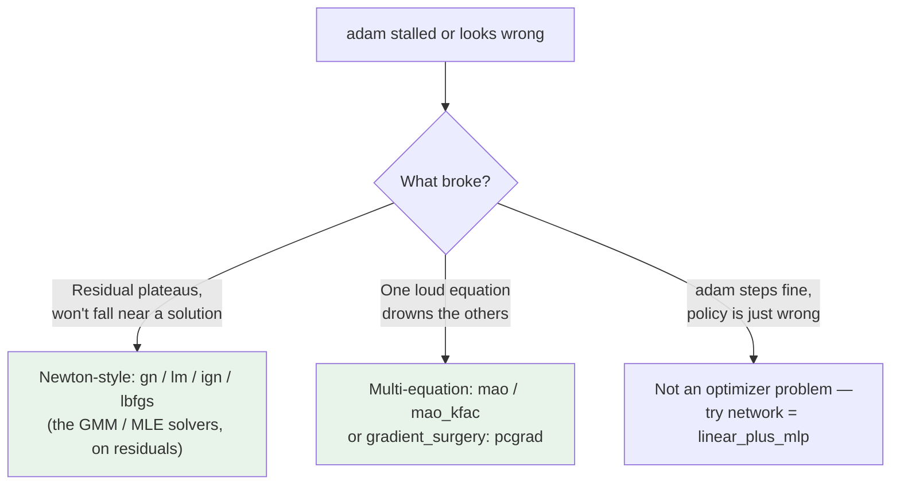

# Optimizers

How DEQN steps the network parameters to drive your equilibrium residuals to zero — the **inner solve** of the projection, in ML clothing. There are thirteen in the registry. **You need one of them.**

!!! tip "The short answer: use `adam`"
    `adam` is the default of the **validated stack** (`adam` + `mlp`/`linear_plus_mlp` + `mse` + antithetic `mc`). Start here, look at the **errREE** distribution on the ergodic path, and only reach into the rest of this page when something concrete breaks. The other twelve are research instruments — a lead when `adam` stalls, **not** a turnkey upgrade.



## The three tiers that matter

<div class="grid cards" markdown>

-   :material-check-decagram:{ .lg .middle } __Validated — reach here first__

    ---

    `adam`, `adamw`, `sgd`. First-order, exercised by the test suite and gallery on working models. **`adam` is the default**; `adamw` adds decoupled weight decay for a large net; `sgd` is for baselines and ablations.

-   :material-function-variant:{ .lg .middle } __Newton-style — the polish step__

    ---

    `gn`, `lm`, `ign`, `lbfgs`. The **Gauss–Newton / Levenberg–Marquardt / quasi-Newton solvers you know from GMM and MLE estimation**, applied to the equilibrium residuals. Quadratic convergence *near* a solution; reach for them when `adam` plateaus, not before. `lbfgs` also drives the steady-state warm-start. (experimental)

-   :material-scale-balance:{ .lg .middle } __Multi-equation — balance the system__

    ---

    `mao`, `mao_kfac`, and the orthogonal `gradient_surgery: pcgrad`. Built for systems like the 11-equation disaster model where one residual swamps the gradient and starves the rest. (experimental)

</div>

!!! warning "Deep-learning optimizers you can ignore: `lion`, `muon`, `shampoo`, `ngd`"
    These are sign-momentum, orthogonalized-update, Kronecker-factored, and diagonal-Fisher optimizers from the deep-learning literature. They are exposed for completeness and trainer stress-testing — on a typical macro model **you will not need them**, and the decision tree above never routes you here. If `adam` stalls, the fix is almost always a better *network* (`linear_plus_mlp`) or a *Newton-style* solver, not a fancier first-order step rule.

Use any optimizer with one flag:

```bash
deqn-jax train brock_mirman -o lm
# or, from a config:
deqn-jax train --config configs/disaster.yaml --set optimizer.name=mao
```

The canonical list always comes from the live registry — never trust a doc table over it:

```bash
uv run deqn-jax optimizers   # the 13 registered optimizers, live
```

## The full registry, one click deeper

??? abstract "All 13 optimizers — name, train-step variant, status, when to reach"
    Each name maps to one of **four train-step variants** (how gradients are formed before the update), dispatched once at construction, outside JIT. (A fifth step variant, PCGRAD, is *gradient surgery*, not a registered optimizer — see below.)

    | Optimizer | Variant | Status | When to reach for it |
    |---|---|---|---|
    | `adam` | STANDARD | **validated** | **The default.** Start here; only move if it stalls. |
    | `adamw` | STANDARD | **validated** | Adam with decoupled weight decay — mild regularization for a large net. |
    | `sgd` | STANDARD | **validated** | Baselines and ablations; rarely the production choice. |
    | `gn` | GN | Newton-style *(exp.)* | Dense Gauss–Newton (H&asymp;J&#7488;J). Quadratic convergence *near* a solution — a polish step. The estimation solver you know, on residuals. |
    | `lm` | GN | Newton-style *(exp.)* | Levenberg–Marquardt: damped Gauss–Newton, the robust GN member. |
    | `ign` | GN | Newton-style *(exp.)* | Matrix-free implicit Gauss–Newton: solves `(J&#7488;J + &lambda;I)&delta; = -J&#7488;r` by conjugate gradients on JVP/VJP products — GN without forming the dense Jacobian. |
    | `lbfgs` | LBFGS | Newton-style *(exp.)* | Quasi-Newton with line search; also the **steady-state warm-start engine**. |
    | `mao` | MAO | multi-eq *(exp.)* | **Multi-equation models.** A separate Adam moment per equation, so a loud equation can't drown a quiet one — built for the 11-equation disaster system. |
    | `mao_kfac` | MAO | multi-eq *(exp.)* | `mao` plus a shared-input Kronecker preconditioner. |
    | `lion` | STANDARD | DL — skip | Sign-momentum; cheaper state than Adam. Deep-learning optimizer; you won't need it. |
    | `muon` | STANDARD | DL — skip | Newton–Schulz orthogonalized updates. Deep-learning optimizer; you won't need it. |
    | `ngd` | STANDARD | DL — skip | Diagonal-Fisher natural gradient. Deep-learning optimizer; you won't need it. |
    | `shampoo` | STANDARD | DL — skip | Kronecker-factored second-order. Deep-learning optimizer; you won't need it. |

    > ML &harr; econ: "optimizer" is just *how you solve for the approximation's coefficients* — the inner solve of a projection method. `adam` is the workhorse; the `gn`/`lm`/`ign`/`lbfgs` family is the Newton-style polish from a deterministic estimation solver.

??? abstract "PCGrad — gradient surgery, orthogonal to the optimizer choice"
    PCGrad is **not** an optimizer; it's a per-equation gradient projection that wraps any STANDARD-variant optimizer:

    ```yaml
    optimizer:
      name: adam
    gradient_surgery: pcgrad
    ```

    Per-equation gradients are computed and conflicting ones projected off each other before summing. Reach for it on multi-equation models where equations pull the policy in competing directions — the same problem `mao` addresses, attacked at the gradient rather than the moment. Currently compatible only with STANDARD-variant optimizers. (experimental)

??? abstract "The five train-step variants — why the table has a 'Variant' column"
    The optimizer's variant determines how gradients are formed inside the single JIT'd train step, dispatched once at construction time. Four of the five are selected by the optimizer's registered kind; the fifth (PCGRAD) is selected by the `gradient_surgery` flag.

    - **STANDARD** — `jax.grad` of the scalar loss, then `opt.update`. (`adam`, `adamw`, `sgd`, `lion`, `muon`, `ngd`, `shampoo`)
    - **PCGRAD** — per-equation gradients with conflict projection, then a STANDARD update. (`gradient_surgery: pcgrad`)
    - **MAO** — per-equation Jacobian via `jax.jacrev`, then per-equation moment updates. (`mao`, `mao_kfac`)
    - **LBFGS** — `optax.lbfgs` with line search; needs value, grad, and a value function. (`lbfgs`)
    - **GN** — residual Jacobian `J`, update `= -(J&#7488;J)^{-1} J&#7488;r`. (`gn`, `ign`, `lm`)

    Full plumbing in the [Optimizers API reference](../api/optimizers.md).

---

The validated stack is deliberately small. Everything past `adam` on this page is a research instrument — start with the default, read the errREE distribution on the ergodic path, and let a concrete failure send you to the right cabinet. A low residual is **necessary but not sufficient**: if `adam` steps cleanly and the residual is small but the *policy* is wrong, that is an equilibrium-*selection* problem no optimizer fixes — try `network = linear_plus_mlp` to anchor on the first-order rule. The full swappable toolkit — networks, expectations, losses, diagnostics — lives in the **[Method Zoo](../method-zoo/index.md)**.

