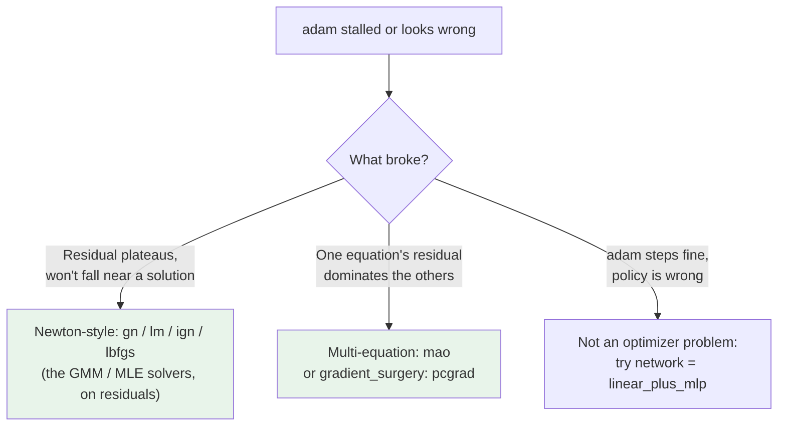

# Optimizers

The optimizer steps the network parameters to drive the equilibrium residuals
to zero; it is the inner solve of the projection. The registry has nine
optimizers, and most runs need only one.

!!! tip "Use `adam`"
    `adam` is the default of the validated stack (`adam` +
    `mlp`/`linear_plus_mlp` + `mse` + antithetic `mc`). Start with it, look at
    the errREE distribution on the ergodic path, and use the rest of this page
    only when something specific fails. The other eight are research
    instruments to try when `adam` stalls, not general upgrades.


```mermaid
flowchart TD
    A["adam stalled or looks wrong"] --> B{What broke?}
    B -->|"Residual plateaus,<br/>won't fall near a solution"| C["Newton-style: gn / lm / ign / lbfgs<br/>(the GMM / MLE solvers, on residuals)"]
    B -->|"One equation's residual<br/>dominates the others"| D["Multi-equation: mao<br/>or gradient_surgery: pcgrad"]
    B -->|"adam steps fine,<br/>policy is wrong"| E["Not an optimizer problem:<br/>try network = linear_plus_mlp"]
    style C fill:#e8f4ea
    style D fill:#e8f4ea
```

## Three groups

- Validated: `adam`. First-order, exercised by the test suite and the
  gallery on working models. It is the default.
- Newton-style (experimental): `gn`, `lm`, `ign`, `lbfgs`. The
  Gauss–Newton, Levenberg–Marquardt and quasi-Newton solvers used in GMM and
  MLE estimation, applied to the equilibrium residuals. They converge
  quadratically near a solution; use them when `adam` plateaus. `lbfgs` also
  runs the steady-state warm start.
- Multi-equation (experimental): `mao` and the independent
  `gradient_surgery: pcgrad`. Built for systems like the 11-equation disaster
  model, where one residual dominates the gradient and stalls progress on the
  others.

!!! warning "Deep-learning optimizers: `muon`, `shampoo`, `ngd`"
    These are orthogonalized-update, Kronecker-factored and diagonal-Fisher
    optimizers from the deep-learning literature. They are included for
    completeness and for stress-testing the trainer. A typical macro model does
    not need them, and the decision tree above does not point to them. If
    `adam` stalls, the fix is usually a better network (`linear_plus_mlp`) or a
    Newton-style solver, not a different first-order step rule.

Select an optimizer with one flag:

```bash
deqn-jax train brock_mirman -o lm
# or, from a config:
deqn-jax train --config configs/disaster.yaml --set optimizer.name=mao
```

The registry is the authoritative list; if it disagrees with a table here, the
registry is right:

```bash
uv run deqn-jax optimizers   # the 9 registered optimizers
```

## The full registry

??? abstract "All 9 optimizers: name, train-step variant, status, when to use"
    Each name maps to one of four train-step variants (how gradients are formed
    before the update), dispatched once at construction, outside JIT. A fifth
    step variant, PCGRAD, is gradient surgery rather than a registered
    optimizer; see below.

    | Optimizer | Variant | Status | When to use it |
    |---|---|---|---|
    | `adam` | STANDARD | validated | The default. Change only if it stalls. |
    | `gn` | GN | Newton-style *(exp.)* | Dense Gauss–Newton (H&asymp;J&#7488;J). Quadratic convergence near a solution; a polish step. The estimation solver, applied to residuals. |
    | `lm` | GN | Newton-style *(exp.)* | Levenberg–Marquardt: damped Gauss–Newton, the most robust GN variant. |
    | `ign` | GN | Newton-style *(exp.)* | Matrix-free implicit Gauss–Newton: solves `(J&#7488;J + &lambda;I)&delta; = -J&#7488;r` by conjugate gradients on JVP/VJP products, without forming the dense Jacobian. |
    | `lbfgs` | LBFGS | Newton-style *(exp.)* | Quasi-Newton with line search; also runs the steady-state warm start. |
    | `mao` | MAO | multi-eq *(exp.)* | Multi-equation models. A separate Adam moment per equation, so one equation cannot dominate the others; built for the 11-equation disaster system. |
    | `muon` | STANDARD | DL, skip | Newton–Schulz orthogonalized updates. Deep-learning optimizer; not needed for typical models. |
    | `ngd` | STANDARD | DL, skip | Diagonal-Fisher natural gradient. Deep-learning optimizer; not needed for typical models. |
    | `shampoo` | STANDARD | DL, skip | Kronecker-factored second-order. Deep-learning optimizer; not needed for typical models. |

    > In economics terms, the optimizer is how the approximation's coefficients
    > are solved for: the inner solve of a projection method. `adam` is the
    > workhorse; the `gn`/`lm`/`ign`/`lbfgs` family is the Newton-style polish
    > of a deterministic estimation solver.

??? abstract "PCGrad: gradient surgery, independent of the optimizer choice"
    PCGrad is not an optimizer. It is a per-equation gradient projection that
    wraps any STANDARD-variant optimizer:

    ```yaml
    optimizer:
      name: adam
    gradient_surgery: pcgrad
    ```

    Per-equation gradients are computed, and conflicting ones are projected off
    each other before summing. Use it on multi-equation models where equations
    pull the policy in different directions. This is the problem `mao` also
    addresses, handled at the gradient instead of the moment. It works only
    with STANDARD-variant optimizers. (experimental)

??? abstract "The five train-step variants"
    The variant determines how gradients are formed inside the single JIT'd
    train step, dispatched once at construction time. Four of the five are
    selected by the optimizer's registered kind; the fifth (PCGRAD) is selected
    by the `gradient_surgery` flag.

    - STANDARD: `jax.grad` of the scalar loss, then `opt.update`. (`adam`, `muon`, `ngd`, `shampoo`)
    - PCGRAD: per-equation gradients with conflict projection, then a STANDARD update. (`gradient_surgery: pcgrad`)
    - MAO: per-equation Jacobian via `jax.jacrev`, then per-equation moment updates. (`mao`)
    - LBFGS: `optax.lbfgs` with line search; needs value, grad, and a value function. (`lbfgs`)
    - GN: residual Jacobian `J`, update `= -(J&#7488;J)^{-1} J&#7488;r`. (`gn`, `ign`, `lm`)

    Details are in the [Optimizers API reference](../api/optimizers.md).

---

A low residual is necessary but not sufficient. If `adam` steps cleanly and the
residual is small but the policy is wrong, the problem is equilibrium
selection, which no optimizer fixes; try `network = linear_plus_mlp` to anchor
on the first-order rule. Networks, expectations, losses and diagnostics are
covered in the [Method Zoo](../method-zoo/index.md).
