# What is DEQN?

In DEQN the neural network is the basis for the decision rule. It plays the
role that Chebyshev polynomials or splines play in a projection method: a
flexible approximation of the policy function $\pi(s)$. The difference is
where the collocation points come from. DEQN draws them by simulating the model
(the ergodic set) instead of placing them on a fixed tensor grid.

## The object we approximate

Take a recursive model: states $s_t$, controls $\pi_t$, equilibrium conditions
$r(s_t, \pi_t, s_{t+1}, \pi_{t+1}) = 0$ (Euler, FOCs, market clearing), and a
transition $s_{t+1} = g(s_t, \pi_t, \varepsilon_{t+1})$. The equilibrium is the
decision rule $\pi^\star(s)$ that makes the residual vanish in expectation over
next-period shocks:

$$\mathbb{E}_{\varepsilon}\!\left[\, r\bigl(s,\, \pi^\star(s),\, g(s, \pi^\star(s), \varepsilon),\, \pi^\star(g(s, \pi^\star(s), \varepsilon))\bigr)\right] = 0 .$$

DEQN approximates $\pi^\star(s)$ with a network $\mathcal{N}_\theta(s)$ and solves
for the weights $\theta$ that drive those residuals to zero on the states the
economy visits. Perturbation, projection and time iteration have the same
target. DEQN is a global method that scales with the state dimension and
handles kinks.

## Relation to standard methods

=== "Projection (Judd)"

    The collocation idea is the same, with two changes. The network replaces
    the Chebyshev or spline basis as the parameterization of $\pi(s)$, and the
    collocation points come from simulating the ergodic set instead of a fixed
    tensor grid. Because there is no grid, adding state variables does not
    make the grid explode. "Training" is the inner solve for the basis
    coefficients.

=== "Time iteration / PFI"

    The fixed-point logic on the policy is the same, but on-policy: simulate a
    trajectory under the current network, improve the network on the data it
    just generated, and repeat. The end state of one episode starts the next,
    so the training distribution converges to the model's own ergodic support,
    which is where the equilibrium residual must hold.

=== "Perturbation (Dynare)"

    DEQN produces a global, nonlinear rule rather than a local Taylor
    expansion at the steady state. Occasionally-binding constraints (ZLB,
    borrowing limits, irreversibility) enter as Fischer–Burmeister
    complementarity residuals and keep their kinks. DEQN also works with an
    existing perturbation solution: a first-order Blanchard–Kahn linearization,
    computed in the framework via QZ or imported from Dynare, warm-starts and
    anchors the solve.

## Output

- A trained decision rule $\pi(s)$ that you can evaluate, simulate and shock at
  any state without re-solving. Consumption, labor and prices follow from it.
- Accuracy reported as the distribution of relative Euler errors (errREE) on
  the ergodic path, the measure used in the literature.
- Scaling in the state dimension. The network approximates a smooth function
  of any dimension, whereas dense-grid methods (VFI, projection) run into the
  curse of dimensionality beyond about 6–10 states.
- Occasionally-binding constraints, disaster or regime-switching expectations,
  and rare-event pricing over the full shock distribution all enter through
  the residual, without special cases.

## Limits

Like any nonlinear global solver, DEQN-JAX has two limits:

- A low residual is necessary but not sufficient. DEQN can converge to the
  wrong equilibrium branch, and the framework does not enforce equilibrium
  selection. This is a multiplicity and selection gap: there is no global
  analogue of the local Blanchard–Kahn saddle-path condition. (BK is a linear,
  local determinacy criterion, so the global gap is not a BK selection issue.)
  Check the policy against a known benchmark where one exists.
- No certified error bounds. Accuracy is measured (the errREE distribution
  along the ergodic path), not proven. Report the number you measured.

## Going deeper

The sections below are reference material for implementing or debugging.

??? abstract "The training loop"

    

    DEQN is a four-level nested loop. From the outside in:

    - **CYCLE**: the outer iteration, run until the equilibrium residuals are
      small.
    - **SIMULATION** (one episode per cycle): fills a trajectory by stepping the
      model under the current network policy.
    - **STEP** (one per timestep): a forward pass gives the policy at the
      current state, and the model dynamics produce the next state.
    - **TRAINING** (on the trajectory just simulated): sweeps EPOCH × BATCH
      updates that adjust $\theta$ to drive the residuals toward zero.

    The end state of the episode is the next cycle's start state. This makes
    the procedure on-policy: simulate under the current policy, improve the
    policy on the data it generated, and repeat.

    Per cycle, in code terms:

    1. **Simulate** a trajectory (or draw a rectangular batch of states).
    2. **Forward** the network at each state for $\pi = \mathcal{N}_\theta(s)$.
    3. **Step** under a sampled shock to get $s'$, and forward again for $\pi'$.
    4. **Residual**: evaluate $r(s, \pi, s', \pi')$ and take the expectation over shocks.
    5. **Loss and backprop**: square, average over the batch, take a gradient step on $\theta$.
    6. Optionally sweep several minibatches before the next rollout.

    Repeat for $N$ cycles. Useful diagnostics during training are per-equation
    loss trajectories, gradient norms, policy plots against known benchmarks,
    and the ergodic Euler-error distribution at the end.

??? abstract "The loss, the expectation and the aggregation"

    The training loss is the mean squared residual, averaged over:

    1. States $s$: either a bounded rectangle (exogenous, for teaching) or
       simulated trajectories under the current policy (ergodic, on-policy).
    2. Shocks $\varepsilon$: Monte Carlo (antithetic sampling by default)
       or Gauss–Hermite quadrature when a small-node grid integrates the
       Gaussian shock accurately.

    Per batch element the loss is $\bigl(\mathbb{E}_\varepsilon[r]\bigr)^2$:
    average over shocks first, then square. This is the correct target for
    conditions of the form "expected residual equals zero", and it avoids the
    Jensen-inequality bias that $\mathbb{E}[r^2]$ would introduce. For the
    unbiased small-sample variant, see `loss_choice: aio` in the
    [Method Zoo](method-zoo/index.md).

    For multi-equation models the per-equation losses are averaged across
    equations. Adaptive reweighting (`lr_annealing`, `relobralo`) and
    per-equation gradient surgery (`pcgrad`) are available when one large
    equation dominates the rest. See [Running experiments](running_experiments.md)
    for the rationale and the learning-rate implications.

??? abstract "Why it converges, and how it can fail without warning"

    If the loss goes to zero, then (up to sampling noise and network
    expressiveness) the residuals hold in expectation on the training
    distribution. An ergodic equilibrium is "residual $= 0$ on the ergodic
    support", so if the training distribution covers that support, the trained
    policy is a valid equilibrium policy. Two failure modes to watch:

    - No accuracy guarantees at unsampled states. Rectangular sampling
      covers a box but extrapolates poorly outside it; ergodic sampling
      concentrates on the attractor but undersamples the tails. The ergodic
      errREE diagnostic is the standard check after training.
    - Training can fail without warning. The loss can fall while the policy
      is wrong if the residual has a degenerate local minimum (for example the
      `bm_labor` case with the savings rate at 0.9 and negative consumption).
      A low loss is necessary but not sufficient; the
      [diagnostic cabinet](method-zoo/index.md#cabinet-diagnostic) is there to
      catch this.

??? quote "Machine-learning terms and their economics equivalents"

    | Machine-learning term | Economics equivalent |
    |---|---|
    | neural-network policy | a flexible approximation of $\pi(s)$, the role Chebyshev polynomials or splines play in projection |
    | loss / training residual | the Euler / FOC / market-clearing error |
    | gradient descent / "training" | the inner solve for the approximation's coefficients |
    | on-policy sampling / minibatch | collocation points drawn by simulating the model (the ergodic set), not a fixed tensor grid |
    | expectation over shocks | Gauss–Hermite quadrature, or Monte Carlo with antithetic variates |
    | constraint penalty | a Fischer–Burmeister complementarity residual (irreversibility, borrowing limits, ZLB) |
    | "deep equilibrium net" | a global, nonlinear, high-dimensional recursive-equilibrium solver |
    | "converged" / low loss | small relative Euler errors (errREE) on the ergodic path; necessary, not sufficient |

## Where to next

- [Where it sits among methods](why.md): perturbation, VFI, projection, PEA and
  PINN-HJB compared, and when DEQN is the better choice.
- [Method Zoo](method-zoo/index.md): the interchangeable networks, optimizers,
  expectation operators and diagnostics, and when to use each.
- [Gallery](gallery/index.md): the three occasionally-binding-constraint models
  and a CMR-style NK-DSGE, each with its measured errREE.
- [Implementing a model](models/implementing.md): declare states, equilibrium
  equations, transition and calibration through the `ModelSpec` contract.

??? quote "Lineage and attribution"
    DEQN-JAX is a JAX/Equinox reimplementation and extension of the Deep
    Equilibrium Nets method of Azinovic, Gaegauf & Scheidegger (2022), building
    on the all-in-one / deep-learning Euler-error line of Maliar, Maliar &
    Winant. The method, the errREE accuracy metric and the linear-anchor idea
    are theirs; this repository contributes the trainer, the optimizer and
    network cabinets, and the model library. Full references are on the
    [home page](index.md#citing).
