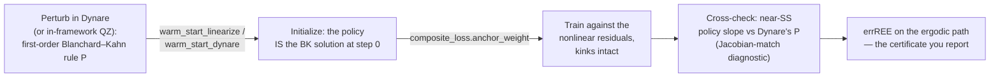

# Where DEQN-JAX sits among the methods you already use

DEQN-JAX is **a global solver for recursive economic equilibria**. It approximates the decision rule &pi;(s) with a neural network — the role Chebyshev polynomials or splines play in a projection method — and drives the Euler / FOC / market-clearing residuals to zero in expectation over next-period shocks, on the simulated ergodic set. This page is the **decision aid**: find the row of the method table that is *your* model, and see when DEQN earns its place next to the tools you already trust.

!!! note "Status: alpha (v0.2.0)"
    The **validated stack is small**: `adam` + an MLP (or `LinearPlusMLP`) + an MSE residual + antithetic Monte-Carlo (or Gauss–Hermite) expectations. DEQN is a *solver*, not an estimator, and not a replacement for Dynare — it [**composes with it**](#composes-with-dynare). The two honest limits are stated plainly below, never buried.

## Pick the row that matches your model

Same target across the whole table: a decision rule &pi;(s) that zeroes the equilibrium residuals. The methods differ in *what* approximates &pi;, *where* it stays accurate, and *how far* it scales in the state dimension.

| Method | Approximates &pi;(s) by | Accurate where | State-dim ceiling | Reach for it when |
|---|---|---|---|---|
| **Perturbation** (Dynare) | Taylor expansion around the steady state | a neighborhood of the SS | effectively unlimited | linear / near-linear models, IRFs, the published baseline |
| **Value-function iteration** | $V(s)$ on a discrete grid | wherever the grid is dense | ~4–6 states | low-dim problems with occasionally-binding constraints |
| **Projection** (Judd) | Chebyshev / splines on a tensor grid | interior of the state domain; basis-dependent | ~6–8 states | medium-dim models with good structural properties |
| **Parameterized expectations** | the conditional expectation as a polynomial | where the polynomial fits the conditional | ~6 states | stochastic models where that expectation *is* the object |
| **DEQN-JAX** (this framework) | a **neural network**, residuals on the simulated **ergodic set** | wherever training samples reach | **no hard grid limit; exercised to ~13 states** (`disaster`) | higher-dim stochastic models with **kinks, rare events, nonlinearities** |
| **PINN-HJB / KFE** | value function / density on continuous state via a PDE residual | wherever collocation points reach | ~4–6 continuous states | continuous-time heterogeneous-agent (Aiyagari-class) models |

The bottom three rows are all *global*. DEQN is the member that **scales in the state dimension without a tensor grid** and **keeps the kinks** — the four selling points below.

## What the DEQN row buys you

-   :material-chart-bell-curve-cumulative:{ .lg .middle } __Kinks stay kinked__

    ---

    ZLB, borrowing limits, irreversible investment enter as **Fischer–Burmeister complementarity** residuals — solved globally, *not* linearized away at the steady state. Perturbation misses these entirely.

-   :material-cube-outline:{ .lg .middle } __No tensor-grid curse__

    ---

    The network plays the basis-function role of a projection method, but **many state dimensions stay tractable** — no grid to explode under the curse of dimensionality.

-   :material-vector-link:{ .lg .middle } __Composes with Dynare__

    ---

    A first-order **Blanchard–Kahn linearization — computed in-framework via QZ, or imported from Dynare — warm-starts and anchors** the solve. You keep your perturbation workflow.

-   :material-ruler-square-compass:{ .lg .middle } __Accuracy you'd quote__

    ---

    Reported as the distribution of **relative Euler errors (errREE)** on the ergodic set — the number you already put in a paper, not a black-box loss.

## When DEQN earns its place vs Dynare specifically

!!! success "Reach for DEQN when Dynare can't"

    - **Occasionally-binding constraints.** ZLB, borrowing limits, irreversibility — first/second-order perturbation misses the kink. DEQN handles it natively, as Fischer–Burmeister residuals solved globally. The shipped examples that *show* this: `bm_labor_constrained` (labor cap), `irbc` (2-country irreversibility), `olg_lifecycle` (6-generation borrowing constraints).
    - **Rare disasters / fat tails.** A 1% disaster probability moves the ergodic distribution and the pricing kernel; a Taylor truncation underweights the tail. DEQN integrates the full shock distribution by Monte Carlo or Gauss–Hermite quadrature.
    - **Higher state dimensions.** Past ~10 states, perturbation loses accuracy far from the SS while VFI and projection collapse under the curse. DEQN is smooth interpolation regardless of $d$.
    - **Non-local counterfactuals.** "What happens at 3&sigma; from the steady state?" is exactly where linearization fails.

!!! warning "Reach for Dynare (or something else) when…"

    - a **first-order perturbation already answers your question** — it is faster, proven, and the profession's common denominator;
    - you need **Bayesian estimation** — Dynare evaluates the likelihood and samples the posterior; DEQN-JAX *solves a calibrated model*, it does not estimate one;
    - you need a **determinacy / equilibrium-selection guarantee** or **certified error bounds** — DEQN provides neither (see the two limits below).

!!! danger "Two honest limits — stated up front, not in a footnote"

    - **A low residual is necessary but not sufficient.** Like any nonlinear *global* solver, DEQN can settle on the **wrong equilibrium branch**, and nothing in the framework enforces equilibrium **selection**. There is **no global analogue of the *local* Blanchard–Kahn saddle-path condition** — this is a multiplicity / selection gap, *not* a "Blanchard–Kahn" criterion (BK is local and linear).
    - **No analytic error bounds.** Accuracy is **measured** (the errREE distribution), not proven by a theorem. Quote the number; don't assume it.

## Composes with Dynare {#composes-with-dynare}

DEQN-JAX **extends** your perturbation workflow — it does not ask you to throw it out. The first-order linearization is the warm start and the anchor; DEQN refines it into a global, nonlinear rule; you cross-check the result back against Dynare near the steady state.

??? example "The recipe, step by step"

    A typical DEQN-in-a-paper recipe:

    1. Perturb in Dynare.
    2. Import the Blanchard–Kahn `P` matrix — `warm_start_linearize` to compute it in-framework via QZ, or `warm_start_dynare` to read a Dynare solution.
    3. Anchor the nonlinear solve to it (`composite_loss.anchor_weight`).
    4. Cross-validate near-SS behavior against Dynare (the Jacobian-match diagnostic).
    5. Report the errREE distribution on the ergodic path.

    The `LinearPlusMLP` network bakes this in: the policy is the BK linear rule plus a **zero-initialized** correction, so at initialization the policy *is* the first-order solution and training can only improve on a correct local floor.

## Where to go next

-   :material-image-multiple:{ .lg .middle } __See worked models__

    ---

    The constraint examples that *show* the sell — each with its measured errREE certificate.

    [:octicons-arrow-right-24: Gallery](gallery/index.md)

-   :material-tune-variant:{ .lg .middle } __Pick your method__

    ---

    Networks, optimizers, expectations, diagnostics — and *when* (and when not) to reach for each.

    [:octicons-arrow-right-24: Method Zoo](method-zoo/index.md)

-   :material-pencil-ruler:{ .lg .middle } __Write your own model__

    ---

    Declare states, equilibrium equations, transition, calibration — as data.

    [:octicons-arrow-right-24: Implementing a model](models/implementing.md)

-   :material-school-outline:{ .lg .middle } __New to the method?__

    ---

    A one-page orientation aimed at economists, before any code.

    [:octicons-arrow-right-24: What is DEQN?](what_is_deqn.md)

??? abstract "Scope — what's in, what's out"

    **In scope:**

    - Discrete-time recursive general-equilibrium models with finite-dimensional state.
    - Any number of representative or finite-count agents (OLG with $A$ generations; multi-country RBC — both shipped).
    - Shocks: continuous (Gaussian → lognormal / AR(1)) or discrete i.i.d., integrated by Monte Carlo or Gauss–Hermite quadrature.
    - Occasionally-binding constraints via Fischer–Burmeister complementarity residuals (`bm_labor_constrained`, `irbc`, `olg_lifecycle`).
    - Warm-starting / anchoring from a linearized solution for disaster-risk and kink settings.

    **Out of scope:**

    - **Continuous-time HJB + KFE models** (Aiyagari / Krusell–Smith with a distributional state evolving under a Kolmogorov-forward PDE). These are the natural fit for **PINN-HJB / finite-difference PDE solvers**, not DEQN. A sibling PINN-HJB-KFE project in this research group complements DEQN — DEQN solves algebraic equilibrium conditions at sampled states; PINN-HJB solves PDEs on a discretized continuous state.
    - **Mean-field games** and any model whose state includes a measure evolving under a continuity equation.
    - **Bayesian estimation.** This framework solves a calibrated model; it does not evaluate a dataset's likelihood. Use Dynare or the estimation literature.

??? abstract "Against a hand-rolled implementation"

    DEQN-JAX is a JAX/Equinox reimplementation and extension of the **Deep Equilibrium Nets** method of Azinovic, Gaegauf & Scheidegger (2022). It assumes you already know the object you are training. What it adds over a single-model, hand-rolled implementation:

    | | DEQN-JAX | Hand-rolled JAX / PyTorch |
    |---|---|---|
    | Swap optimizer / network / expectation | config change | rewrite the loop |
    | Batched model / variant comparison | config-driven, built-in | per-script |
    | MC ↔ quadrature expectations | config toggle | hand-coded |
    | Composite loss (anchor + Jacobian + barriers) | config toggle | reimplement |
    | Diagnostic suite (errREE, IRFs, ergodic moments) | shared across models | per-script |
    | Single JIT boundary | yes | depends on the author |

    The packaged models in `src/deqn_jax/models/` are reference implementations meant to be read, forked, and extended — not a fixed catalogue. The full menu of swappable parts lives in the [Method Zoo](method-zoo/index.md); the live registries are always the source of truth (`uv run deqn-jax list`, `uv run deqn-jax optimizers`).

??? quote "Lineage & attribution"

    A JAX/Equinox reimplementation and extension of the **Deep Equilibrium Nets** methodology of **Simon Scheidegger and collaborators**; all credit for the original method belongs to the upstream authors.

    - Azinovic, M., Gaegauf, L., Scheidegger, S. (2022). *Deep Equilibrium Nets.* International Economic Review 63(4), 1471–1525.
    - Scheidegger, S., Bilionis, I. (2019). *Machine learning for high-dimensional dynamic stochastic economies.* Journal of Computational Science 33, 68–82.

    This reimplementation migrates the approach to JAX + Equinox and adds architectural priors (`LinearPlusMLP`) and composite-loss terms. Full references on the [home page](index.md).
