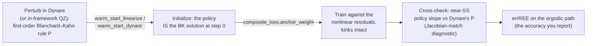

# Where DEQN-JAX sits among solution methods

DEQN-JAX is a global solver for recursive economic equilibria. It approximates
the decision rule &pi;(s) with a neural network, in the role Chebyshev
polynomials or splines play in a projection method. It drives the Euler, FOC
and market-clearing residuals to zero in expectation over next-period shocks,
on the simulated ergodic set. This page compares it with the standard methods
to help you decide when to use it.

DEQN-JAX solves calibrated models; it is not an estimator. It does not replace
Dynare and can [use a Dynare solution](#composes-with-dynare) as its starting
point. The status of the code and the validated configuration are on the
[home page](index.md).

## Comparison of methods

All methods in the table look for a decision rule &pi;(s) that sets the
equilibrium residuals to zero. They differ in what approximates &pi;, where the
approximation is accurate, and how far it scales in the state dimension.

| Method | Approximates &pi;(s) by | Accurate where | State-dim ceiling | Reach for it when |
|---|---|---|---|---|
| **Perturbation** (Dynare) | Taylor expansion around the steady state | a neighborhood of the SS | effectively unlimited | linear / near-linear models, IRFs, the published baseline |
| **Value-function iteration** | $V(s)$ on a discrete grid | wherever the grid is dense | ~4–6 states | low-dim problems with occasionally-binding constraints |
| **Projection** (Judd) | Chebyshev / splines on a tensor grid | interior of the state domain; basis-dependent | ~6–8 states | medium-dim models with good structural properties |
| **Parameterized expectations** | the conditional expectation as a polynomial | where the polynomial fits the conditional | ~6 states | stochastic models where that expectation *is* the object |
| **DEQN-JAX** (this framework) | a neural network, residuals on the simulated ergodic set | wherever training samples reach | no hard grid limit; exercised to ~13 states (`disaster`) | higher-dim stochastic models with kinks, rare events, nonlinearities |
| **PINN-HJB / KFE** | value function / density on continuous state via a PDE residual | wherever collocation points reach | ~4–6 continuous states | continuous-time heterogeneous-agent (Aiyagari-class) models |

Every method in the table except perturbation is global. Among the global methods, DEQN scales in the state
dimension without a tensor grid and handles kinks. Specifically:

- The ZLB, borrowing limits and irreversible investment enter as
  Fischer–Burmeister complementarity residuals and are solved globally, not
  linearized away at the steady state. Perturbation does not capture them.
- The network takes the place of the basis functions in a projection method,
  but without a grid, so many state dimensions remain tractable.
- A first-order Blanchard–Kahn linearization, computed in the framework via QZ
  or imported from Dynare, warm-starts and anchors the solve, so an existing
  perturbation workflow carries over.
- Accuracy is reported as the distribution of relative Euler errors (errREE) on
  the ergodic set, the measure used in the literature.

## DEQN compared with Dynare

!!! success "Use DEQN when Dynare cannot handle the problem"

    - Occasionally-binding constraints. First- and second-order
      perturbation miss the kink of a ZLB, borrowing limit or irreversibility
      constraint. DEQN solves it globally as a Fischer–Burmeister residual. The
      shipped examples are `bm_labor_constrained` (labor cap), `irbc`
      (two-country irreversibility) and `olg_lifecycle` (six-generation
      borrowing constraints).
    - Rare disasters and fat tails. A 1% disaster probability shifts the
      ergodic distribution and the pricing kernel, and a Taylor truncation
      underweights the tail. DEQN integrates over the full shock distribution
      by Monte Carlo or Gauss–Hermite quadrature.
    - More state variables. Beyond about 10 states, perturbation loses
      accuracy far from the steady state, and VFI and projection become
      infeasible. DEQN interpolates smoothly in any dimension $d$.
    - Counterfactuals far from the steady state. At 3&sigma; from the
      steady state, linearization is unreliable.

!!! warning "Use Dynare (or another tool) when"

    - a first-order perturbation already answers your question. It is faster,
      well tested and the common standard.
    - you need Bayesian estimation. Dynare evaluates the likelihood and samples
      the posterior; DEQN-JAX solves a calibrated model and does not estimate
      one.
    - you need a determinacy or equilibrium-selection guarantee, or certified
      error bounds. DEQN provides neither; see the limits below.

!!! danger "Limits"

    - A low residual is necessary but not sufficient. Like any nonlinear
      global solver, DEQN can converge to the wrong equilibrium branch, and the
      framework does not enforce equilibrium selection. There is no global
      analogue of the local Blanchard–Kahn saddle-path condition. This is a
      multiplicity and selection gap, not a Blanchard–Kahn criterion (BK is
      local and linear).
    - No analytic error bounds. Accuracy is measured (the errREE
      distribution), not proven. Report the number you measured.

## Composes with Dynare {#composes-with-dynare}

The first-order linearization serves as the warm start and the anchor. DEQN
refines it into a global, nonlinear rule, and you check the result against
Dynare near the steady state.

```mermaid
flowchart LR
    DY["Perturb in Dynare<br/>(or in-framework QZ):<br/>first-order Blanchard&ndash;Kahn rule P"]
    DY -->|"warm_start_linearize /<br/>warm_start_dynare"| WS["Initialize: the policy<br/>IS the BK solution at step 0"]
    WS -->|"composite_loss.anchor_weight"| TR["Train against the<br/>nonlinear residuals,<br/>kinks intact"]
    TR --> XV["Cross-check: near-SS<br/>policy slope vs Dynare's P<br/>(Jacobian-match diagnostic)"]
    XV --> ACC["errREE on the ergodic path<br/>(the accuracy you report)"]
```

??? example "Step by step"

    A typical workflow for a paper:

    1. Perturb in Dynare.
    2. Import the Blanchard–Kahn `P` matrix: `warm_start_linearize` computes it
       in the framework via QZ, and `warm_start_dynare` reads a Dynare solution.
    3. Anchor the nonlinear solve to it (`composite_loss.anchor_weight`).
    4. Cross-validate near-SS behavior against Dynare (the Jacobian-match
       diagnostic).
    5. Report the errREE distribution on the ergodic path.

    The `LinearPlusMLP` network builds this in. The policy is the BK linear
    rule plus a zero-initialized correction, so at initialization it equals the
    first-order solution, and training starts from a correct local
    approximation.

## Where to go next

- [Gallery](gallery/index.md): the constraint examples, each with its measured
  errREE.
- [Method Zoo](method-zoo/index.md): networks, optimizers, expectation
  operators and diagnostics, and when to use each.
- [Implementing a model](models/implementing.md): declare states, equilibrium
  equations, transition and calibration.
- [What is DEQN?](what_is_deqn.md): a one-page introduction for economists,
  without code.

??? abstract "Scope"

    In scope:

    - Discrete-time recursive general-equilibrium models with finite-dimensional state.
    - Any number of representative or finite-count agents (OLG with $A$ generations and multi-country RBC are both shipped).
    - Shocks: continuous (Gaussian innovations, mapped to lognormal or AR(1) processes) or discrete i.i.d., integrated by Monte Carlo or Gauss–Hermite quadrature.
    - Occasionally-binding constraints via Fischer–Burmeister complementarity residuals (`bm_labor_constrained`, `irbc`, `olg_lifecycle`).
    - Warm-starting and anchoring from a linearized solution in disaster-risk and kink settings.

    Out of scope:

    - Continuous-time HJB + KFE models (Aiyagari / Krusell–Smith with a distributional state evolving under a Kolmogorov-forward PDE). PINN-HJB or finite-difference PDE solvers fit these better. A sibling PINN-HJB-KFE project in this research group covers them: DEQN solves algebraic equilibrium conditions at sampled states, while PINN-HJB solves PDEs on a discretized continuous state.
    - Mean-field games and any model whose state includes a measure evolving under a continuity equation.
    - Bayesian estimation. This framework solves a calibrated model; it does not evaluate a likelihood. Use Dynare or the estimation literature.

??? abstract "Compared with a hand-written implementation"

    DEQN-JAX is a JAX/Equinox reimplementation and extension of the Deep Equilibrium Nets method of Azinovic, Gaegauf & Scheidegger (2022). Compared with a hand-written implementation for a single model, it adds:

    | | DEQN-JAX | Hand-rolled JAX / PyTorch |
    |---|---|---|
    | Swap optimizer / network / expectation | config change | rewrite the loop |
    | Batched model / variant comparison | config-driven, built-in | per-script |
    | MC ↔ quadrature expectations | config toggle | hand-coded |
    | Composite loss (anchor + Jacobian + barriers) | config toggle | reimplement |
    | Diagnostic suite (errREE, IRFs, ergodic moments) | shared across models | per-script |
    | JIT-compiled rollout and gradient steps | yes | depends on the author |

    The models in `src/deqn_jax/models/` are reference implementations to read, fork and extend; the set is not fixed. The [Method Zoo](method-zoo/index.md) lists the interchangeable parts. The registries are the authoritative list (`uv run deqn-jax list`, `uv run deqn-jax optimizers`).

??? quote "Lineage and attribution"

    A JAX/Equinox reimplementation and extension of the Deep Equilibrium Nets methodology of Simon Scheidegger and collaborators; all credit for the original method belongs to the upstream authors.

    - Azinovic, M., Gaegauf, L., Scheidegger, S. (2022). *Deep Equilibrium Nets.* International Economic Review 63(4), 1471–1525.
    - Scheidegger, S., Bilionis, I. (2019). *Machine learning for high-dimensional dynamic stochastic economies.* Journal of Computational Science 33, 68–82.

    This reimplementation moves the approach to JAX + Equinox and adds an architectural prior (`LinearPlusMLP`) and composite-loss terms. Full references are on the [home page](index.md#citing).
